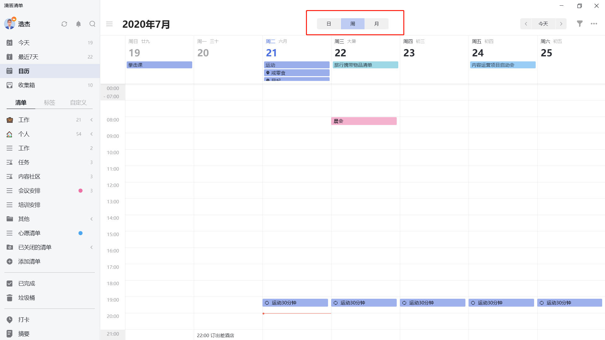
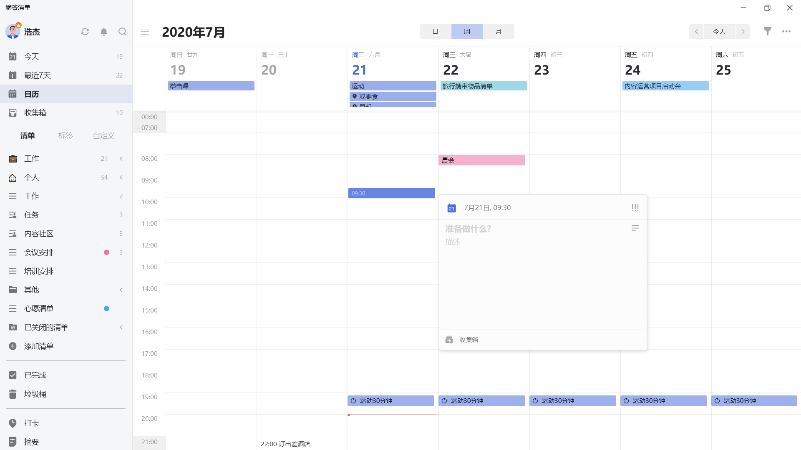
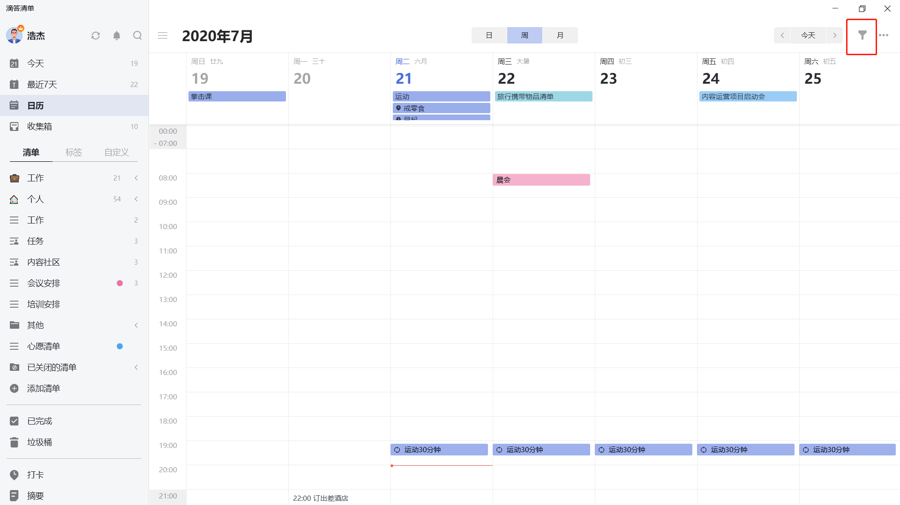
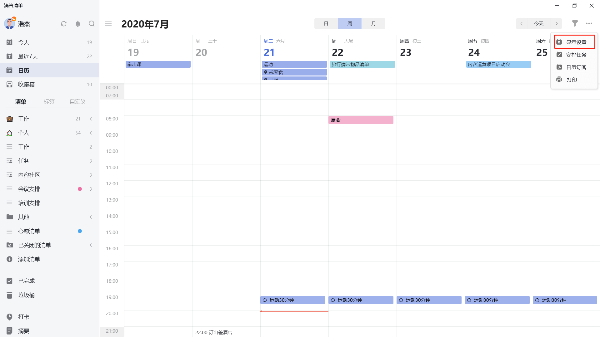

## 日历管理

### 日历视图切换

「日历视图」可以帮助您更直观地查看自己的任务计划和日程安排。

* 单击页面左上角头像，进入「设置」-「智能清单」-「日历」，将日历状态改为**显示**。设置成功后，「日历」将出现在左侧边栏智能清单「最近7天」的下方。

* 点击「日历」，即可进入日历视图查看每月任务。如果某天的任务较多，日历格中会出现「更多」按钮，点击可展开当天的全部任务。

* 农历和节假日调休可以在「设置」-「偏好设置」-「农历、周数、节假日」中开启。

在日历页面上方有日视图、周视图和月视图的切换按钮，点击对应按钮即可切换到相应视图。日视图和周视图分为全天任务区域和时间轴区域。

全天任务区域显示当天的全天任务和跨天任务，任务比较多的时候可以把全天区域整个展开。

时间轴区域内默认隐藏 00:00-7:00 和 21:00-24:00 两个时间段，如果想要查看这两个时间段中的任务，可以点击时间轴展开进行查看。
`注：时间轴任务的最小高度是半个小时，时间点任务和时间不足半小时的时间段任务默认半小时占格。`

### 日历视图中的任务管理

#### 添加任务

在月视图和周视图中，点击对应日期的空白处即可添加该天任务，拖动选中多个日历格时，可以创建跨天任务。

在日视图和周视图中，点击时间轴添加任务将自动设置任务时间，选中后进行拖动可以创建带有时间段任务。

#### 编辑任务

选中某条任务，可以在详情框中修改任务详情或删除任务。

#### 拖动任务

拖动任务到其他日期对应的日历格中可以快速修改任务到期日。

#### 筛选清单

点击日历视图右上角的筛选按钮，可以根据清单来筛选显示在日历中的任务。

#### 隐藏/显示已完成任务

在日历右上角「···」-「显示设置」中选择「显示已完成」，可以在日历中查看已完成的任务。

#### 隐藏/显示子任务

在日历右上角「···」-「显示设置」中选择「显示子任务」，可以在日历对应的网格中显示该时间的子任务。 

#### 隐藏/显示未来重复周期

在日历右上角「···」-「显示设置」中选择「显示未来重复周期」，可在日历中显示每个周期的任务。

#### 安排任务

点击日历右上角「···」-「安排任务」，可以在日历中安排未设置日期和时间的任务，您可以通过将任务拖拽到日历格或时间轴中来设置任务日期和时间。

### 打印日历

点击日历右上角的「···」选择「打印」，可以打印日视图、周视图和月视图页面。

