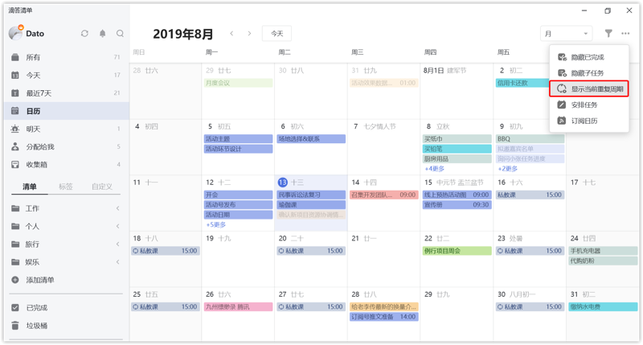

#### 隐藏/显示已完成任务

点击日历右上角的「...」选择「隐藏已完成任务」，可以在日历中不显示已完成的任务，默认为显示。

#### 隐藏/显示子任务

点击日历右上角的「...」选择「显示子任务」，可以在日历对应的网格中显示有时间的子任务，默认为隐藏。 `注：已完成的子任务和所属主任务已完成的子任务是不显示在日历上的。`

#### 显示未来重复周期

点击日历右上角的「...」选择「显示未来重复周期」，在日历中显示重复任务的全部周期的任务。

