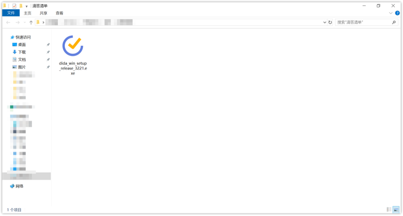
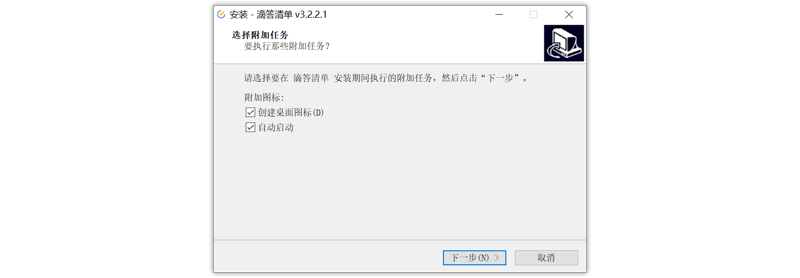

#### 下载滴答清单 Windows 版

您可以在滴答清单官网下载 Windows 客户端，下载地址：[https://dida365.com/static/getApp/download?type=win](https://dida365.com/static/getApp/download?type=win)

下载完成之后，双击安装文件，然后按照安装指引下一步完成安装。

安装完成之后，会在桌面上出现滴答清单的快捷方式，双击快捷方式，即可打开滴答清单应用。

#### Windows 7 安装

滴答清单的运行需要依赖 .NET 4.5.2 及以上环境，Window 7 默认是没有安装的，需要手动下载安装，下载地址：[https://www.microsoft.com/zh-CN/download/details.aspx?id=42642](https://www.microsoft.com/zh-CN/download/details.aspx?id=42642)

点击红色按钮进行下载，完成之后安装 .NET 环境，之后重新安装滴答清单客户端安装包安装即可。

