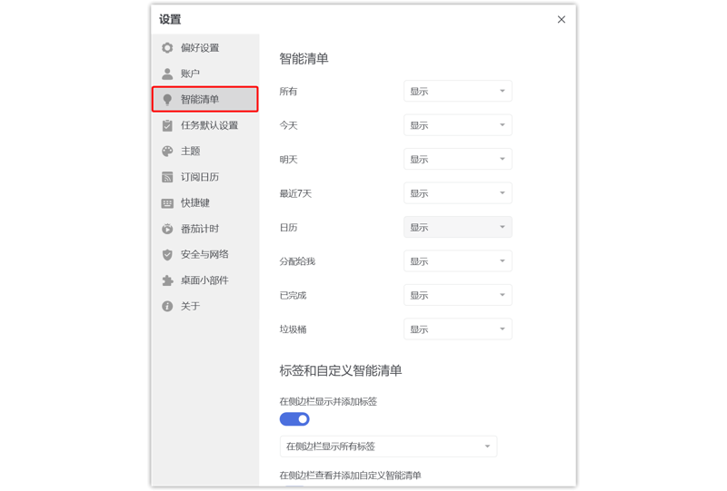

#### 管理智能清单

当清单栏列表中清单过多时，您可以选择将部分不常用的清单隐藏。

点击左上角头像-「设置」-「智能清单」，可以对智能清单的状态进行设置。

显示：该清单始终显示在清单栏； 自动：当清单中有任务时，该清单显示在清单栏，清单中没有任务时，该清单不显示； 隐藏：该清单始终不显示在侧边栏。

`注：「收集箱」不能被隐藏。`

拖动智能清单: 在智能清单区域拖动，即可改变智能清单的排序。

