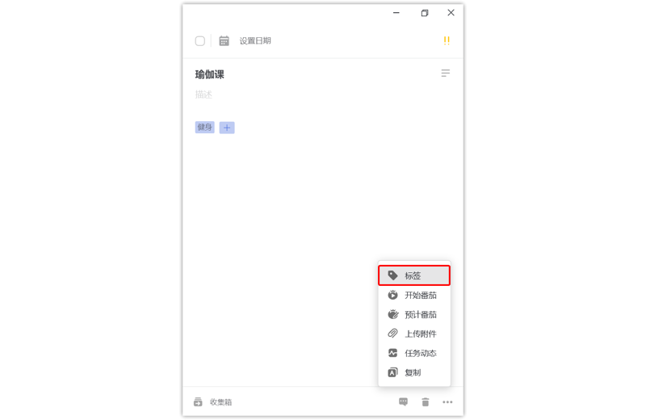

#### 为任务添加标签

在输入框内创建任务时，可以插入 #标签名 ，回车保存，快速为当前任务设置标签。如果需要添加一个已有的标签，在插入 # 后，输入框下方会显示一个已有标签的列表，可直接进行选择。

当任务已经有至少一个标签后，在任务详情页，标签的右侧会出现一个「+」按钮，点击后也可直接添加新标签。

或者点击任务详情页右下角的「···」-「标签」，然后为当前任务添加标签。

`注：添加好的标签会出现在任务详情页的下方区域内；以及任务列表页，任务名的右侧。点击标签，会跳转到该标签的任务列表页，即包含该标签的全部任务。`

