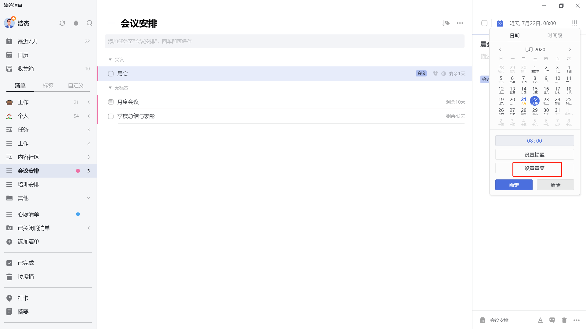
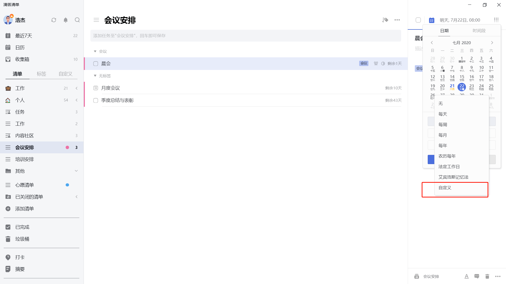
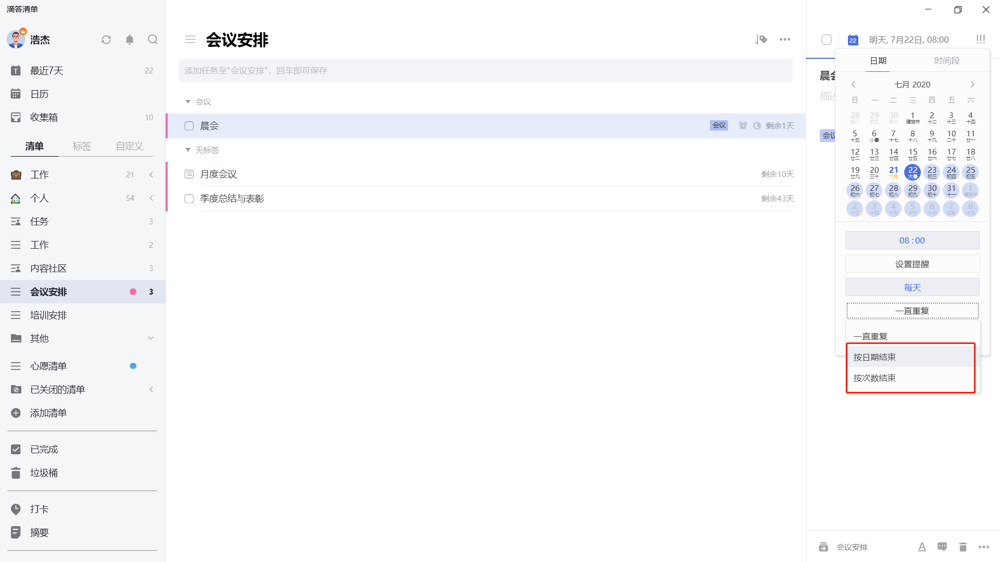

## 设置重复任务

### 常见重复

当任务是固定时间重复出现时，可以将其设置为重复任务。

点击任务进入右侧详情页，依次点击顶部日期栏 - 「设置重复」，可以根据需求快速选择按每天/周/月/年/法定工作日/艾宾浩斯记忆法等周期来重复。

`注：艾宾浩斯记忆法的重复周期按照1，2，4，7，15，15，15，15，15，15，15，15……循环。`

### 自定义重复

若默认重复中没有您需要的重复周期，您可以点击「自定义重复」，包括以下两种重复类型：

* **到期重复**：是指当前时间到达设置的时间就会提醒的重复，不会因为完成进度而变化。
   `例子：小明需要每周五下午安排下周工作，所以设置一个每周五下午都会提醒的到期重复。`
* **完成重复**：是指上次任务完成后再开始计算下次提醒时间的重复，再次提醒的时间会因为自己所完成的时间而改变。
   `例子：小明想要每三天去一次健身房跑步，这一次是星期二，那么下一次提醒会在星期五；但他星期五没有去，在星期日完成了这个任务，那么下一次的提醒时间是星期三，而不是星期一。`

### 结束重复

重复任务默认「一直重复」。您可通过设置「按日期结束重复」和「按次数结束重复」来自动结束任务的重复。

* **按日期结束重复**：设置一个重复的截止日期，此日期之后不再重复创建该任务。
* 
* **按次数结束重复**：设置一个重复次数，到达该次数以后不再重复创建该任务。

