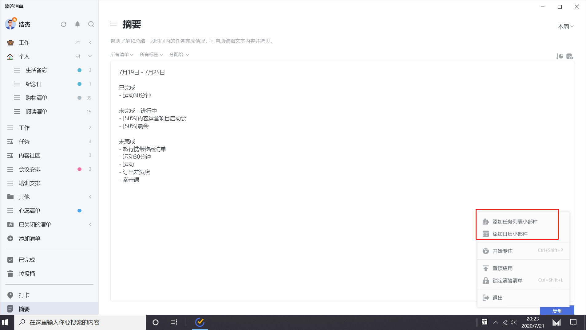
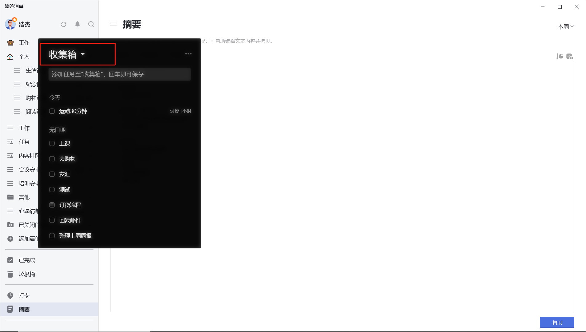
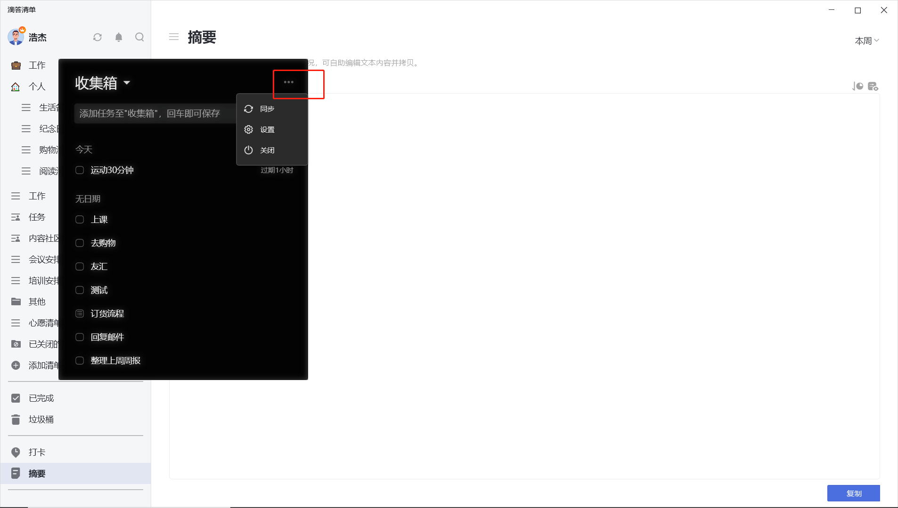
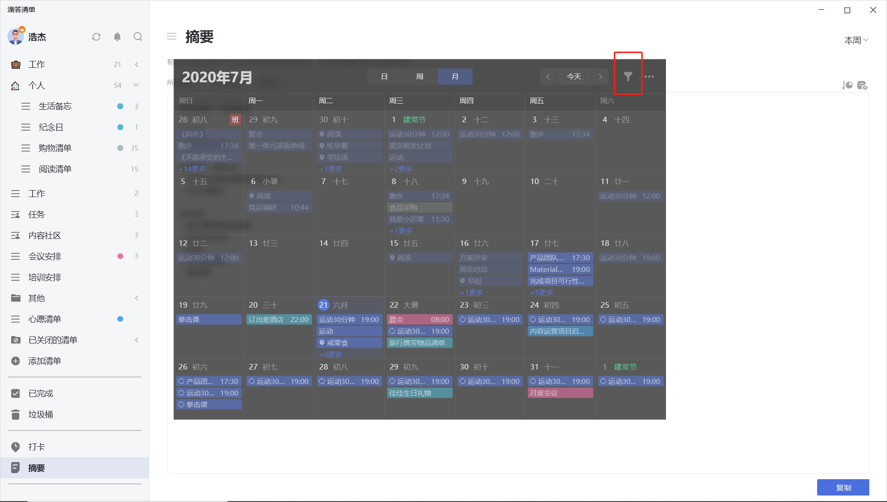
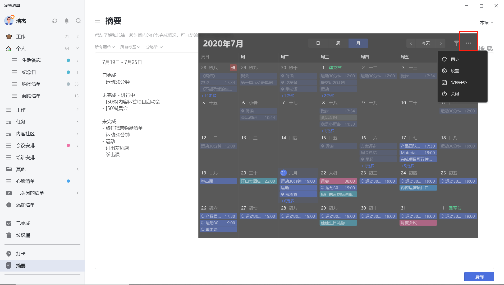

## 配置桌面小部件
您可以在系统托盘右键滴答清单图标以添加桌面小部件，目前滴答清单支持两种小部件类型：

* **任务列表小部件**
您可以在桌面添加多个任务列表小部件，并且可以拖拽小部件到屏幕顶部以自动隐藏。

* **日历视图小部件**
您可以在桌面添加 1 个日历视图小部件以查看近期日程。

`注：可以添加多个列表小部件，只能添加一个日历小部件。`

### 任务列表小部件

#### 切换清单

点击小部件左上方区域，可以选择需要显示的清单。

#### 添加任务

在小部件上方任务添加区域，输入任务后回车即可添加任务。添加区域支持使用「#」 快捷添加标签，使用「!」快捷添加优先级，使用「*」快捷选择日期，使用「^」 选择清单。

#### 小部件设置

小部件右上角的「···」按钮，支持如下设置： 

* **同步**：同步其他端任务修改，默认情况下，10 分钟自动同步一次； 
* **设置**：打开设置界面，可以设置主题、透明度和小部件的显示方式；
* **关闭**：移除小部件。

### 日历视图小部件

日历小部件支持日视图、周视图和月视图两种模式，点击小部件顶部按钮进行切换。

#### 筛选任务

点击小部件右上方区域，可以筛选需要显示的清单。

#### 小部件设置

小部件右上角的「···」按钮，支持如下设置： 

* **同步**：同步其他端任务修改，默认情况下，10 分钟自动同步一次； 
* **设置**：打开设置界面，可以选择主题、透明度和小部件的显示方式；
* **安排任务**：可以在日历中安排没有日期和时间的任务，您可以通过将任务拖拽到网格或时间轴中来设置任务日期和时间；
* **关闭**：移除小部件。

