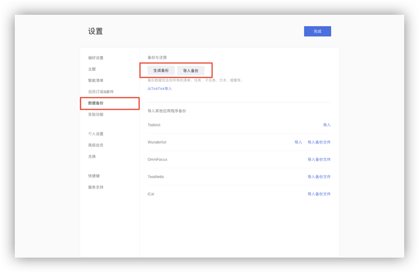
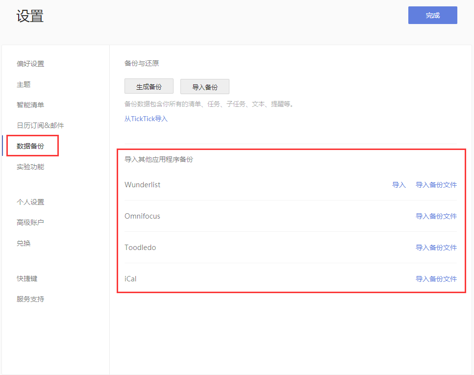

## 数据

#### 生成和导入备份

点击左上角头像-「设置」-「数据备份」。然后,点击「生成备份」按钮, 这样您就可以备份一个以 csv 为后缀的文件。  如你需要导入备份,您可以单击「导入备份」，再上传以 csv 为后缀的文件。  `注：若一天内备份次数过多，会提示“你今天已经备份过多次，请明天再试。”` 

#### 从其他应用中导入任务

若您希望将其他应用的任务移入滴答清单，可以点击左上角头像-「设置」-「数据备份」。

然后选择对应的应用（ Wunderlist , Astrid , Toodledo 等等 ）上传备份文件到滴答清单。

#### 账户迁移

如果你是 TickTick 用户，现在使用滴答清单，可以进行数据迁移。  数据迁移需要登陆网页版[滴答清单](http://www.dida365.com/)。

迁移方式有两种：

* 自助迁移：打开[数据迁移页面](http://dida365.com/import/#ticktick), 输入 TickTick 用户名和密码，点击导入即可。
* 人工迁移：当自助迁移出现问题时，用您的注册邮箱发送邮件到support@dida365.com 提交申请，我们将会在一个工作日之内受理您的数据迁移请求。
   `注：密码中含有特殊字符会导致迁移失败，所以如果密码带特殊字符，请更改密码后再进行迁移，迁移成功后可自行更改密码。`

#### 高级账户如何迁移？

滴答清单支持将 TickTick 高级账户迁移到滴答清单，若您是 TickTick 的高级账户，且高级账户未到期，则迁移到滴答清单后，依然享有高级账户权限。

* 支付宝付款的TickTick高级账户，直接进行数据迁移即可，高级账户会迁移到滴答清单。
* 如您非支付宝付款，请用您的注册邮箱将 TickTick 账户信息、滴答账户信息以及支付信息发送到我们的邮箱 supprot@dida365.com ，我们将为您进行人工迁移。

