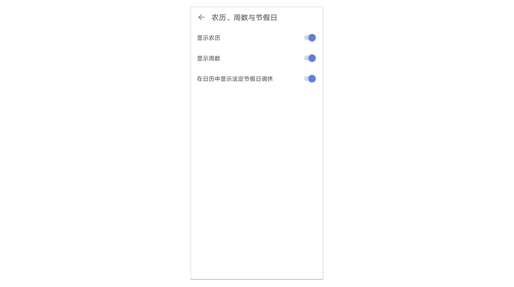
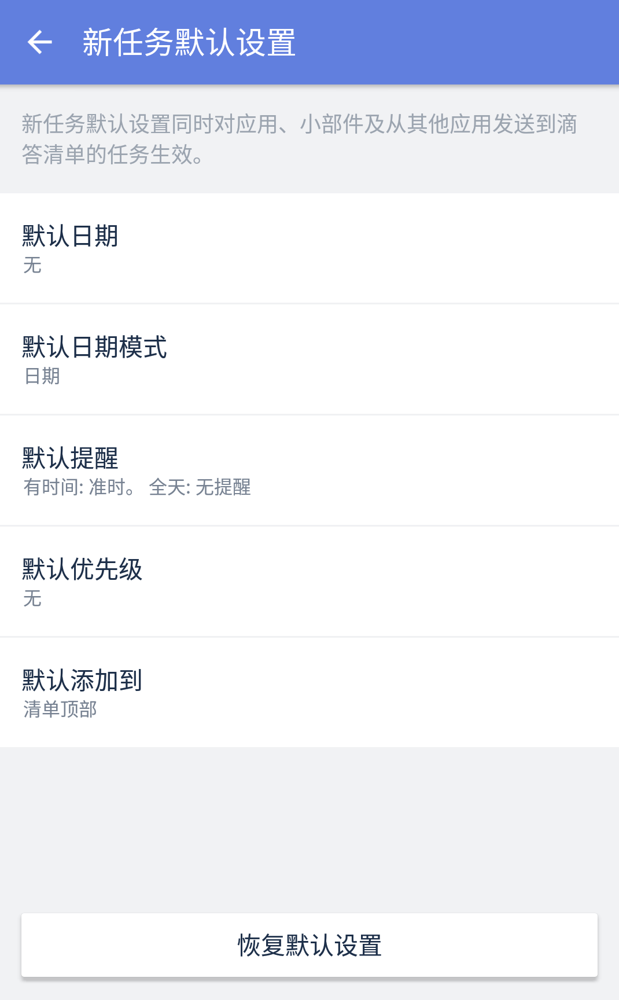
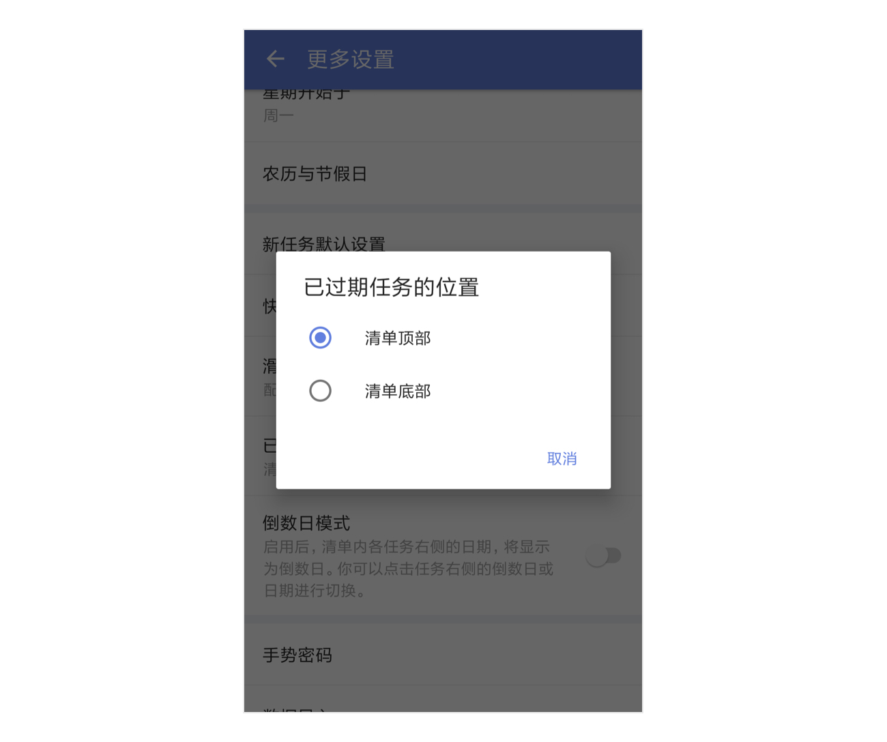
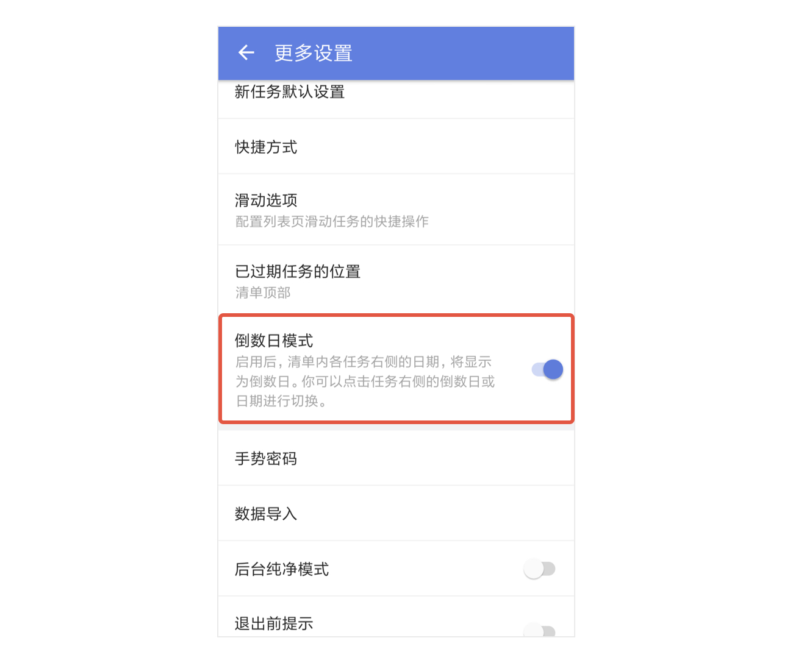

## 更多设置

在设置页中，点击「更多设置」，进入更多的 App 设置界面。

#### 语言

滴答清单默认跟随系统语言，如果您希望使用其他语言，可以手动选择。目前可以选择跟随系统、简体中文和英文。

#### 字体大小

滴答清单提供两种字体大小选择：「标准」和「大号」。 偏好设置页面点击「字体大小」并选择适合自己的字体大小。

#### 星期开始于

偏好设置页面点击「星期开始于」，您可以设置日历中的星期开始日期，目前有周六、周日和周一可以选择。

#### 农历与节假日

「农历」开关开启后，在日历中就会显示出农历日期。 「显示法定节假日调休」开关开启后，在日历中会显示节假日调休情况。

#### 新任务默认设置

在主界面底部 Tab 栏点击「设置」图标，进入设置界面后点击「更多设置」，选择「新任务默认设置」，可以对新任务日期、日期模式、提醒时间、优先级、默认添加到清单的位置进行设置，之后创建的新任务会自动带上这些默认设置。

`注：新任务默认设置对应用、小部件和状态栏生效，但智能清单“今天”、“明天”、“最近7天”和日历不受默认日期的影响。`

#### 快捷方式

在主界面底部 Tab 栏点击「设置」图标，进入设置界面后点击「更多设置」，选择「快捷方式」，在主屏幕中长按 app 的 icon 可进行快捷操作，您可以根据自己的需求配置常用的选项。

`注：最多可选择配置4个选项。Android 7 以上系统的手机才有该功能。`

#### 滑动选项

在「设置」-「更多设置」中，选择「滑动选项」来配置列表页滑动任务的快捷操作。

`注：如果未在应用内开启番茄计时功能，「开始番茄」选项也不会出现在滑动选项中。`

#### 已过期任务的位置
可手动选择已过期任务的显示位置，包括：清单顶部、清单底部。

#### 倒数日模式
启用后，清单内任务右侧的日期，将显示为倒数日。您可以点击任务右侧的倒数日或日期进行切换。

#### 手势密码
开启手势密码，然后为滴答清单设置一个手势密码，以后每次打开应用时需要先进行解锁。

#### 数据导入

在「设置」-「更多设置」-「数据导入」中，可以将数据从第三方应用中直接导入滴答清单安卓版，包括：奇妙清单、Todoist、Any.do、Gtasks，还有更多数据导入支持，请去往网页版操作。

#### 后台纯净模式

在主界面底部 TAB 栏点击「设置」图标，进入设置界面后点击「更多设置」，启用「后台纯净模式」。

开启后台纯净模式后，滴答清单将不再允许后台推送同步。为保障同步可用，滴答清单会定时拉取数据。

`注：如果您更新数据比较频繁，此模式可能会影响个平台间的数据同步，请谨慎使用。`

#### 退出前提示

开启了「退出前提示」后，点击系统返回键退出应用时，需要再次点击确认退出，避免误触。 在主界面底部 TAB 栏点击「设置」图标，进入设置界面后点击「更多设置」，启用「退出前提示」即可。

