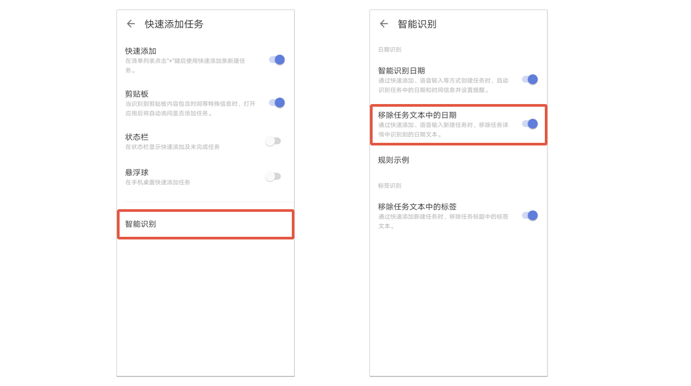
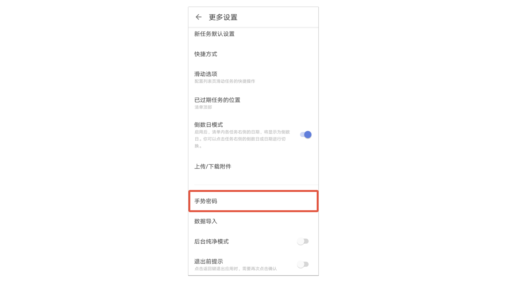
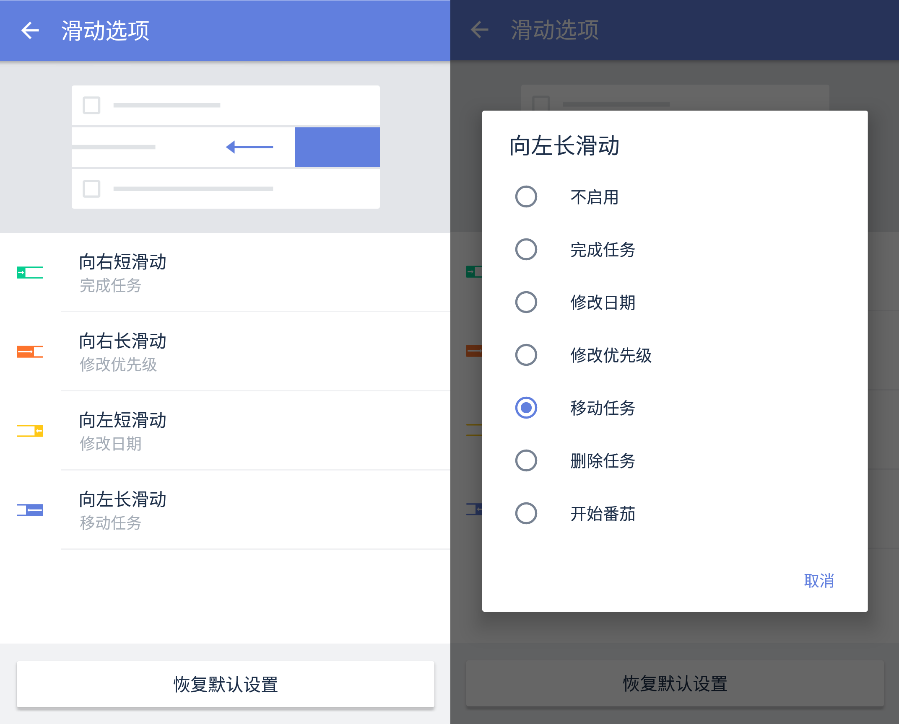

## 更多设置

在设置页中，点击「更多设置」，进入更多的 App 设置界面。

### 语言

滴答清单默认跟随系统语言，如果您希望使用其他语言，可以手动选择。目前可以选择跟随系统、简体中文和英文。

### 应用程序快捷方式

在主屏幕长按ICON可进行快捷操作，您可以在「更多设置」-「应用程序快捷方式」中配置常用的选项。

`注：最多可选择配置4个选项。Android 7 以上系统的手机才有该功能。

### 智能识别

智能识别分为**日期识别**和**标签识别**。

#### 日期识别

**智能识别日期**：通过快速添加、语音输入等方式创建任务时，自动识别任务中的日期和时间信息并设置提醒。
**移除任务文本中的日期**：通过快速添加、语音输入新建任务时，移除任务详情中识别到的日期文本。
**规则示例**：展示「日期和时间」、「重复」、「提前提醒」、「延后提醒」的智能识别规则及示例。

#### 标签识别

**移除任务文本中的标签**：通过快速添加新建任务时，移除任务标题中的标签文本。

### 快速添加任务

滴答清单提供了多种添加任务的方式，包括：快速添加、剪贴板、状态栏、悬浮球。您可以根据需要自行设置。

### 任务默认值

在主界面底部 Tab 栏点击「设置」图标，进入设置界面后点击「更多设置」，选择「任务默认设置」，可以对任务日期、日期模式、提醒时间、优先级、默认添加到清单的位置以及已过期任务的位置进行设置，之后创建的新任务会自动带上这些默认设置。

`注：新任务默认设置对应用、小部件和状态栏生效，但智能清单“今天”、“明天”、“最近7天”和日历不受默认日期的影响。`

### 上传/下载任务中的附件

在主界面底部 Tab 栏点击「设置」图标，进入设置界面后点击「更多设置」，选择「上传/下载任务中的附件」，可以设置使用数据流量时，是否可以上传/下载任务中的附件。

### 模板

模板开启后，可以将任务保存为模板。在新建任务时，点击右上角的模板按钮，选择您想使用的模板即可。

### 在手表中显示清单

可以选择在手表中显示清单的范围，包括：**今天**、**最近7天**、**所有**和**收集箱**。

### 手势密码
开启手势密码，然后为滴答清单设置一个手势密码，以后每次打开应用时需要先进行解锁。

### 滑动操作

在「设置」-「更多设置」中，选择「滑动操作」来配置列表页滑动任务的快捷操作。

`注：如果未在应用内开启番茄计时功能，「开始番茄」选项也不会出现在滑动选项中。`

### 高级选项

#### 后台纯净模式

在主界面底部 TAB 栏点击「设置」图标，进入设置界面后点击「高级选项」-「更多设置」，启用「后台纯净模式」。

开启后台纯净模式后，滴答清单将不再允许后台推送同步。为保障同步可用，滴答清单会定时拉取数据。

`注：如果您更新数据比较频繁，此模式可能会影响个平台间的数据同步，请谨慎使用。`

#### 退出前提示

开启了「退出前提示」后，点击系统返回键退出应用时，需要再次点击确认退出，避免误触。 在主界面底部 TAB 栏点击「设置」图标，进入设置界面后点击「更多设置」，启用「退出前提示」即可。

