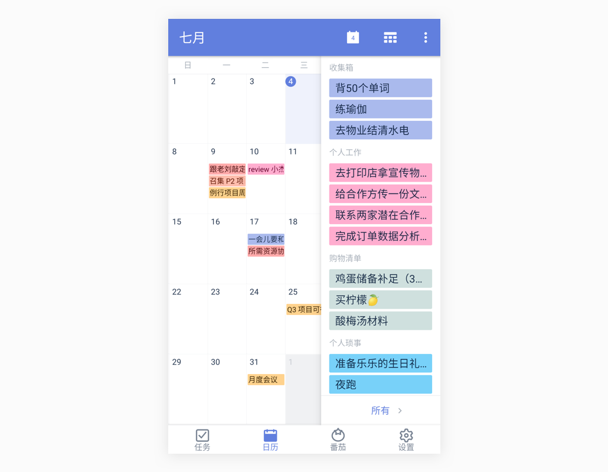
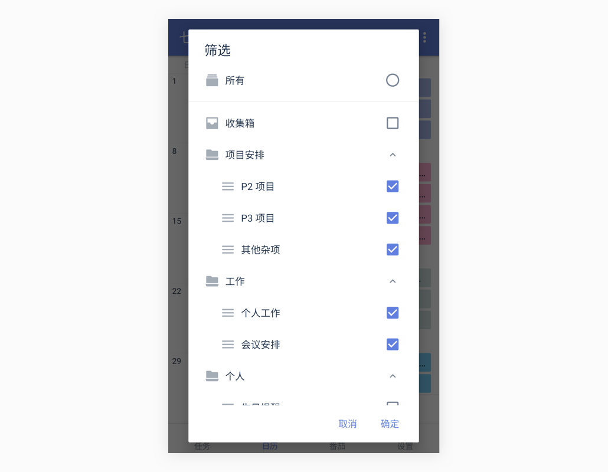

### 日历管理

日历视图可以帮助你更直观地查看自己的任务计划，安排日程。方便你在制定计划时，可以考虑到一周甚至一个月的任务安排，更好的统筹任务安排，规划时间。

在主界面底部 TAB 栏点击【日历】图标，即可进入日历界面。

#### 切换列表视图/网格视图

进入日历，可以切换列表视图、月视图、日视图、三日视图和周视图，既可以直观显示月度计划、也能够轻松安排近日任务。

#### 双指缩放时间轴
在时间轴日历视图中（日、三日、周），「双指捏合」或「双指张开」，即可更改时间轴的高度。

双指捏合时，时间轴的高度将变矮，你就可以在一屏内查看更多的任务;双指张开时，时间轴的高度将变高，当某个任务标题较长时，你就能看到更多的标题内容。

#### 显示子任务与重复周期

在日历的列表视图中，点击右上角“...”，按钮，可以选择在日历中显示子任务和任务的重复周期。

#### 安排任务

只需要在日历视图中从屏幕右侧边缘向左滑动，即可滑出「安排任务」区域。那些尚未设置日期的任务，将在此区域内展示。

您可以点击底部的“筛选清单”并选择特定清单下的任务进行安排。

筛选完成后，回到日历视图。长按安排任务区域内的任一任务，将它拖拽到日历视图上来设置日期和时间。

`注：已经拖拽起来的任务，如果想要取消本次操作，可以将任务拖拽到右下角的「取消」区域。` `注：长按拖动已经在日历上的任务，选择合适的日期再松手，也可修改任务时间。` `注：完成后，向右滑动屏幕即可收起安排任务区域。`

#### 切换月视图/周视图

在列表视图界面，将日历上滑可切换到周视图，下方区域可以显示更多的任务。

#### 日历订阅

* 将本地日历的事件显示在滴答中：
  在主界面底部 TAB 栏点击【设置】图标，进入设置界面后点击【更多设置】-【数据导入】-【订阅日历】，启用该功能。 在下方显示的本地日历中设置需要显示或者隐藏的日历类型。如节假日、生日、工作等日历分组。
  `注：滴答清单显示的日历事件是本地日历所能显示的事件，如果你设置了本地日历不能读取该事件，那就不会显示在滴答清单上。`

* 订阅其他日历事件到滴答清单中：
  滴答清单允许您从其他日历服务中订阅事件。在订阅日历界面，点击【添加日历】，可以选择谷歌日历订阅和通过链接订阅日历。 -**订阅谷歌日历**：登录谷歌账号，允许滴答清单订阅谷歌日历，即可完成订阅。 -**通过链接订阅日历**：输入你想订阅日历的URL，即可完成订阅。

`注：【订阅日历】开关开启后，在侧边栏中会显示【事件】智能清单，在这里可以查看本地日历和您订阅的日历事件。本地日历事件是可以进行添加、编辑和删除的。`
`注：此功能仅对付费用户开放。`

