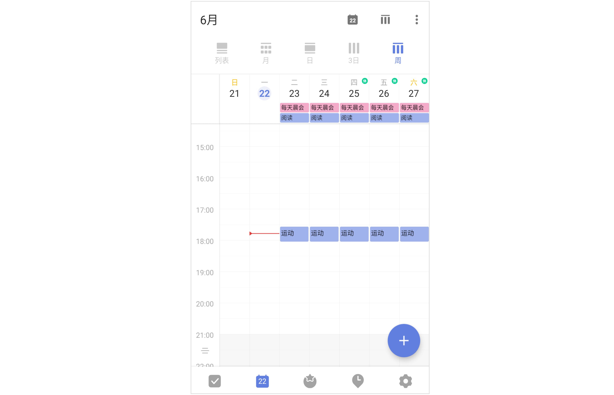

## 日历管理

「日历视图」可以帮助您更直观地查看自己的任务计划和日程安排。

在主界面底部 Tab 栏点击「日历」图标，即可进入日历界面。

### 5 种日历视图

进入日历，可以切换列表视图、月视图、日视图、三日视图和周视图，既可以直观显示月度计划，也能够轻松安排近日任务。

在列表视图界面，将日历上滑可切换到周视图，下方区域可以显示更多的任务。

### 快速安排任务

只需要在日历视图中从屏幕右侧边缘向左滑动，即可滑出「安排任务」区域。那些尚未设置日期的任务，将在此区域内展示。

点击底部的“筛选清单”，可选择特定清单下的任务进行安排。筛选完成后，回到日历视图。长按安排任务区域内的某个任务，将它拖拽到日历视图上来可自动设置日期和时间。

已经拖拽起来的任务，如果想要取消本次操作，可以将任务拖拽到右下角的「取消」区域。长按拖动已经在日历上的任务，选择合适的日期再松手，也可修改任务时间。完成后，向右滑动屏幕即可收起安排任务区域。

### 时间轴缩放
在时间轴日历视图中（日、三日、周），「双指捏合」或「双指张开」，即可更改时间轴的高度。双指捏合时，时间轴的高度变矮，您就可以在一屏内查看更多的任务；双指张开时，时间轴的高度变高，您就能看到更多的标题内容。

### 任务显示设置

在日历的列表视图中，点击右上角「···」-「显示设置」按钮，可以个性化设置日历中的任务显示。可以选择是否在日历中显示详细、子任务、已完成任务和所有重复周期。

「显示范围」可以筛选显示在日历中的清单、标签、订阅日历。
「颜色」：日历中任务块的颜色根据清单、标签、优先级显示。

