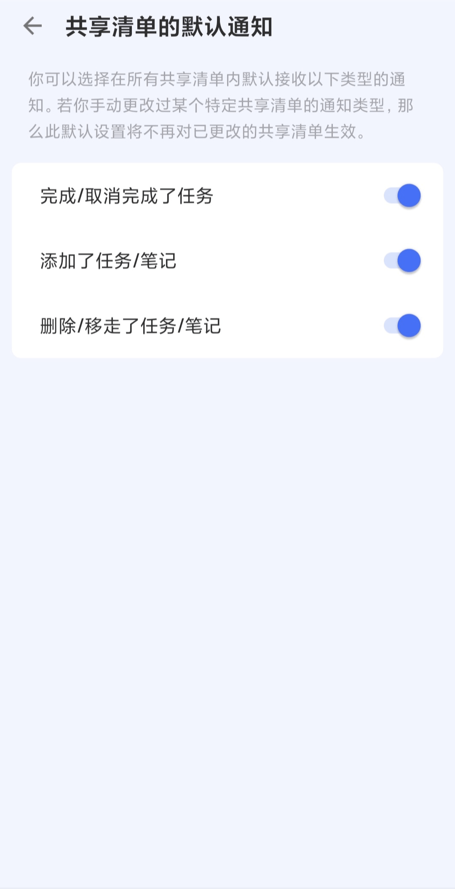
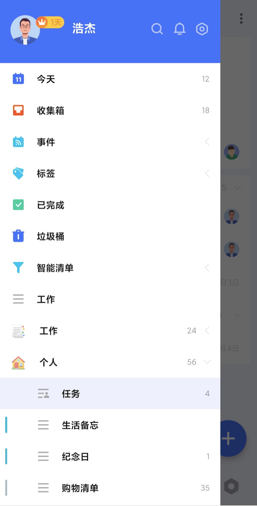
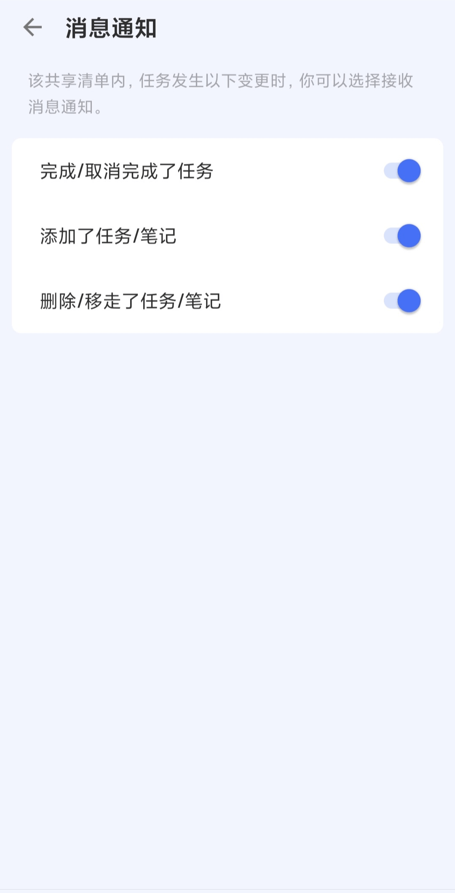

## 共享请通知权限

「滴答清单」支持给共享清单设置通知权限。在「设置」 - 「声音、提醒与通知」 - 「共享清单的默认通知」中可以开启「完成/取消完成了任务」、「添加任务/笔记」、「删除/移走了任务/笔记」等权限，开启之后权限会作用于所有共享清单。

开启之后其他成员在所有共享清单中进上述操作时，您会在 app 的通知中心内 - 「动态」内查看到通知内容。

您也可以单独给一个共享清单设置通知权限。在侧边栏长按该共享清单之后点击编辑按钮进入清单编辑界面 - 点击「消息通知」就可以单独给当前清单开启「完成/取消完成了任务」、「添加了任务/笔记」、「删除/移走了任务/笔记」等通知权限。

