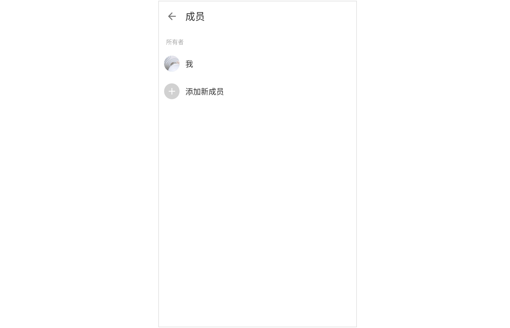
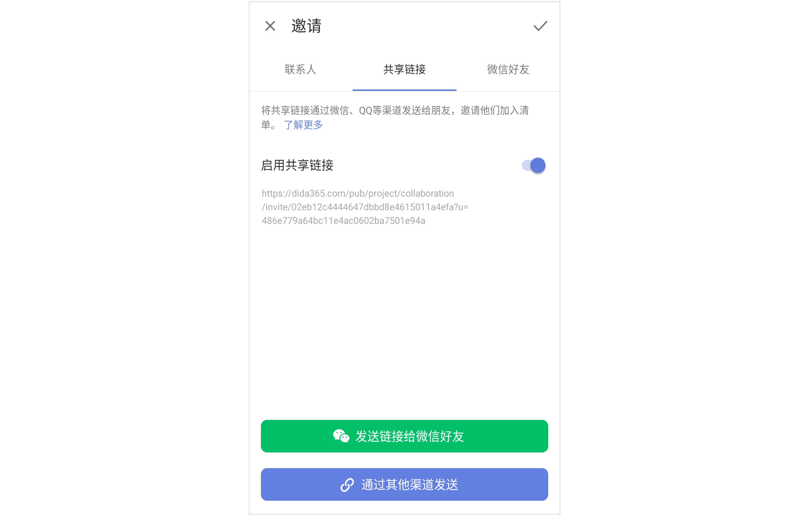

## 共享清单

滴答清单不仅能记录您的个人计划，还可以和他人共享清单，实现团队的共享协作。将清单共享给其他成员，所有成员都可以在清单内查看、编辑、添加和删除任务。

点击某个清单进入清单内任务列表页，点击右上角「···」-「共享协作」，选择邀请新成员即可。

邀请新成员有以下三种方式：

* **联系人邀请**：输入联系人电子邮箱或名字，回车即可发送邀请。没有注册过滴答清单的邮箱也可以，我们会将共享邀请发送至该邮箱，通过点击邮箱内的链接来激活共享。或者可以从最近邀请和团队成员里显示的联系人中选择一个或者多个进行邀请。
**共享链接邀请**：点击即可创建一个共享链接，可复制链接发送给其他人。好友确认后会发送一个申请加入清单的通知给您，只有您确认同意该申请之后，这个清单才被成功分享。
**微信好友邀请**：可点击「邀请微信好友」直接转跳至微信进行邀请，页而已通过二维码邀请好友加入。

以上三种邀请方式都可以对被邀请人进行权限设置，权限分为**可评论**、**只读**和**可编辑**三个层级。

