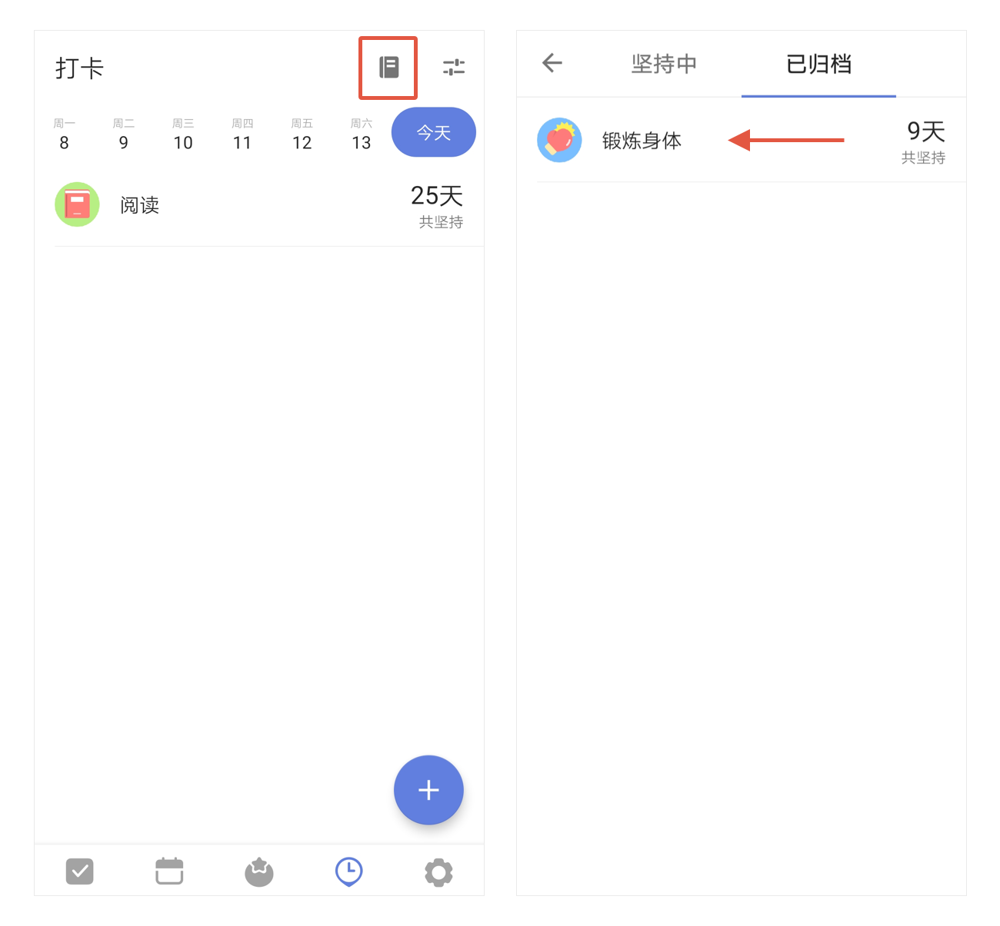

## 打卡

### 开启/关闭打卡

在设置中，找到「功能模块」的入口，点击进入后，开启「打卡」即可。

###添加习惯

点击右下角的「+」，即可添加习惯。如果「习惯库」中没有您需要的习惯，可以点击底部的「自定义习惯」。
`注：普通账户最多只可添加 5 个习惯，高级账户数量无限制。`

### 编辑习惯

将习惯向**左滑**即可编辑习惯，修改习惯**名称**和**鼓励语**，**图标**可进行选择或自定义。
可以设置习惯打卡的**频率**（可**按天**、**按周**和**按时间间隔**计算）和**提醒时间**（可以添加多个提醒）。可以按照**当天完成打卡**和**当天完成一定量**对习惯进行目标管理。
还可以单独对每个习惯设置是否**自动显示打卡日志**。

### 打卡归档

可以将暂时不需要打卡的习惯进行归档。
左滑习惯进入编辑页后，点击右上角的「···」，选择「归档」即可。

`注：如果选择「删除」，那么该习惯的所有打卡数据都将删除，且无法恢复。`

另外，可以点击打卡主界面右上角的图标，查看「已归档」的习惯，左滑该习惯可以**恢复打卡**。

### 打卡统计

可以点击习惯，在打卡动画界面中上滑，即可呼出该习惯的打卡统计。
`注：「今天」以前的日期都可以补卡。`

### 习惯显示 & 打卡日志

点击打卡主界面右上角的图标，可以设置打卡的**铃声**，是否**按完成状态分类显示**及选择是否在**日历**和**智能清单**“今天”、“最近7天”中显示。

