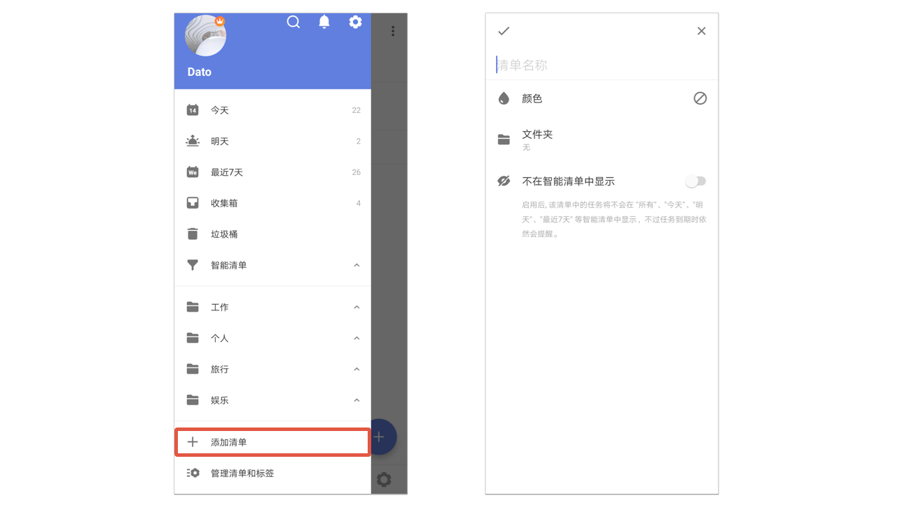
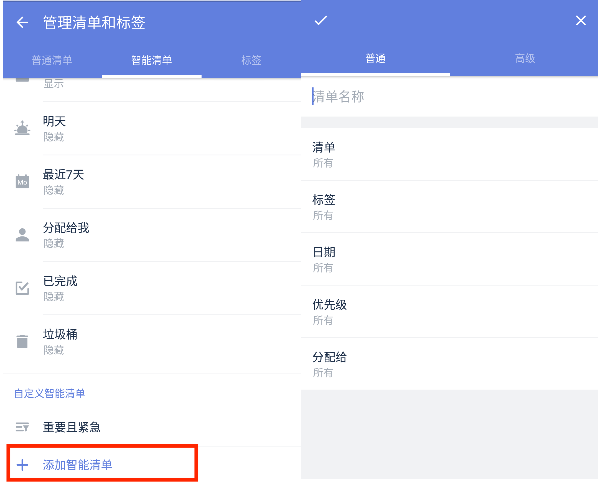
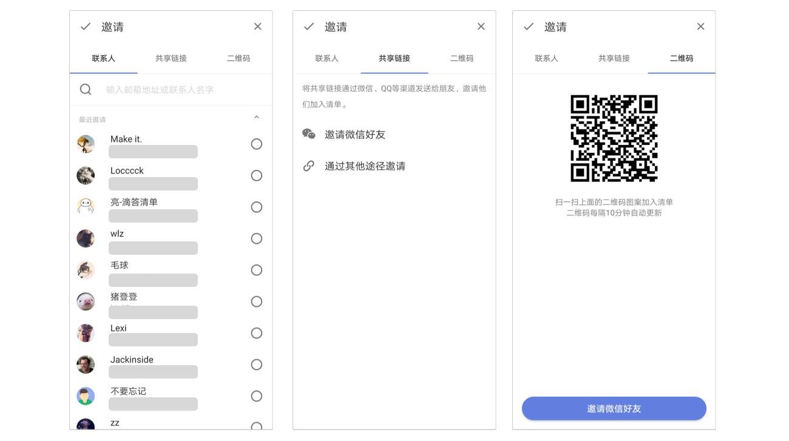

### 创建及管理清单

#### 新建清单

底部 TAB 栏点击「任务」图标，进入任务列表页面，点击侧边栏底部「添加清单」，即可创建一个新的清单。

您可以为清单命名，设置清单颜色，将清单添加到清单文件夹，也可以隐藏该清单。  `注：隐藏后，该清单的任务将不会出现在「所有」「今天」「最近七天」等智能清单中，但到期仍会提醒。`

 `注：滴答清单支持用 Emoji 创建清单名，同时可使用 Emoji 作为清单标识。`

#### 编辑清单

点击侧边栏底部「管理清单和标签」-「普通清单」，选择要编辑的清单，即可进入编辑界面，编辑该清单。
 

在侧边栏长按某个清单，放手后也可触发「编辑」/「删除」选项。

如果侧边栏清单过多，您可以将不常用的清单隐藏： 进入清单编辑界面，启用「不在智能清单中显示」即可。 `注：共享清单隐藏后，如果没有分配给你的任务，将不会出现在「所有」「今天」「最近七天」等智能清单中，到期也不会提醒。`

在编辑清单界面，点击右上角「···」按钮，可以选择「关闭清单」或「删除」清单。 
`注1：关闭后，任务不会再出现在智能清单，到期也不会提醒。`
`注2：删除清单将会同时删除清单下的所有任务。`

#### 自定义智能清单

左侧边栏底部，点击「管理清单和标签」-「智能清单」-「添加智能清单」。

可按**普通**方式添加，即可根据「清单」「日期」「优先级」「标签」「分配给」五个筛选条件对任务进行筛选条件，创建新的智能清单。  `当前没有带标签任务和共享清单时，「标签」和「分配给」不显示。`

也可按**高级**方式添加，即可根据「清单」「日期」「优先级」「标签」「分配给」五个筛选条件和「没有逻辑」、「且」和「或」三个逻辑进行筛选，创建新的智能清单。

你也可以对自定义智能清单进行编辑和删除。  `注：删除自定义智能清单，其中的任务不会被删除。`

##### 管理智能清单

当侧边栏中清单过多时，你可以选择将部分不常用的智能清单隐藏。  点击「管理清单和标签」-「智能清单」，可以对智能清单的状态进行设置。

* 显示：该清单始终显示在清单栏；
* 自动：当清单中有任务时，该清单显示在清单栏，清单中没有任务时，该清单不显示；
* 隐藏：该清单始终不显示在清单栏。
   `智能清单不能被分享、智能清单不能被排序。` 

#### 共享协作

如果您需要邀请他人协作，可以共享清单给他们。  在侧边栏中，点击清单进入清单编辑页，点击右上角「···」按钮 -「共享协作」-「添加新成员」，可以通过以下任一方法进行共享。

* **联系人邀请**：可搜索邮箱地址或联系人姓名，进行共享。通过邮件邀请：输入被共享人的邮箱地址，对方将收到分享邀请，通过点击邮箱内的链接来激活共享。
   `注：任意邮箱均可，未注册滴答的邮箱也可。`
* **共享链接邀请**：开启「启用共享链接」即可创建一个链接。直接选择发送链接给微信好友或选择通过其他渠道发送。好友确认后会发送一个申请加入该清单的通知到你的滴答清单账户。只有你确认同意该申请之后，这个清单才被成功分享。
* **微信好友邀请**：开启后可通过二维码邀请微信好友，或者可以直接转跳至微信进行好友邀请。
共享清单，可以对任务进行分配，指定任务的负责人或执行者。  共享清单的任何人都可以进行指派分配操作。被指派的人会在「通知中心」收到提醒。 点击任务进入任务详情界面，点击右上角「分配给」图标，选择分配的对象即可。  `注：一个任务只能指派给一个对象。`

详情请参照[共享和协作](../collaboration.md)。

#### 文件夹

随着清单增多，可以使用清单文件夹整理您的清单列表。

* 创建文件夹：长按一个清单拖动到另一个清单至重叠，松手后可以创建一个新的清单文件夹，输入文件夹名字即可。或者通过清单编辑界面中的文件夹来创建新的文件夹。 `可以直接拖动清单到文件夹，也可以拖动清单移出文件夹。`

* 编辑文件夹：在侧边栏中，点击「管理清单和标签」，进入「普通清单」列表，选择需要编辑清单文件夹，修改文件夹的名字。

* 解散文件夹：在侧边栏中，点击「管理清单」，进入编辑清单列表，选择相应文件夹-解散文件夹。 `解散文件夹不会删除文件夹中的清单，其中的清单会独立出来显示在左侧边栏。`

* 适用场景：  清单文件夹能够帮助您更好的管理清单。例如，购物文件夹中可以整理出超市购物清单、商场购物单、网购清单等；读书文件夹可以分出小说清单、学习书单等。将相同类型或者是同一项目的清单放在一个文件夹中，会让您的清单列表看上去更加整洁有条理。

#### 清单排序

在侧边栏中，智能清单、普通清单和自定义智能清单可以在自己的区域内直接拖动排序。

#### 分享清单

您可以将清单以及清单内的任务标题和时间分享出去，支持文本形式和图片形式，可以直接发给微信好友或发到朋友圈。 在侧边栏中，点击清单进入清单列表-点击右上角「···」-「分享」。

