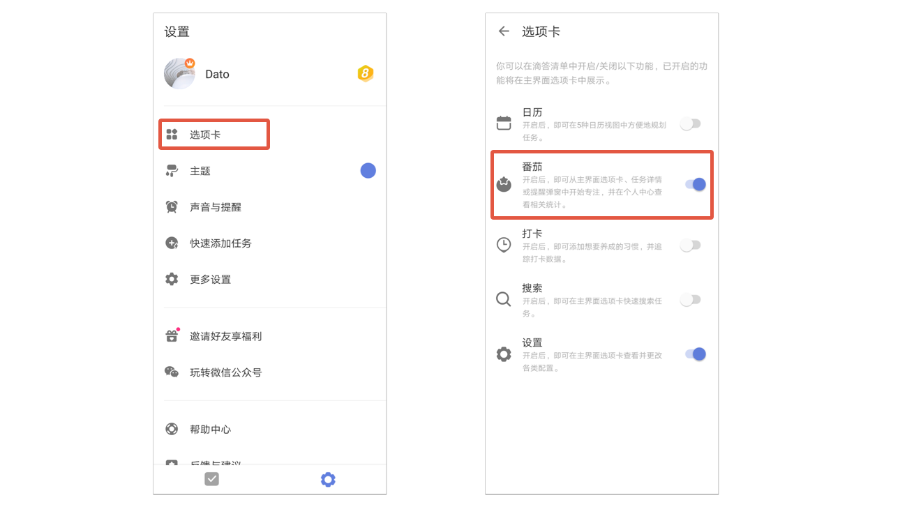
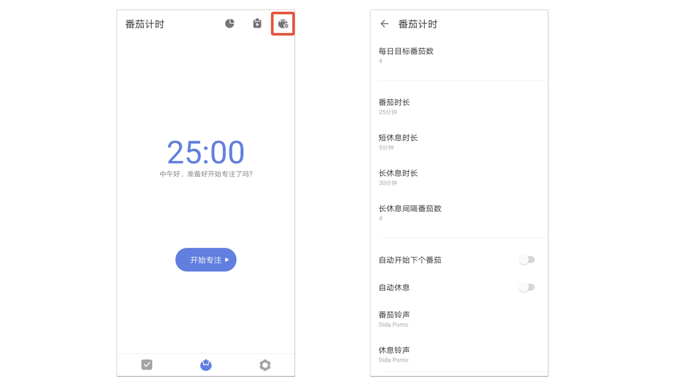
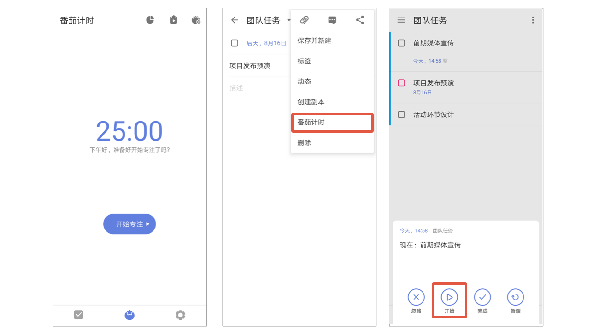
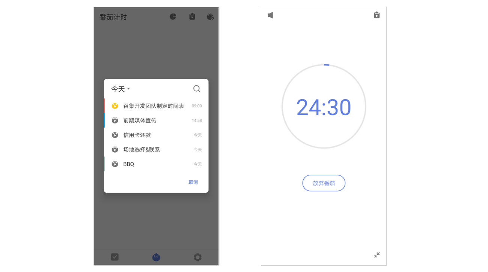
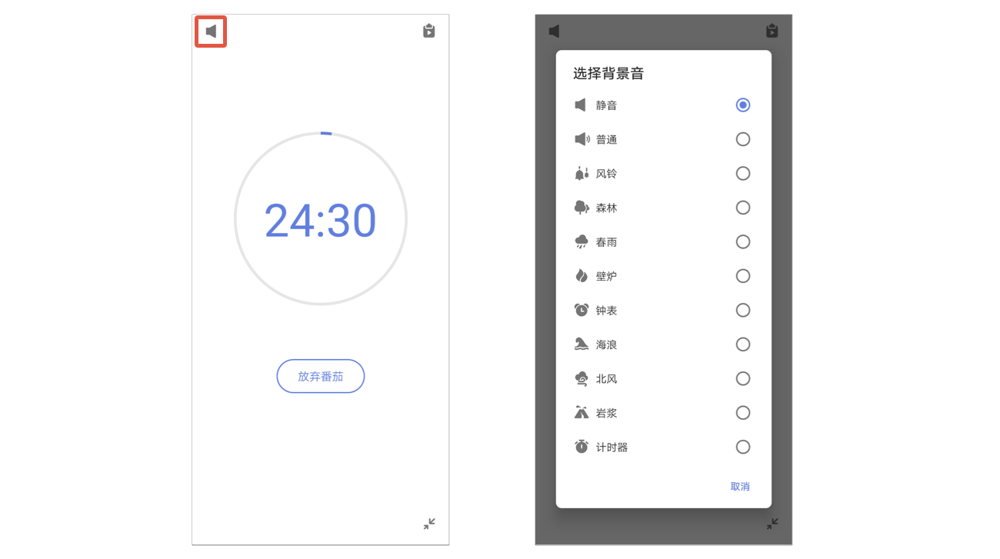
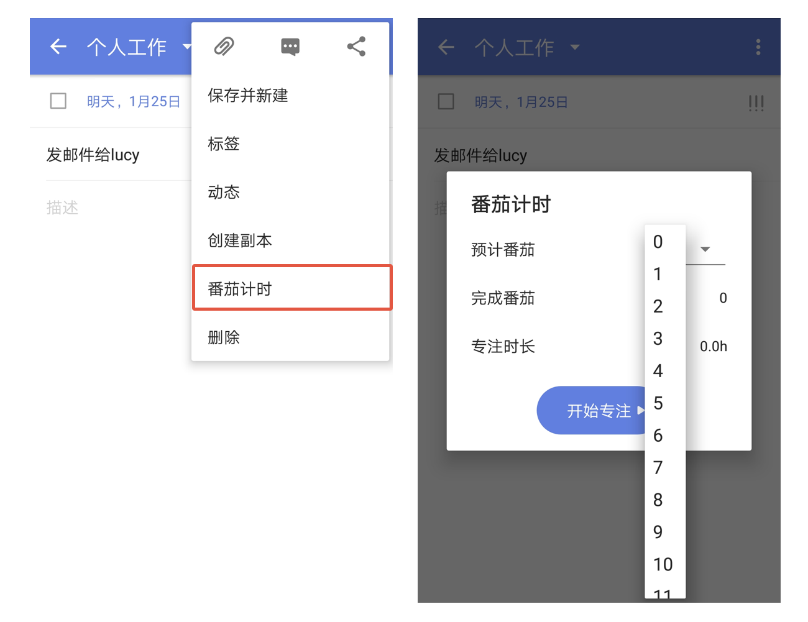

## 专注

#### 开启/关闭专注计时

在设置中，找到「功能模块」的入口，点击进入后，开启「专注」即可。

#### 更改专注计时选项

启用后，你可以在「专注」界面内，点击左上角切换按钮，可选择**番茄专注**或者**正计时**。点击右上角的设置按钮，然后对以下选项进行配置：

* **番茄时长**：每个番茄倒计时的时长。
* **短休息时长**：但番茄结束后，休息倒计时的时长。
* **长休息时长**：每完成一定数量的番茄后，进入长休息，长休息倒计时的时长。
* **长休息间隔番茄数**：每完成多少个番茄后，进入长休息。
* 开启/关闭“**自动开始下个番茄**”：休息结束后，自动开始番茄倒计时。
* 开启/关闭“**自动休息**”：番茄结束后，自动开始休息倒计时。
* **番茄铃声**：设置一个喜欢的番茄铃声。
* 开启/关闭“**屏幕常亮**”：倒计时过程中，阻止系统锁屏。
* **专注模式**：启用后，在番茄计时的专注进程中退出应用，将不会获得当前番茄。

#### 开始专注

启用「专注」后，你可以从主界面底部 TAB 栏、任务详情、提醒弹窗开始番茄。

* 主界面 TAB 栏：点击「专注」图标进入专注界面，点击「开始」进入专注状态。
* 任务详情：点击任务进入详情，在右上角「···」中点击「开始专注」可设置**番茄专注/正计时**、**预计时长**和**专注时长**，点击「开始」进入专注。
* 提醒弹窗：提醒响起时，点击提醒弹窗左下角「开始」图标，选择**番茄专注/正计时**进入专注。

#### 在专注过程中选择/更改任务

进入「专注」界面后，点击中部「专注」图标，可在弹窗内选择任务，即可在「专注」界面显示这条任务的标题。在选择任务的弹窗内，你可以

* 直接点击任务选中
* 点击弹窗左上角清单切换btn切换清单
* 点击弹窗右上角「搜索」直接搜索任务

#### 专注统计

进入「专注」界面后，点击右上侧「统计」图标，可分别按**概览**、**天**和**周**进行番茄数和专注时长的统计。

#### 番茄白噪音

在专注进行中，可以点击界面右上角白噪音图标，选择一个白噪音作为背景音播放，进而获得更好的专注体验。

专注背景音默认为无声音，专注进行过程中支持随时更换白噪音。

`注：一次只能选择一个白噪音，不可叠加多个声音。`

#### 最小化专注

在专注进行中，点击左上角按钮，可将专注计时最小化到底部TAB栏，方便临时添加任务或者在滴答中完成其他工作。

最小化后仍可以从主界面TAB栏上番茄图标的主题色动态环判断专注的状态。当一个番茄结束进入休息界面时，TAB栏上的番茄图标也会变成绿色，并且弹出休息提示弹窗。

#### 预计时长

为任务设置预计需要的时长，帮助更加合理的安排每日计划。进入任务详情页，点击右上角「···」图标，选择「开始专注」-「预计时长」，可设置预计的时长。

设置成功后，任务详情页内任务优先级的图标下方，以及清单列表页开启「显示详情」后，都会出现设置的预计番茄。

