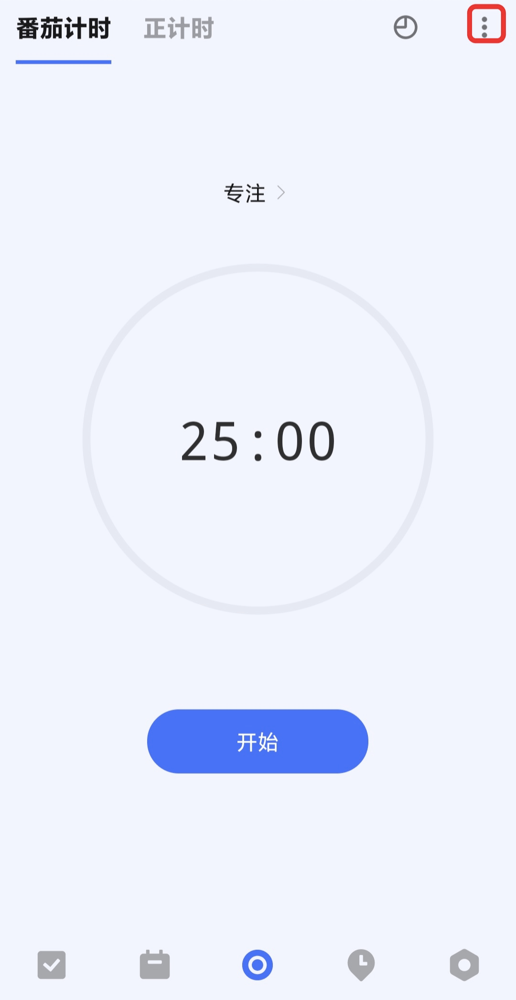

## 设置专注计时

### 开启/关闭专注计时

在设置中，找到「功能模块」的入口，点击进入后，开启「专注」即可。

### 更改专注计时选项

启用后，您可以在「专注」界面内，点击左上角切换按钮，可选择**番茄专注**或者**正计时**。

点击右上角的设置按钮，可对以下选项进行设置：

* **每日专注目标**：计划每天的番茄数和专注时长；
* **番茄时长**：每个番茄倒计时的时长；
* **短休息时长**：番茄结束后，休息倒计时的时长；
* **长休息时长**：每完成一定数量的番茄后，进入长休息，长休息倒计时的时长；
* **长休息间隔番茄数**：每完成多少个番茄后，进入长休息；
* 开启/关闭“**自动开始下个番茄**”：休息结束后，是否自动开始番茄倒计时；
* 开启/关闭“**自动休息**”：番茄结束后，是否自动开始休息倒计时；
* **番茄铃声**：设置番茄完成的提示铃声；
* **休息铃声**：设置休息结束番茄开始的提示铃声；
* 开启/关闭“**屏幕常亮**”：倒计时过程中，不会自动锁屏；
* **专注模式**：启用后，在番茄计时的专注过程中退出应用，将不会获得当前番茄。

