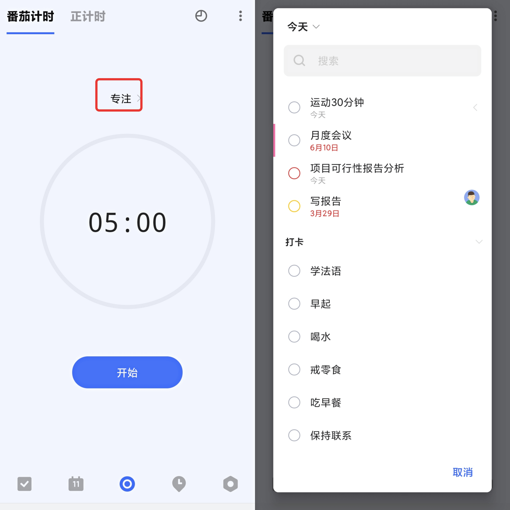

## 开始专注计时

启用专注后，您可以从主界面底部 TAB 栏、任务详情、提醒弹窗开始专注。
* **主界面 TAB 栏**：点击「专注」-「开始」进入专注。

在「专注」界面，您还可以选择需要进行专注计时的任务或习惯。
开始专注前，点击计时器上方的「专注」，选择需要进行计时的任务或者习惯，然后点击「开始」即可开始专注。

* **任务详情**：点击任务进入详情，点击右上角「···」-「开始专注」进入专注。

