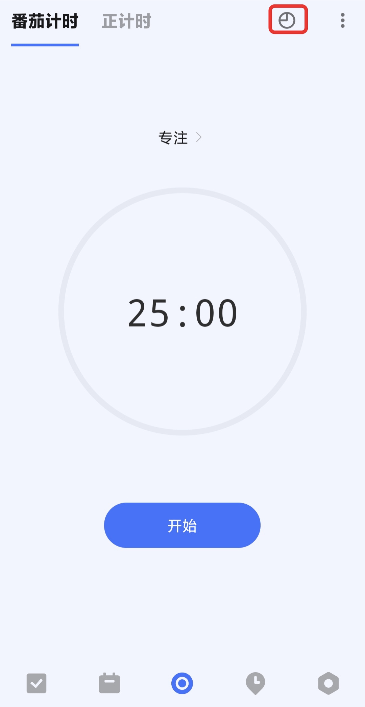
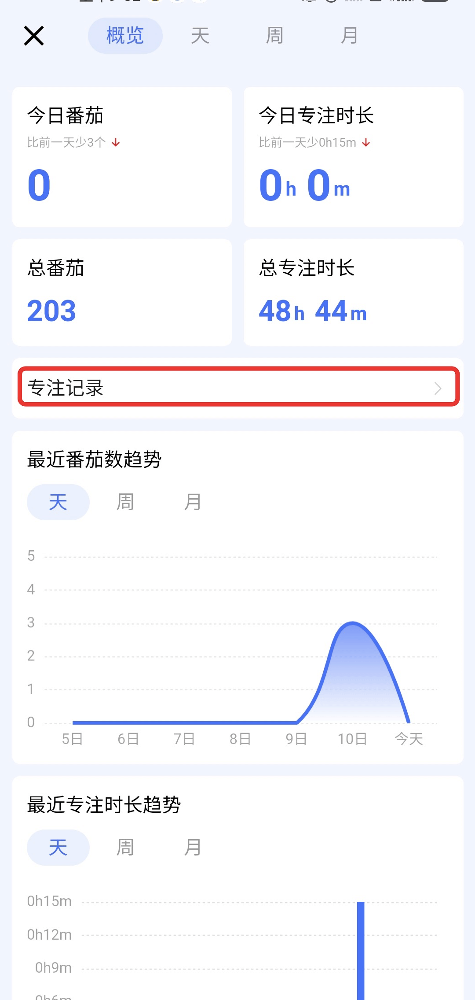
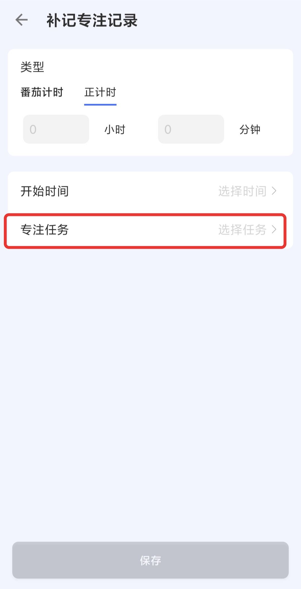

## 专注计时统计

### 统计
进入「专注」界面后，点击右上侧「统计」图标，可分别按**概览**、**天**和**周**进行番茄数和专注时长的统计。

### 编辑专注记录

在专注计时统计中，支持对最近7天的专注记录进行编辑。
在专注计时统计中，点击「概览」-「专注记录」进入专注记录界面。

### 添加专注记录

点击「专注记录」底部的「补记」，进入「补记专注记录」界面。
在该界面中，可以设置需要补记的专注记录类型、数量、开始时间和专注任务。

### 补记专注任务

在「专注记录」中，点击没有记录任务的专注时长进入详情，点击「选择任务」，可以重新为专注时长选择对应的任务。

### 删除专注记录

在「专注记录」中，点击需要删除的专注时长进入详情，点击右上角「···」-「删除」即可。

