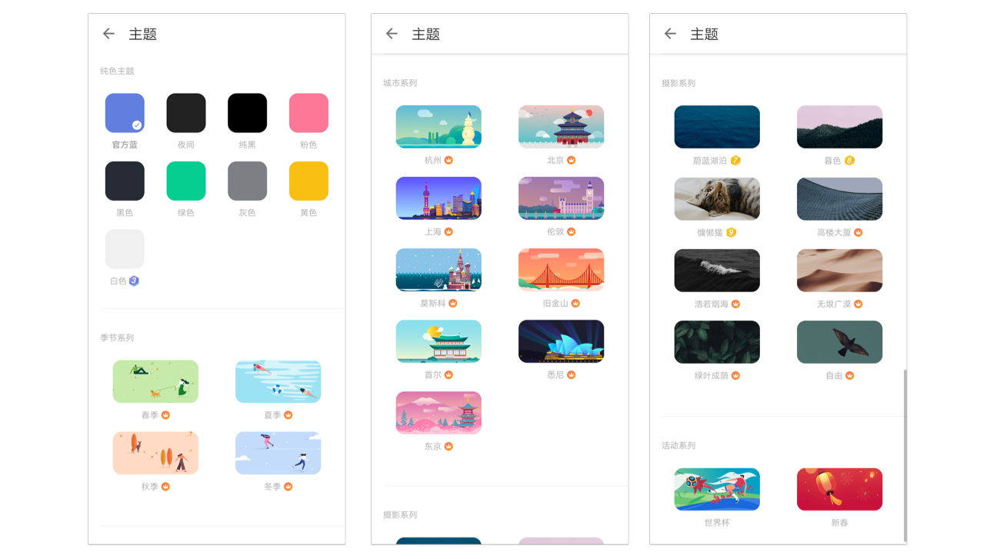

### 偏好设置

在主界面底部 TAB 栏点击【设置】图标，进入设置界面后点击【偏好设置】，进入偏好设置页面。你可以根据自己的使用习惯来进行设置，更加便于使用。

#### 语言

滴答清单默认跟随系统语言，如果您希望使用其他语言，可以手动选择。目前可以选择跟随系统、简体中文和英文。

#### 字体大小

滴答清单提供两种字体大小选择：【标准】和【大号】。 偏好设置页面点击【字体大小】并选择适合自己的字体大小。

#### 星期开始于

偏好设置页面点击【星期开始于】，您可以设置日历中的星期开始日期，目前有周六、周日和周一可以选择。

#### 农历与节假日

【农历】开关开启后，在日历中就会显示出农历日期。 【显示法定节假日调休】开关开启后，在日历中会显示节假日调休情况。

#### 完成提示音

默认任务打钩完成时是有提示音的，如果您不希望有提示音，也可以把【完成提示音】开关关闭。

#### 滑动选项

在偏好设置页面的【自定义配置】中，选择【滑动选项】来配置列表页滑动任务的快捷操作。

`注：如果未在应用内开启番茄计时功能，【开始番茄】选项也不会出现在滑动选项中。`

#### 更换主题

滴答清单包括【夜间】和【默认】在内的八种纯色主题，四种季节主题，九种城市主题以及三种摄影主题。  在主界面底部 TAB 栏点击【设置】图标，进入设置界面后点击【主题】，即可自由更换主题。  `注：季节主题和城市主题为高级账户功能。白色主题和摄影系列主题是拿成就值换取的，当你赚取越来越多的成就值，成就等级也会提升，就能领取对应的主题奖励`

