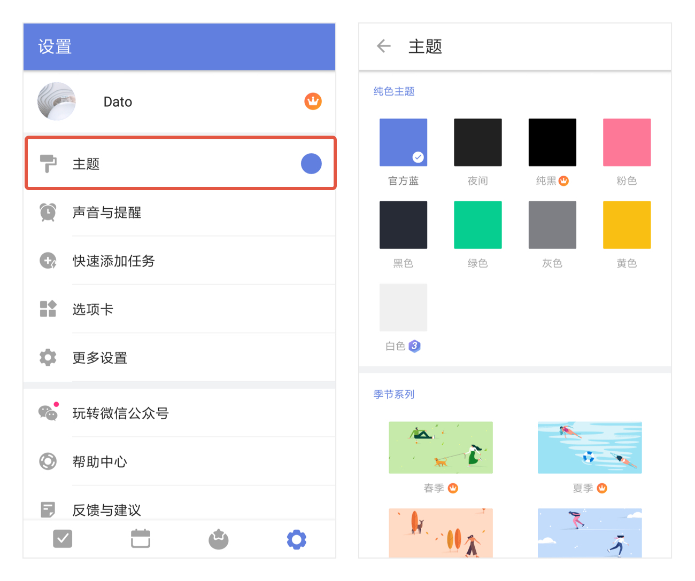
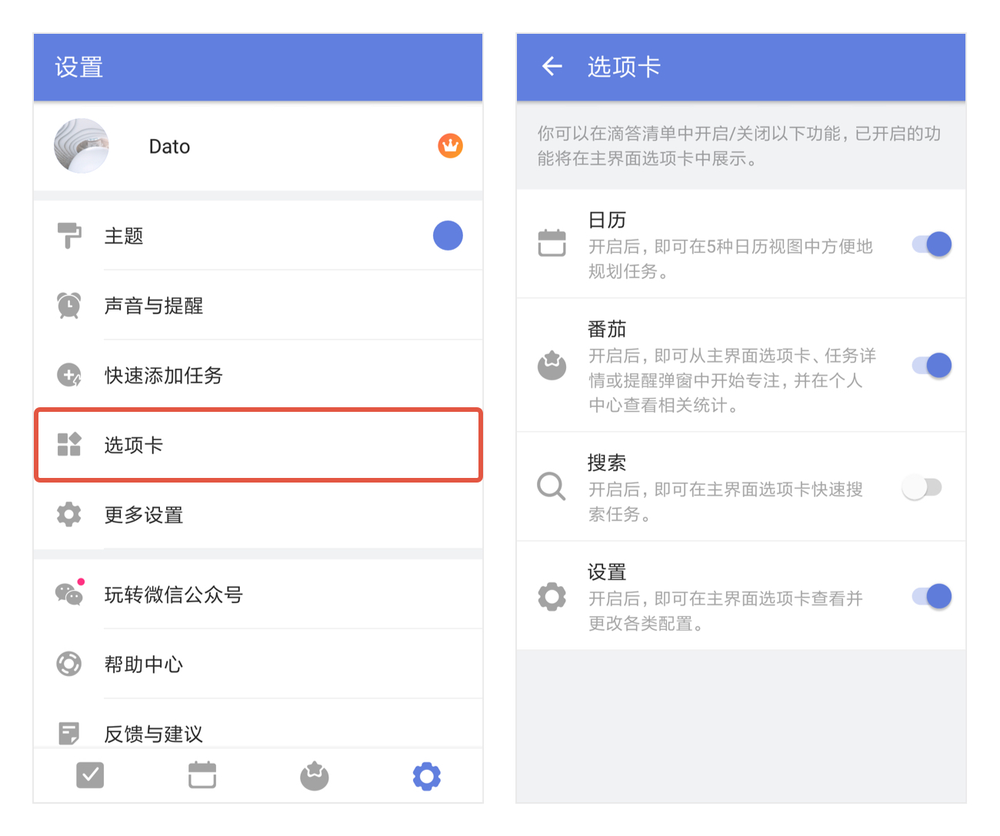

## 设置

在设置页，个人头像的下方，可以找到下列基础设置的入口：
####主题
点击进入后，可以对 App 主题进行设置。

####声音与提醒
与 App 的声音和提醒相关的设置都在这里，包括：每日提醒、铃声、振动等；如果您在使用中遇到了提醒的问题，也可以在「声音与提醒」页的底部找到「提醒不工作？」，进行简单的自我故障排查。

####快速添加任务
滴答清单提供了多种添加任务的方式，包括：快速添加、剪贴板、状态栏、悬浮球，还有智能识别。您可以根据需要自行进行设置。

> 注：如果您想要移除智能识别后的日期信息，请找到「快速添加任务」- 「智能识别」-「移除任务文本中的日期」，将其开启。

####选项卡
滴答清单主界面底部选项卡支持自行配置。只需要在设置中点击「选项卡」，即可根据需要在滴答清单主界面选项卡内启用/关闭以下功能：日历、番茄、搜索、设置。

