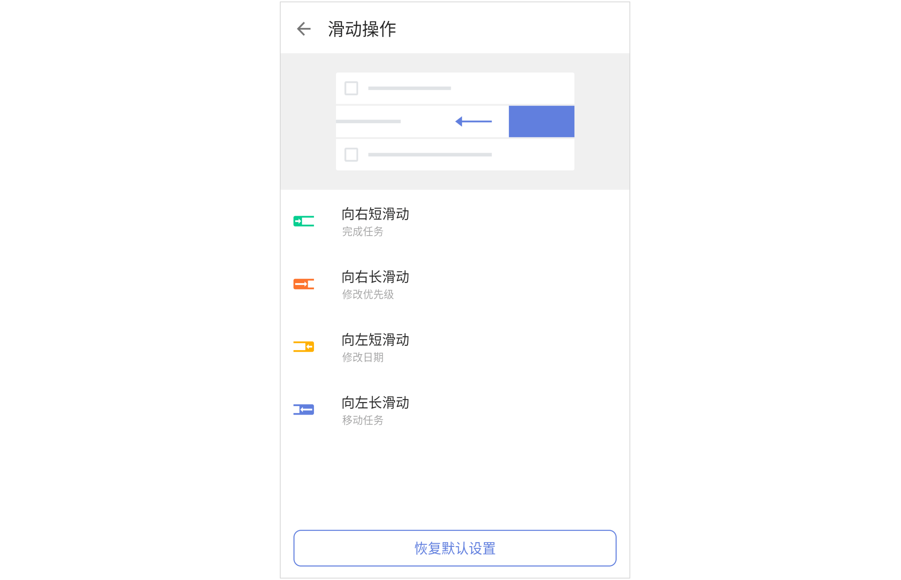

## 更多设置

在「设置」页中，点击「更多设置」，进行更多自定义设置。

### 语言

应用内语言默认跟随系统语言，您可以手动更改。目前支持选择跟随系统、简体中文和英文三种方式。

### 应用程序快捷方式

在主屏幕长按ICON可进行快捷操作，您可以在「更多设置」-「应用程序快捷方式」中配置常用的选项。
`注：最多可选择配置4个选项。Android 7 以上系统的手机才有该功能。`

### 智能识别

智能识别分为**日期识别**和**标签识别**。

#### 日期识别

**智能识别日期**：通过快速添加、语音输入等方式创建任务时，自动识别任务中的日期和时间信息并设置提醒。
**移除任务文本中的日期**：通过快速添加、语音输入新建任务时，移除任务详情中识别到的日期文本。
**规则示例**：展示「日期和时间」「重复」「提前提醒」「延后提醒」的智能识别规则及示例。

#### 标签识别

**移除任务文本中的标签**：通过快速添加新建任务时，移除任务标题中的标签文本。

### 快速添加任务

滴答清单提供了多种添加任务的方式，包括：快速添加、剪贴板、状态栏、悬浮球。您可以根据需要自行设置。

### 任务默认值

您可以对新任务的日期、日期模式、提醒时间、优先级以及默认添加到的清单等进行设置。设置成功后，添加新任务时将按照默认设置进行添加。

`注：新任务默认设置对应用、小部件和状态栏生效，但智能清单“今天”、“明天”、“最近7天”和日历不受默认日期的影响。`

### 上传/下载任务中的附件

您可以设置使用数据流量时，是否自动上传/下载任务中的附件。

### 模板

滴答清单提供不同类型的模版，您可以前往「设置」-「更多设置」-「模板」中开启此功能。开启后，您可以创建模板和从模板添加任务。

创建模板：在任务详情界面，点击右上角的「功能菜单」-「保存为模版」即可将某个任务保存为模板。保存后可选择从模版中添加新任务。

### 在手表中显示清单

可以选择在手表中显示清单的范围，包括：**今天**、**最近7天**、**所有**和**收集箱**。

### 手势密码
开启「手势密码」，为滴答清单设置一个手势密码，以后每次打开应用时需使用手势密码进行解锁。

### 滑动操作

在「设置」-「更多设置」中，选择「滑动操作」来配置列表页滑动任务的快捷操作。

### 高级选项

#### 后台纯净模式

在主界面底部 TAB 栏点击「设置」图标，进入设置界面后点击「高级选项」-「更多设置」，启用「后台纯净模式」。

开启后台纯净模式后，滴答清单将不再允许后台推送同步。为保障同步可用，滴答清单会定时拉取数据。如果您更新数据比较频繁，此模式可能会影响个平台间的数据同步，请谨慎使用。

#### 退出前提示

在主界面底部 TAB 栏点击「设置」图标，进入设置界面后点击「更多设置」，可选择启用「退出前提示」。开启「退出前提示」后，点击系统返回键退出应用时，需要再次点击确认退出，避免误触。 

