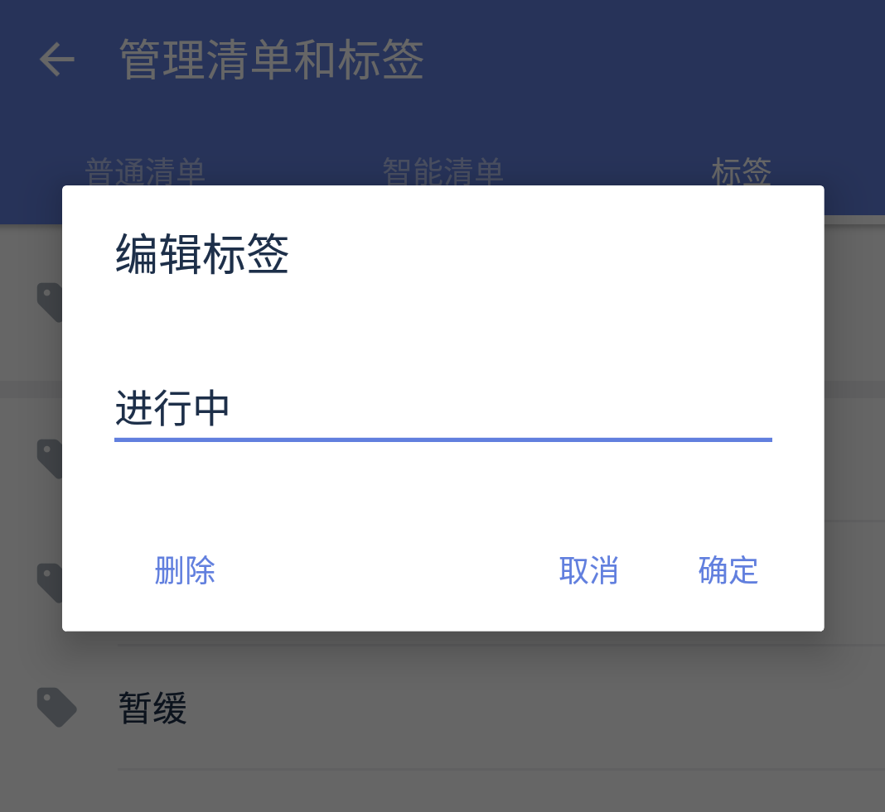

#### 标签的编辑与删除

当需要为标签编辑名字或删除时，可以在左侧边栏找到【管理清单和标签】-【标签】，然后选择【编辑】或【删除】。

`注：当“标签”处于自动状态时，将不会在侧边栏显示任务数为0的标签。` `注：标签颜色也可以在【编辑】中进行设置。`

 操作成功后，所有包含这个标签的任务都会对应更新。如果选择删除某标签，该标签会从之前所分配的任务中移除，任务并不会被删除。

`注：标签颜色也可以在【编辑】中进行设置。`

