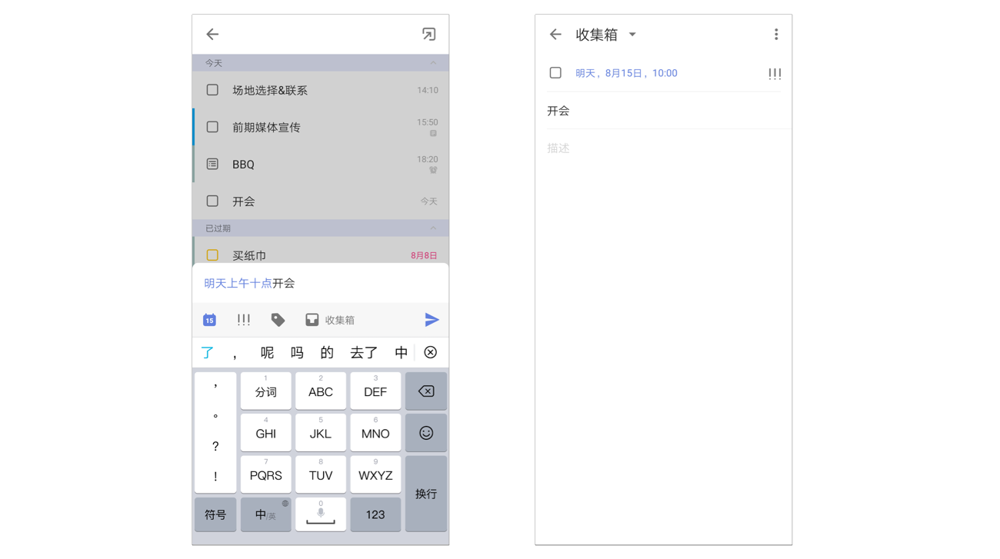
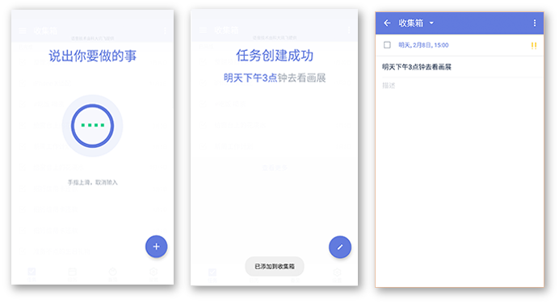
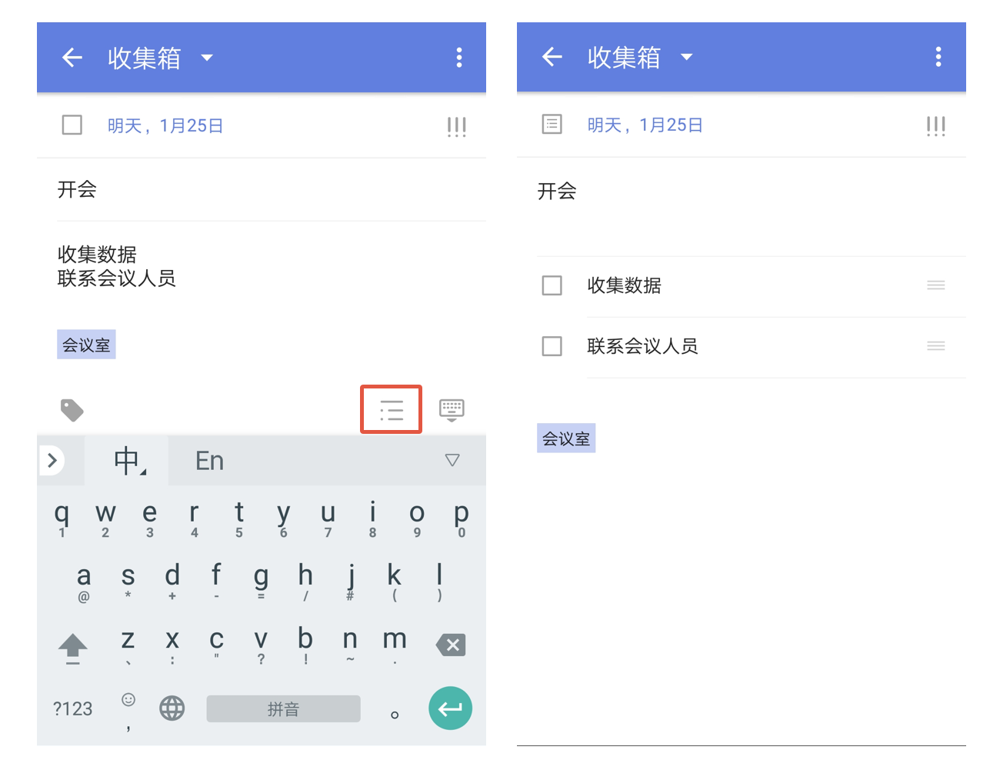
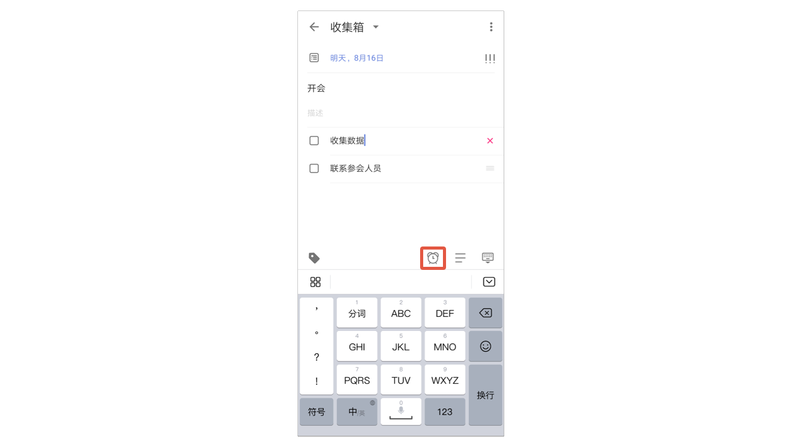

## 创建任务

滴答清单支持微信添加、邮箱添加、客户端添加、网页端添加多种任务添加形式。

#### 在客户端创建任务

【快速添加】默认开启，在清单列表页面点击“+”键，呼出快速添加条，输入任务内容并保存即可创建。

关闭【快速添加】，在清单列表点击“+”键，直接进入任务详情页创建任务。

`注：在主界面底部 TAB 栏点击【设置】图标，进入设置界面后点击【快速添加任务】，可以关闭【快速添加】。`

在智能清单中创建的任务将会归在收集箱中；如果你创建在其它非智能清单中，则会保存到对应的清单下。 `注：任务创建后，就会自动保存到滴答清单并同步到所有设备。`

你可以给任务设定[优先级](managetask.md)、[任务时间和提醒](task/reminder.md) 。

#### 自然语言识别

在主界面底部 TAB 栏点击【设置】-【快速添加任务】-【智能识别】，开启【文本输入识别】，可以在创建新任务时自动识别文本中的日期和时间，为任务设定到期日和提醒时间。

文本中不需要显示日期和时间，点击【设置】-【快速添加任务】-【智能识别】，开启【移除任务文本中的日期】即可。

#### 语音输入

长按右下角“+”号键进入语音输入状态。

常见界面如下图： 

* 智能识别时间信息：当语句中带有“今天3点”“明天下午”这样的时间信息时，可以智能识别出来，并为你创建带有这个时间的任务。
* 取消输入：如果不小心说错了，将手指上滑再松开，即可取消当前输入。
* 快速修改：提醒创建任务成功后，发现创建内容有误，可以点击屏幕中的【编辑任务】，即可进入任务编辑界面。如果在显示创建成功后2秒内无操作，视为识别无误。
* 创建失败：如果网络太差或者说话时间过短，会导致任务创建失败。

#### 子任务/列表任务

滴答清单支持文本任务和列表任务之间快速切换。点击紧贴键盘上方右边的的切换按钮，即可切换。  `注：子任务模式下，换行即创建了一条新的子任务。`

* 编辑和管理子任务：
   选择一条子任务，可以直接编辑，或者点击右边的「X」，将其整条都删除。
   按住右边的「≡」可以对子任务进行拖动排序。
   `注：高级账户每个任务不限子任务数（免费账户最多19个）。`

* 在子任务编辑栏中可以点击【时钟】按钮对子任务设置提醒时间。

### 添加附件

点击任务进入任务详情界面- 点击右上角图标-【附件】，即可上传：

* 相机：会打开你的相机，拍照结束后点击【使用照片】，将照片上传成附件。
* 图片 ：调用手机相册中的照片作为附件上传。
* 录音：会打开你的麦克风，录音结束后就会上传成为你的附件。
* 其他：可以上传doc、xls、ppt、txt、keynote等常用文档格式。

每个附件的大小限制为 10MB 。  `高级账户一天最多可上传99个附件（免费账户一天仅能上传1个)`

#### 微信创建任务

关注并绑定微信公众号，可以通过微信在滴答清单中创建任务。  更多与微信公众号相关的内容请参考 [5.微信公众号](../wechat.md)

#### 邮件创建任务

你可以通过发送邮件到指定邮箱来创建任务，如果邮件标题中带有时间或者重复信息，会智能识别并创建任务。

可以使用你的注册邮箱发送邮件到todo@mail.dida365.com , 或者任意邮箱发送邮件到您的专用的邮箱地址。

查看专用邮箱地址请登录网页版[滴答清单](https://www.dida365.com/)：左上角头像-【设置】-【日历订阅＆邮件】服务。

