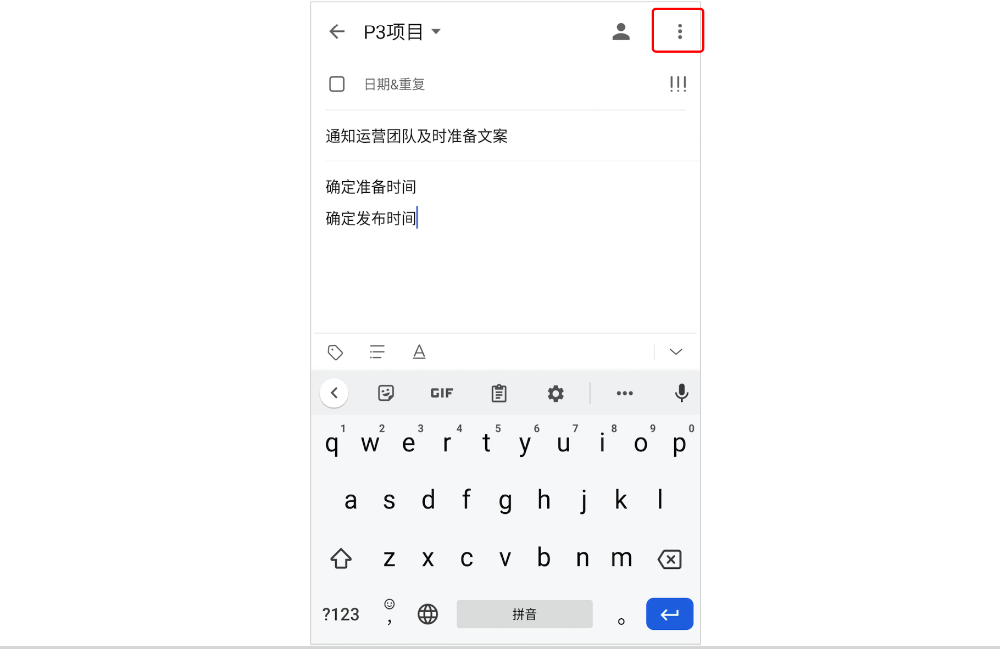
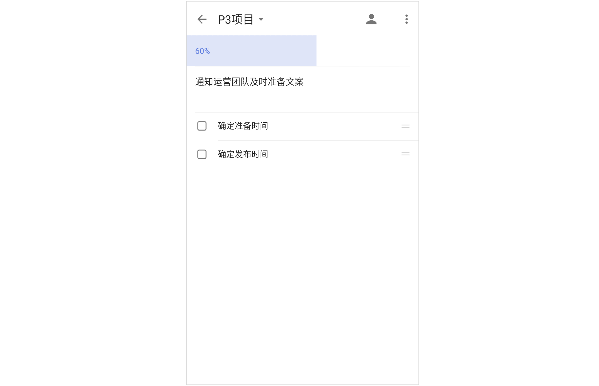
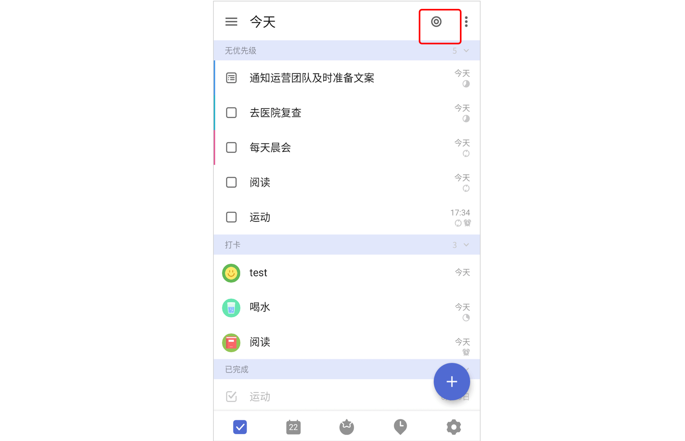
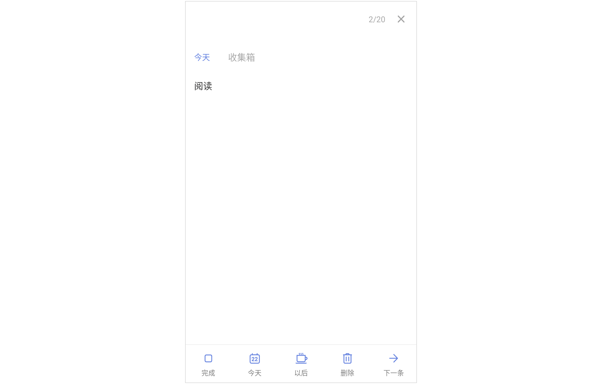
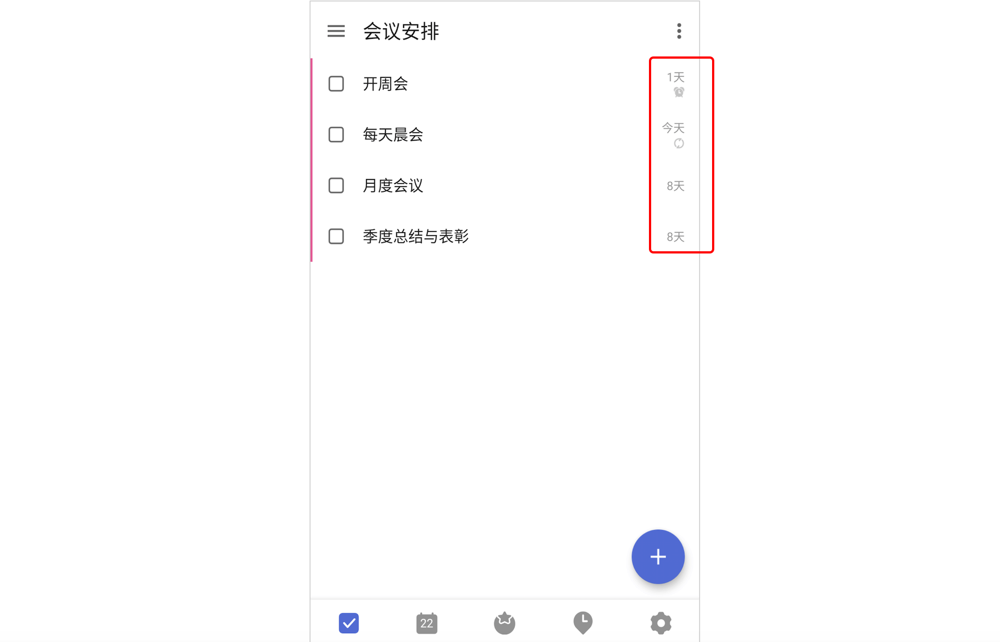

## 列表模式管理任务

在列表模式下，滴答清单为您提供了多种不同的方式来管理您的任务。

### 删除任务

进入任务详情页，点击右上角「···」，选择「删除」即可删除任务。如果误删，可以在页面下方的弹出框中点击「撤销」来恢复任务，也可以在左侧边栏中选择「垃圾桶」，在垃圾桶中选择要恢复的任务。 

### 任务排序

进入清单列表，点击点击右上角「···」选择「排序」，您可以按以下几种方式对任务进行排序。

* **按自定义排序**：该排序模式下，长按拖动根据自己的需求排序。
* **按时间排序**：该排序下会将任务按「已过期」「今天」「最近7天」「更远」区分排序。长按任务可以拖动排序，拖到对应的时间区域，智能设置时间。
* **按标题排序**：按任务标题的首字母排序。
* **按标签排序**：按任务所携带的标签进行排序。
* **按优先级排序**：该排序下会将任务按高、中、低、无优先级四个等级排序。长按拖动任务从一个等级区域到另一个等级区域，智能更改任务的优先级。
* **按指派人排序**：只在共享清单中会使用此种排序方式。为了合作完成某个项目而共享清单时可以使用这种排序方式，按任务的指派人排序，清晰明确每人的任务。
* **按清单排序**：只在智能清单、自定义智能清单以及清单文件夹「所有任务」清单中有「按清单排序」。方便区分个人任务和工作任务，同时可以了解各个清单下的任务情况。

### 搜索任务

在滴答清单中，可以搜索任务的内容、标题和标签。 在左侧边栏中，点击「搜索」图标，输入关键词或标签，即可对所有任务进行搜索。

也可以点击「设置」-「功能模块」- 「搜索」，即会在 Tab 栏中出现搜索图标。只要待完成任务和已完成任务的任务名称、任务描述、子任务中包含关键词，就会被搜索出来。

`注：在输入时，点击键盘上方左侧的标签图标，或在输入框输入「#」即可对标签进行搜索。`

### 滑动操作

支持在任务列表中左右滑动任务进行快速操作。滴答清单默认设置为：任务左滑，可以设置到期时间和移动任务到其他清单；任务右滑，可以选择归档或者设置优先级。

您也可以在「设置」-「更多设置」中，选择「滑动操作」来自定义列表页滑动的快捷操作。

### 批量操作

需要对较多任务进行相同的设置操作时，可以通过批量操作来进行。在清单中长按一条任务，任务前会出现小圆圈，点击选择需要编辑的任务，就可以对选中的任务进行以下批量处理：

* 修改到期时间；
* 移动到其他清单；
* 删除；
* 设置优先级；
* 发送；
* 合并任务。

合并任务后，原任务将作为子任务，任务名称默认为原任务名称，原任务将被删除，且不保存原任务的附件、评论和任务时间。带有不同时间的任务在批量修改到期日期后，仍会保持原有的时间。

### 分享清单内任务

进入任务详情页，点击右上角「···」，选择「分享」。 在弹出的界面选择分享形式和分享途径，确认发送即可。

### 隐藏已完成的任务

如果清单中任务较多，只想看到未完成的任务，那么可以选择「隐藏已完成」。进入清单，点击右上角「···」，选择「隐藏已完成」即可。 

可以在「已完成」清单中查看已完成的任务，也可以右上角「更多」按钮点击「显示已完成」，将已完成任务重新显示出来。

`注：「已完成」是智能清单，需要在「管理清单」-「智能清单」中开启「已完成」清单后才能查看。`

### 任务进度

进入任务详情页，左右拖拽日期栏，可对任务设置进度条百分比。如果是列表任务，会根据已完成子任务所占的比例自动计算任务进度。

### 任务动态

您可以在任务详情中查看任务动态，了解任务每一次改动的信息。滴答清单提供两种方式查看任务动态：动态概要和完整动态。

#### 查看动态概要

进入任务详情后，向上轻拉界面，即可在底部查看以下动态信息：

* 任务的创建日期；
* 任务的完成日期。

#### 查看完整动态（高级功能）

进入任务详情后，点击右上角「菜单」图标，点击「动态」即可进入完整的动态界面，您可以在这里查看以下动态信息：

* 任务的创建日期；
* 任务的标题/内容改动记录；
* 任务的日期改动记录；
* 附件的上传/删除记录；
* 指派人改动记录；
* 任务的完成日期。

### 今日任务计划

进入「今天」清单，点击右上角小圆圈，可以对到期日是今天的任务和已过期的任务和收集箱的无日期任务逐条进行处理。

在底部操作区有「完成任务」「今天」「以后」「下一个」按钮，可以修改任务的日期和时间。

### 任务倒数日模式

在「设置」-「更多设置」中 开启「倒数日模式」，然后在任务列表找到想要查看倒数日的任务，点击任务下侧的截止时间，会自动切换到任务倒数日。不需要时，可以再次点击任务下侧的倒数日，切换回截止日期。

