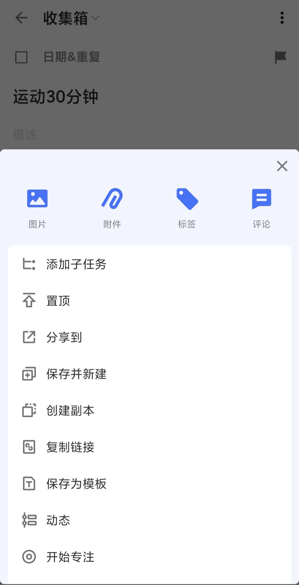
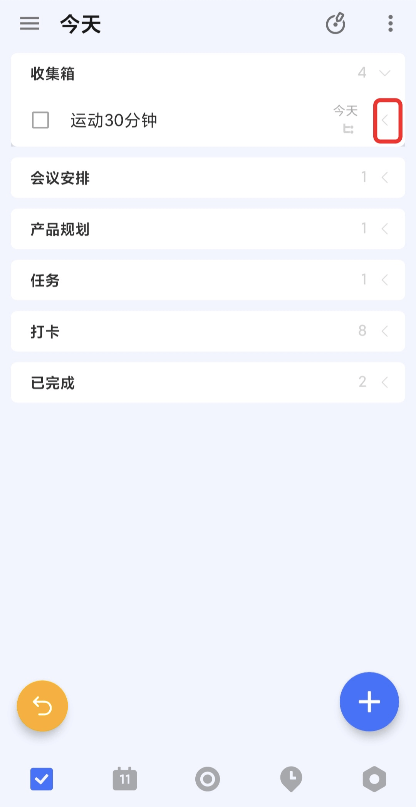

## 多级任务

在 Android 端，可以点击进入「任务详情」 - 点击右上角的「···」 - 点击「添加子任务」就可以添加子任务了。

可以在输入完第一个子任务之后点击「纸飞机」图标完成创建，或者点击键盘左下角的「换行」来完成创建当前子任务，并且可以继续创建第二个同级的子任务，如此往复。

可以点击进入「子任务详情」，点击「子任务详情」中的右上角的「···」 - 点击「添加子任务」就可以再次在子任务中添加子任务了，最多支持五个不同层级的任务。

可以在子任务详情中点击子任务标题上方的主任务标题来跳转到主任务详情。

在任务列表中，可以点击主任务右侧的箭头图标来展开或者收起任务下的所有子任务。

可以通过拖动加号键到任务下方偏右一点的位置来在这个任务下快速创建子任务。

`注：这一功能在「今天」、「最近七天」等智能清单中不可用，只可以在「收集箱」以及自己创建的普通清单中可用。`

每一个层级的子任务在功能上都与普通任务相同，即子任务可以设置时间和时间段、进行专注、在其下写任务详情、删除之后可以在「垃圾桶」中恢复、设置标签和优先级以及分配给其他人。