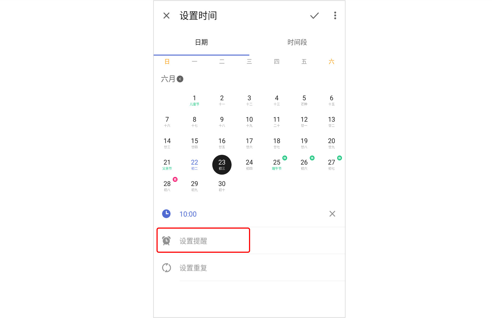

## 设置提醒

### 设置任务时间和提醒

为任务设置提醒时间后，滴答清单将按时提醒您，避免您错过重要的任务。

进入任务详情页，点击任务标题栏上方的「日期与重复」，设置好任务日期和时间后，设置提醒。您可以为单个任务设置多个提醒。滴答清单也支持自定义提醒时间：如提前 45 分钟、提前 4 小时等。 

### 清除任务提醒

若不需要任务提醒，您可以清除任务时间和提醒。 点击任务进入右侧详情页点击日期栏，选择「清除」即可，任务的日期/时间段/提醒都将被清除。

### 每日提醒

每日提醒会在每天的一个固定时间提醒您过期任务以及当天需完成的任务。 「设置」 -「声音与提醒」-「每日提醒」，选择您需要的提醒时间即可。

### 设置提醒铃声

在「设置」-「声音、提醒与通知」-「提醒铃声」中，选择适合的铃声即可。

同时，也可以在「声音、提醒与通知」中打开持续响铃。开启后，提醒铃声会持续播放一分钟直到您对任务进行操作。若没有处理任务，则第一次响铃结束后，间隔两分钟后会再次响铃。

### 提醒弹窗

「设置」-「声音、提醒与通知」-「提醒弹窗」，开启「提醒弹窗」，每次提醒时会弹出提示窗口。

### 提醒须知

设置的提醒时间到了但没有进行提醒，或者延迟提醒。通知中会显示“提醒不工作”，点击查看配置方法。或请参考滴答清单APP内：「设置」-「声音、提醒与通知」-「提醒没有生效？」。

