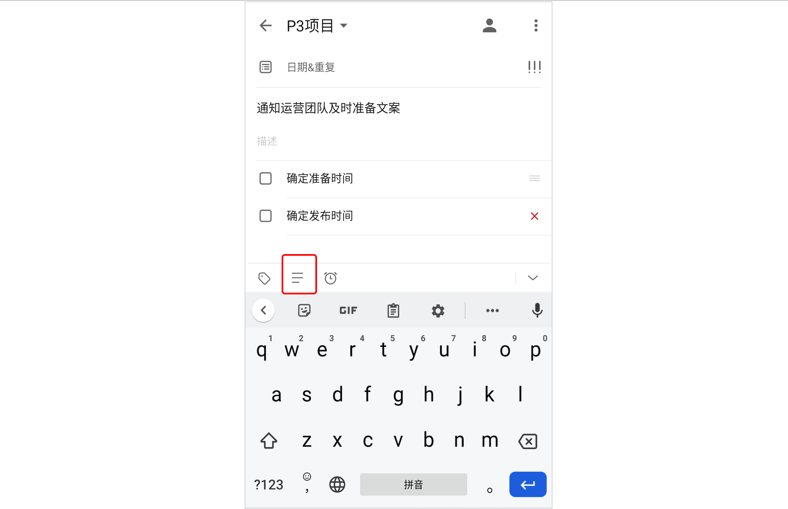
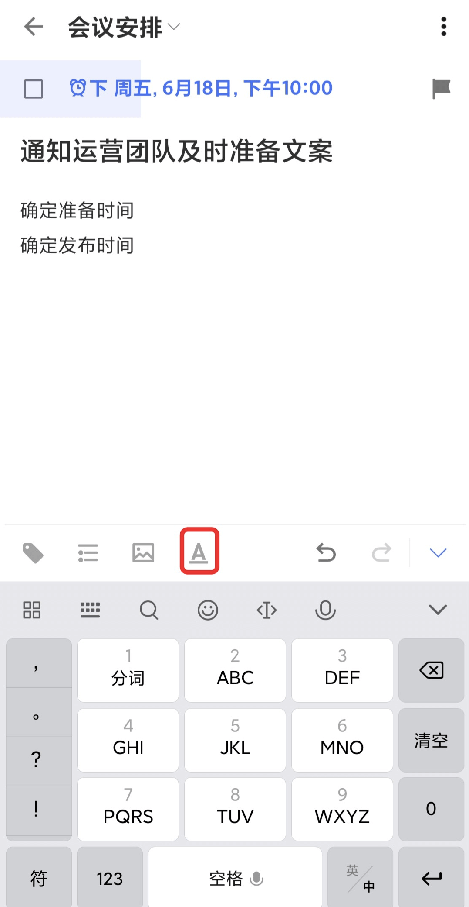

## 创建任务

滴答清单支持客户端添加、微信添加和邮件添加等多种任务添加形式。

### 在客户端创建任务

【快速添加】默认开启，在清单列表页面点击「+」，呼出快速添加条，输入任务内容并保存即可创建。您还可以给任务设定「优先级」和「任务时间和提醒]」 。

在「设置」-「快速添加任务」中可选择关闭「快速添加」。关闭后在清单列表点击「+」键，直接进入任务详情页创建任务。

#### 自然语言识别

在主界面底部 TAB 栏点击【设置】-【更多设置】-【智能识别】，开启【智能识别日期】，可以在创建新任务时自动识别文本中的日期和时间，为任务设定到期日和提醒时间。

文本中不需要显示日期和时间，点击【设置】-【更多设置】-【智能识别】，开启【移除任务文本中的日期】即可。

#### 语音输入

长按右下角「+」键进入语音输入状态。

* 智能识别时间信息：当语句中带有“今天10点”“明天上午”这样的时间信息时，可以被智能识别出来，并为您创建带有这个时间的任务。
* 取消输入：如果不小心说错了，将手指上滑再松开，即可取消当前输入。
* 快速修改：提醒创建任务成功后，发现创建内容有误，可以点击屏幕中的「编辑任务」，即可进入任务编辑界面。如果在显示创建成功后2秒内无操作，视为识别无误。

#### 任务文本内容与检查事项切换

滴答清单支持任务文本内容和检查事项之间进行切换。点击紧贴键盘上方右边的的切换按钮，即可切换。在检查事项模式下，换行即可创建一条新的子任务。

编辑和管理检查事项：
*  选择一条检查事项，可以直接进行编辑，或点击右侧的删除按钮，可将整条任务都删除；
*   长按右边的「≡」可以对检查事项进行拖动排序；
* 	在检查事项编辑状态下键盘上方点击**时钟**按钮可以对检查事项设置提醒时间。
 

#### 使用 Markdown 编辑任务描述

在任务详情界面，点击 Markdown 入口「<u>A</u>」即可使用 Markdown 功能进行编辑。

该功能支持加标题、加粗、高亮、斜体、下划线、删除线、加备注、左右缩进等文本格式，还支持多种方式添加有序列表。不仅可以添加外部链接，还可以在任务内关联其他任务以便快速跳转。

#### 添加附件

点击任务进入任务详情界面，点击右上角「···」，选择「附件」，即可上传：

* 相机：打开您的相机，拍照结束后点击「使用照片」，上传照片成为附件。
* 图片 ：调用手机相册中的照片作为附件上传。
* 录音：会打开您的麦克风，录音结束后音频文件就会上传成为您的附件。
* 其他：可以上传doc、xls、ppt、txt和keynote等常用文档。

`注：每个附件的大小限制为 10MB 。 `

### 微信创建任务

关注并绑定”滴答清单“微信公众号，可以通过微信公众号在滴答清单中创建任务。  更多相关的内容请参考 [玩转微信公众号](../wechat.md)。

### 邮件创建任务

您可以通过发送邮件到指定邮箱来创建任务，如果邮件标题中带有时间或者重复信息，会被智能识别并据此创建任务。

可以使用您的注册邮箱发送邮件到todo@mail.dida365.com，或者使用任意邮箱发送邮件到您的专用邮箱地址。

查看专用邮箱地址请登录网页版[滴答清单](https://www.dida365.com/)：点击左上角头像进入「设置」，在「日历订阅＆邮件」中查看。

