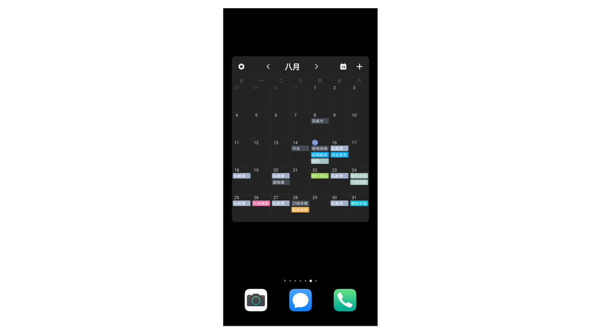
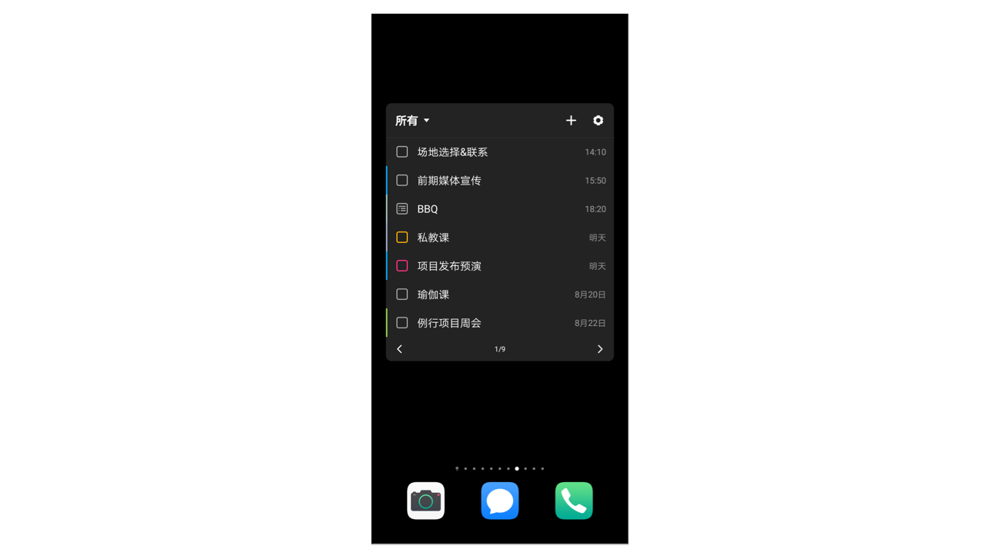
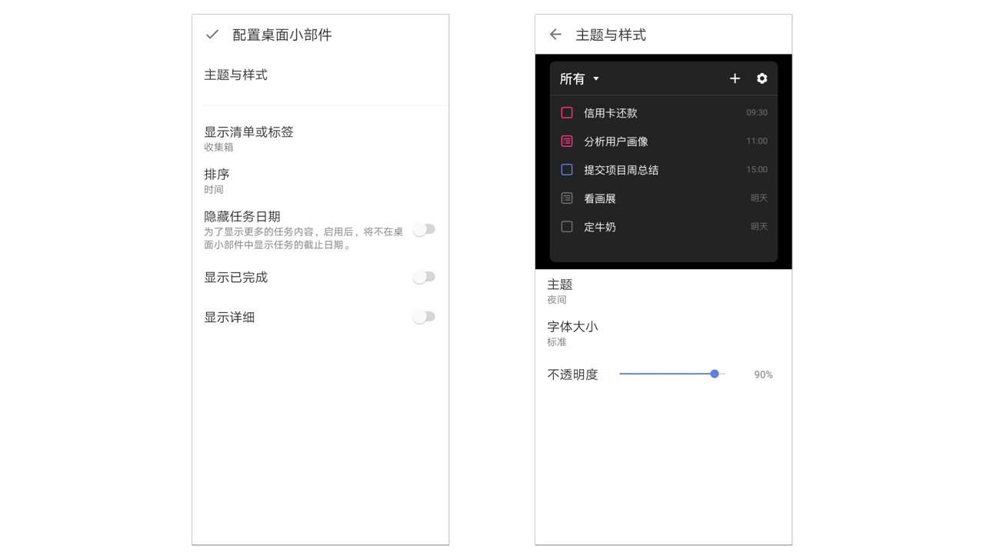

## 桌面小部件

滴答清单提供9种不同的桌面小部件。

* 滴答清单 （周）

* 滴答清单 （月）

* 滴答清单 （时间轴）

* 滴答清单 （标准）

* 滴答清单 （紧凑）

* 滴答清单 （翻页）

* 滴答清单 （角标）

* 滴答清单（番茄）

* 滴答清单（今日习惯）

您可以根据自己的喜好，使用习惯和桌面空间来自行选择。

### 配置桌面小部件

当您选中某个桌面小部件后，可以先对其进行配置。每个小部件配置的选项都不太相同。

时间轴（可选择**日试图**和** 3 日试图**）、周、月这三个小部件的设置选项如下：

* 主题：现在有夜间、白色、官方蓝、暗夜橙、粉色、黑色、绿色、灰色、黄色这九种主题可供选择；
* 字体大小：可以选择标准和大号两种字体；
* 不透明度：0~100 区间任意调整；
* 筛选：可以根据清单、标签和日历来筛选小部件中所显示的任务；
* 农历：默认关闭，开启后会在小部件上显示农历日期；
* 显示已完成：默认关闭，开启后会在小部件上显示已完成任务；
* 显示法定节假日调休：在滴答清单（月）小部件的设置中可以选择是否显示节假日调休；
* 开始于和结束于：在时间轴小部件中可以选择时间轴的开始和结束时间；
* 显示所有重复周期：可以设置是否显示未来的重复周期任务。

标准、紧凑和翻页这三个小部件的设置选项如下：

* 主题和样式：可以设置主题和字体大小，调节透明度；
* 显示清单或标签：按清单或标签筛选想要显示的任务；
* 排序：选择任务排序的方式；
* 隐藏任务日期：为了显示更多的任务内容，可以选择隐藏任务日期；
* 显示已完成：标准和翻页小部件中可以选择是否显示显示已完成任务；
* 点击任务：在紧凑小部件中可以选择点击任务后是打开清单还是打开该任务详情页，标准和翻页小部件中点击任务就是打开任务的详情页。

### 滴答清单（角标）和滴答清单快捷方式的区别

滴答清单（角标）上会显示一个数字，代表您当前已过期以及今天待完成的任务数；最大显示数值为9；若您当前已过期加上今天待完成的任务数超过9时，则会显示9+。而滴答清单快捷方式仅仅在桌面上提供一个快捷操作的图标。

### 小部件列表中没有滴答清单

为确保桌面小部件的运行，首先您需要将滴答清单应用安装在手机内存里，而不是SD卡上。如果桌面小部件偶尔消失，您可以尝试重启手机。

