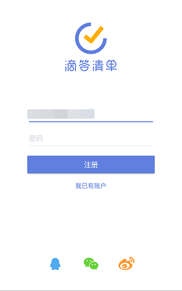
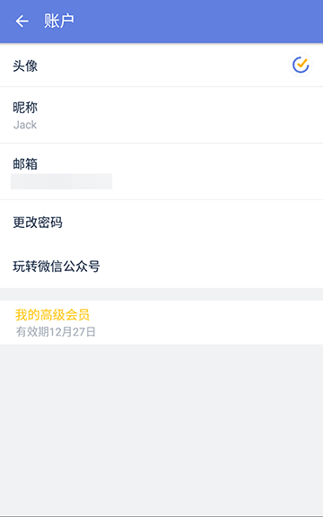
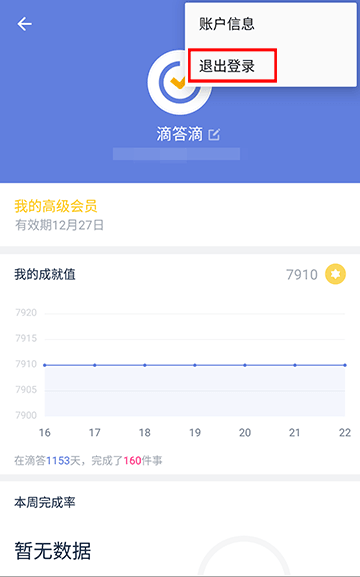
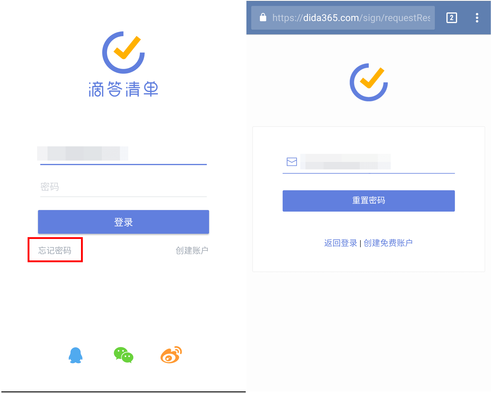

##账户

####注册和登陆
* 注册

您可以使用邮箱注册滴答清单，还可以通过 QQ 、微信、新浪微博账号登录到滴答清单。
 还没有滴答清单帐户吗？[立即免费创建](https://dida365.com/signup)

* 登录

若您已有滴答账号，可以直接输入邮箱及密码登录，也可以 QQ 、微信、新浪微博登录。

* 绑定

如果你使用 QQ 、微信、新浪微博账户登录滴答清单，可以绑定您的邮箱：
 点击头像-【账户信息】，选择邮箱，即可按提示绑定邮箱。

若您使用邮箱登录，可以绑定微信，就可以使用滴答清单的微信服务，及微信登录。
 点击您的头像-【账户信息】-玩转微信公众号，按照提示绑定微信即可。
 `注：滴答清单目前无法绑定 QQ 号和新浪微博账号。`

* 退出登录

如果你需要退出登录，点击头像-【账户信息】，点击右上角「更多」按钮，选择【退出登录】即可。

* 免费帐户

通过以上方式注册的滴答账户均为免费账户，任何人都可以免费创建滴答清单帐户。
 免费帐户可以使用这篇指南中介绍的所有核心功能和更多其他功能。

* 高级帐户

滴答清单高级帐户有诸多专享功能，能帮你更好的使用滴答清单，支持按月订购和按年订购。
 要了解滴答清单高级帐户专享功能详情，请访问[滴答清单高级帐户页面](https://www.dida365.com/about/upgrade)。

####忘记密码
如果您忘记了登录密码，点击登录框下方的忘记密码，或者[忘记密码?](https://www.dida365.com/sign/requestRestPassword)

在打开的网页中输入你的注册邮箱，点击重置密码。
 去你的注册邮箱查收邮件，按照邮件里的指示重新设置密码即可。

####个人设置

* 上传头像

上传一个具有辨识度的头像代表自己。
 点击头像-【账户信息】-【头像】，支持拍照和本地照片。
 `上传头像时，请保持网络通畅。上传不成功请多试几次。`

* 修改昵称

设置一个昵称，可以更加方便你的好友或者家人在共享清单中认出你。
 点击头像-【账户信息】-【昵称】，输入您的昵称即可。

* 修改邮箱

点击头像-【账户信息】-【邮箱】，即可输入您的新邮箱地址。

* 修改密码

点击头像-【账户信息】-【更改密码】。输入您的当前密码和新密码，即可成功修改。

