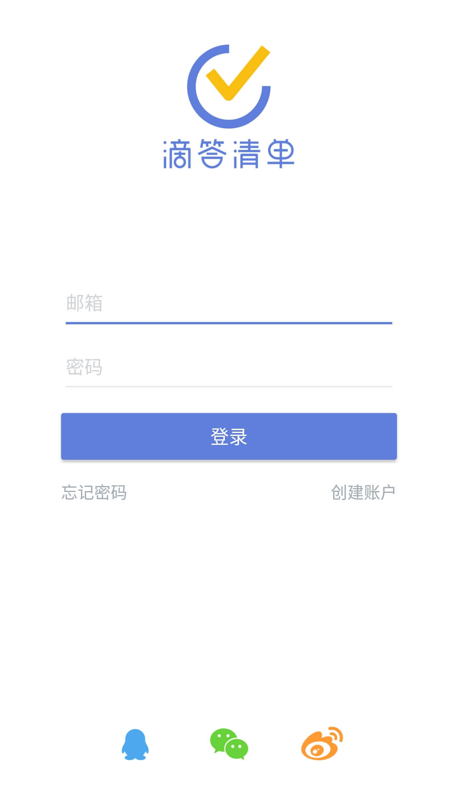

##账户

####注册新的账号
 除了可以使用邮箱注册，还可以通过 **QQ 、微信、新浪微博**等第三方账号登录滴答清单。
 还没有滴答清单帐户吗？[立即免费创建](https://dida365.com/signup)
 滴答清单为你提供两种帐户选择：免费帐户和高级帐户。

 **免费帐户**
 任何人都可以免费创建滴答清单帐户。免费帐户可以使用这篇指南中介绍的所有核心功能和更多其他功能。

 **高级帐户**
 滴答清单高级帐户有诸多专享功能，能帮你更好的使用滴答清单，支持按月订购和按年订购。
 要了解滴答清单高级帐户专享功能详情，请访问[滴答清单高级帐户页面](https://www.dida365.com/about/upgrade)。

####登录
为了保证你的任务信息和数据能够实时同步，请保持你的账户处于登录状态。
 `TickTick的登录界面和滴答清单是不同的，若登录页显示的是TickTick，说明您使用的不是滴答清单。`
 点击登录界面左上角的【试用】，可以跳过登录，进入试用。

####退出登录
如果你需要退出已登录账户，点击你的账户信息，点击右上角选择【退出登陆】。

####忘记密码
点击登录框下方的忘记密码，或者[忘记密码?](https://www.dida365.com/sign/requestRestPassword)

 在打开的网页中输入你的注册邮箱，点击重置密码。
 去你的注册邮箱查收邮件，按照邮件里的指示重新设置密码即可。
