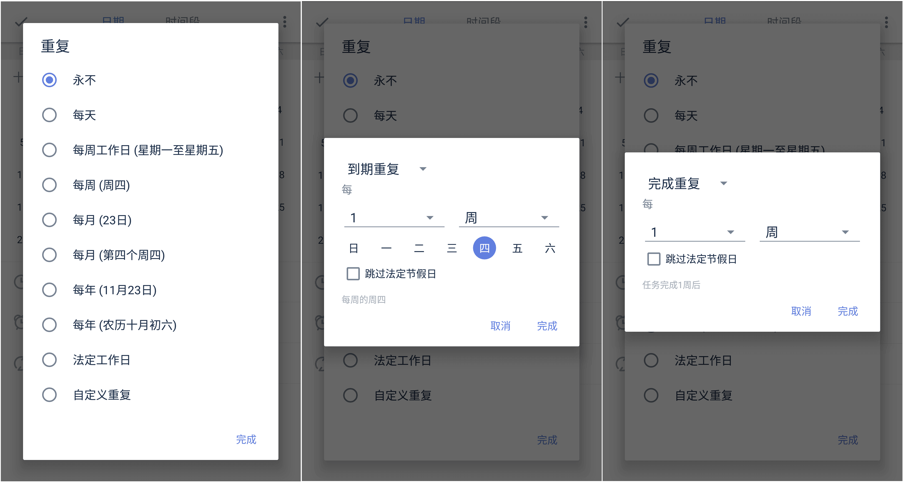

###设置重复

当任务是每天、每月或者是每年重复出现时，可以将其设置为重复任务。

进入任务详情页，点击日期栏，跳转页面中选择【设置重复】，可以根据需求快速选择按每天/周/月/年等周期来重复。

若默认重复中没有您需要的重复周期，您可以点击【自定义重复】，【自定义重复】中有两种不同的重复类型：
* 按到期时间重复：是指当前时间到达设置的时间就会提醒的重复，不会因为完成进度而变化。
 `例子：小明需要每周五下午安排下周工作，所以设置一个每周五下午都会提醒的到期重复。`
* 按完成时间重复：是指上次任务完成后再开始计算下次提醒时间的重复，再次提醒的时间会因为自己所完成的时间而改变。
 `例子：小明想要每三天去一次健身房跑步，这一次是星期二，那么下一次会在星期五提醒他；但他星期五没有去，在星期日完成了这个任务，那么下一次的提醒时间是星期三，而不是星期一。`

####结束重复
在设置好重复之后，可以选择【永不】结束重复任务或者「按日期」结束重复任务。
* 按日期：设置一个重复任务不再执行的日期，到了该日期，完成任务后不会再自动创建下一周期的任务。

