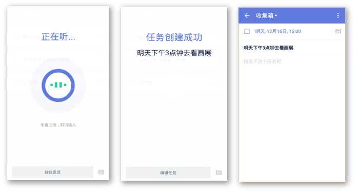
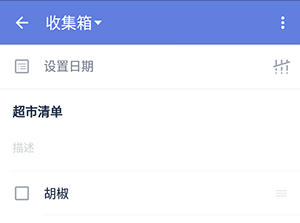

##创建新的任务
滴答清单能帮您随时随地记录并同步工作、生活中的所有任务，能灵巧、清晰的管理您分派的每一个任务，让您在管理和规划未来的时间中事半功倍！
 为了让你更加方便地创建任务，支持多种添加形式：微信添加任务、邮箱添加任务、客户端添加任务、网页端添加任务。。。

####创建新的任务
在默认开启『快速添加』时，在底部输入框中输入文本内容即可创建任务；点击右侧的，可以变成语音模式，按住语音键说出内容创建任务。 默认情况下，新任务将会创建到收集箱中；如果你在其它非智能清单中创建，则会保存到对应的清单下。 `任务创建后，就会自动保存到滴答清单并同步到所有设备。`
 新建任务界面如下图：
 
1. **添加任务的提醒时间**：点击「设置日期」可以设置任务到期时间、任务提醒时间以及任务重复周期。
2. **设置任务的优先级**：点击图标设置任务的优先级。
3. **移动到**：点击上方显示的**所在清单名称**，可以进入选择清单界面，快速选择需要移动的清单。
4. **更多设置**：点击输入框上面的可以看到更多选项。
   - **列表**/**文本**：将任务切换成列表/文本任务。
   - **附件**：为任务添加附件，更多请参考本文中*添加附件*
   - **发送**：将任务的到期时间和任务标题内容一起发送给好友。
   - **删除**：删除此条任务。
   - **保存并新建**：保存此条任务的同时再打开新建任务界面。

####语音输入
快速添加状态下，点击右侧的，可以变成语音创建任务，按住语音键说出内容创建任务。普通模式下，长按右下角加号键进入语音输入状态
 常见界面如下图：
 
- **智能识别时间信息**：当语句中带有“今天3点”“明天下午”这样的时间信息时，可以智能识别出来并为你创建带有这个时间的任务。
- **取消输入**：如果不小心说错了，将手指上滑再松开，即可取消当前输入。
- **快速修改**：提醒创建任务成功后，发现创建内容有误，可以点击屏幕中的「编辑任务」，即可进入任务编辑界面。如果在显示创建成功后2秒内无操作，视为识别无误。
- **创建失败**：如果网络太差或者说话时间过短，会导致任务创建失败。

####子任务/列表任务
列表任务就是我们常见的清单类格式，可以作你的购物清单或者待办清单。子任务是指列表任务内小任务。
 滴答清单支持文本任务和列表任务之间快速切换。换行或者回车会被自动识别为一个新的子任务。
1. 点击输入框上面的可以看到更多选项。
2. 选择「文本」或者「列表」进行切换。
 `子任务模式下，换行即创建了一条新的子任务。`

 高级账户可以在列表任务模式下，对任务添加文本描述。

1.	点击任务进入任务详情页。
2.	点击任务标题或其中一个列表任务进入编辑模式。
3.	「描述」区域出现，输入需要补充的任务描述。

####编辑和管理子任务
选择一条子任务，可以直接编辑，或者点击右边的「X」，将其整条都删除。
 按住右边的「≡」可以对子任务进行拖动排序。
 `高级账户每个任务下最多可以创建299个子任务（免费账户最多19个）。`

###添加附件
可以将手机相册内的照片或者拍照或者录音作为附件加入到任务中。
给任务添加附件，仅需以下操作：
1. 点击任务进入任务详情界面
2. 点击右上角图标，选择「附件」，有4种附件类型上传：

   - **图片**  ：调用手机相册中的照片作为附件上传。
   - **相机** ：会打开你的相机，拍照结束后点击「使用照片」，将照片上传成附件。
   - **录音**  ：会打开你的麦克风，请允许滴答清单访问你的麦克风。录音结束后就会上传成为你的附件。
   - **其他**  ：可以上传doc、xls、ppt、txt、keynote等常用文档格式。

 附件上传成功后会自动同步到各个平台
 每个附件的大小限制为__5MB__。
 `高级账户一天最多可上传99个附件（免费账户一天仅限一个)`

####新建任务默认设置
你可以在『设置->高级设置->新建任务默认设置』中设置新建任务的「默认优先级」、「默认截止日期」和「默认提前提醒时间」。
设置完毕后，在你只输入标题创建任务时，就会带有这些属性。

####微信创建任务
关注并绑定微信公众号，可以通过微信在滴答清单中创建创建任务。
 更多与微信公众号相关的内容请参考 [5.微信公众号](wechat/README.md)

####邮件创建任务
你可以通过发送邮件到指定邮箱来创建任务，如果邮件标题中带有时间或者重复信息，会智能识别并创建任务。
可以发送邮件到todo@mail.dida365.com（仅限于使用你的注册邮箱）或者专用的邮箱地址（适用任何邮箱）。
查看专用邮箱地址请登录网页版[滴答清单](https://www.dida365.com/)：右上角头像——>设置——>邮箱服务。
