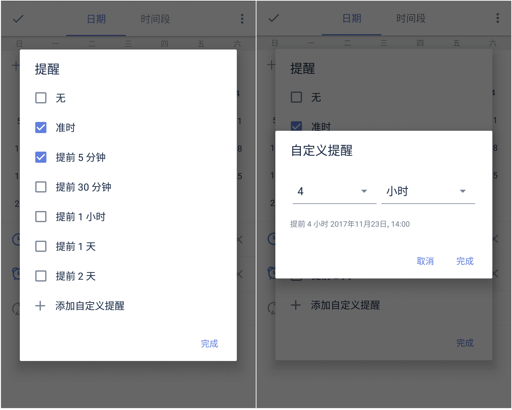
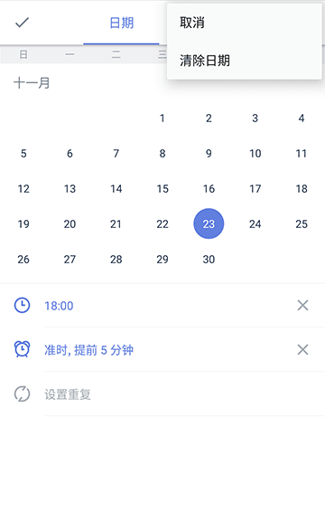
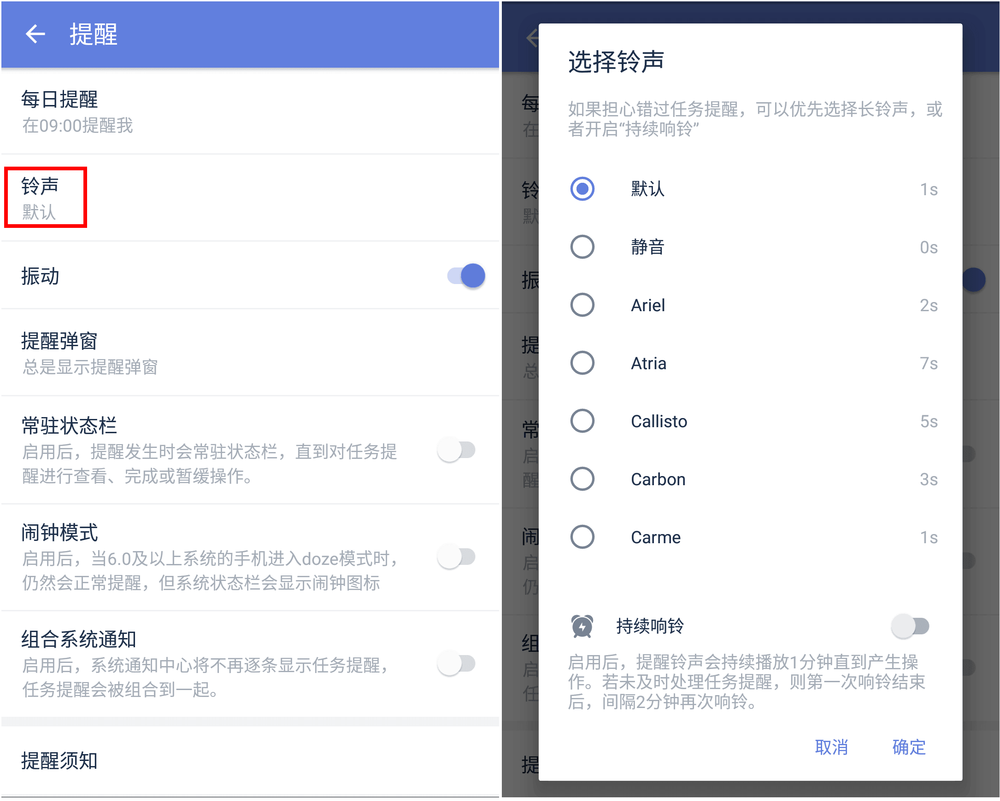
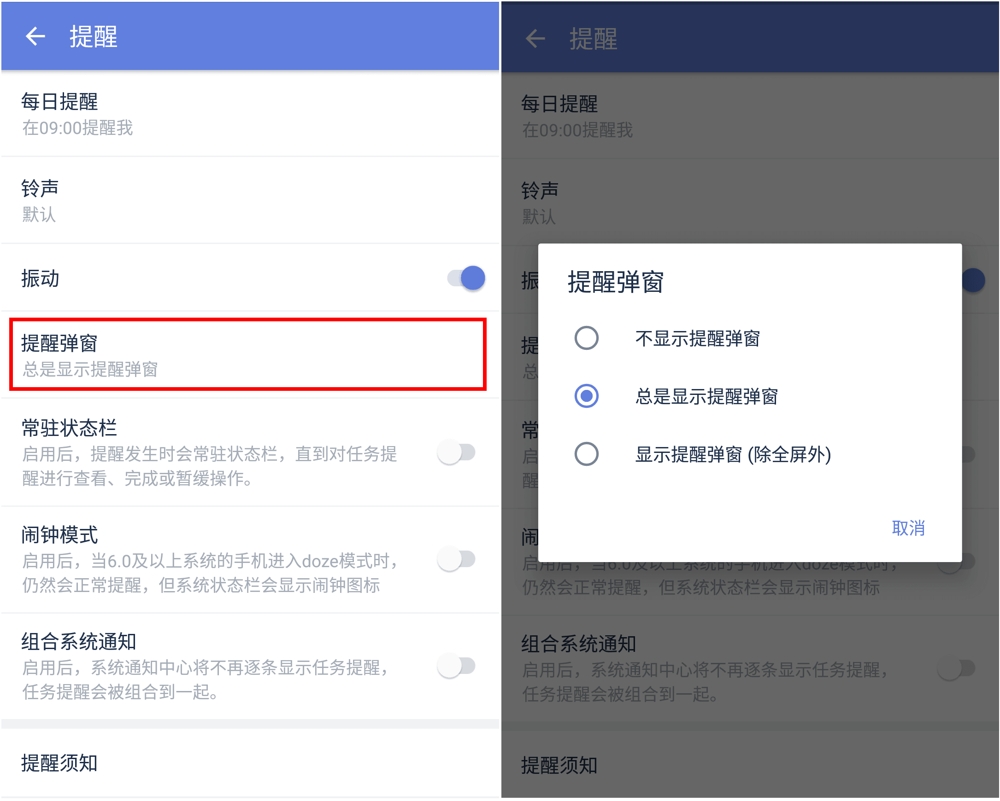

###设置提醒
为你创建的任务设置提醒，就不会遗漏重要事项了。

根据设置好的时间，任务会出现在【今天】【最近7天】等智能清单中。  

进入任务详情页，设置好时间后，会自动设定任务提醒。如果需要多个提醒，可以手动添加提醒时间，滴答清单支持自定义提醒时间：如提前45分钟、提前4个小时等。
 `注：高级账户单个任务最多可以设置五个提醒，免费账户可以设置两个。`

####清除任务的到期时间和提醒
若不需要任务提醒，您可以清除任务的到期时间和提醒。
 点击任务日期栏，点击右上角的，选择【清除日期】即可，任务会清除到期日，也不再提醒。

####每日提醒
每日提醒会在每日一个固定时间提醒您所有未完成以及当天需完成的任务。
设置-【提醒】-【每日提醒】，选择您需要的提醒时间即可。

####设置提醒铃声
滴答清单安卓版支持更改任务提醒铃声。
 设置-【提醒】-【铃声】，选择适合的铃声即可。

同时，也可以在【铃声】中可以开启【持续响铃】，开启后，提醒铃声会持续播放一分钟直到你对任务进行操作。若没有处理任务，则第一次响铃结束后，间隔两分钟再次响铃。

####提醒弹窗
设置-【提醒】-【铃声】-【提醒弹窗】，开启【提醒弹窗】，每次提醒时会弹出一个窗口。

####常驻状态栏
设置-【提醒】，开启【常驻状态栏】，提醒时，任务会显示在状态栏，直到对任务提醒进行操作。

####闹钟模式
android6.0及以上系统的手机，有一段时间没有使用之后，会进入doze模式，可能导致提醒延迟响起。开启【闹钟模式】后，就会按到期时间正常提醒。

####提醒须知
设置提醒时间到了，但是提醒没响起，或者延迟响起。通知中会显示“提醒不工作”，点击查看配置方法。或请参考软件内：设置-提醒-提醒须知。

`注：手机系统有自带的安全服务，当第一次添加一条有效提醒的任务时，会提示对系统安全服务进行配置。`
