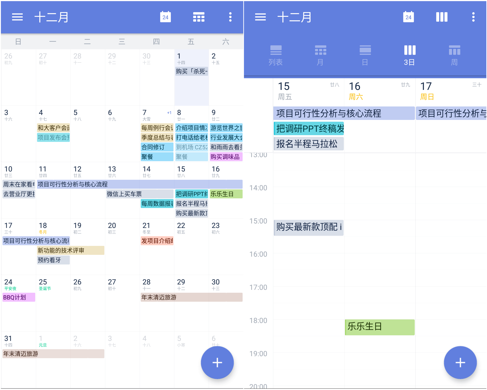
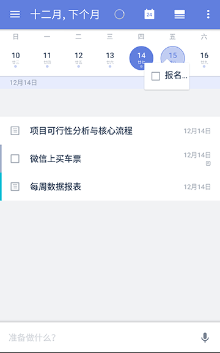
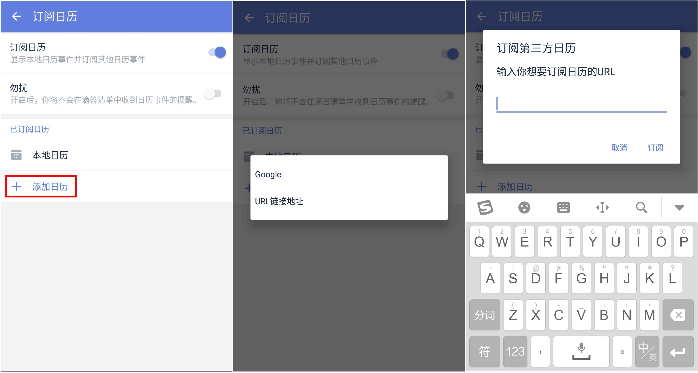

###日历管理

日历视图可以帮助你更直观地查看自己的任务计划，安排日程。方便你在制定计划时，可以考虑到一周甚至一个月的任务安排，更好的统筹任务安排，规划时间。

####开启/关闭日历视图

在侧边栏，点击【管理清单】，进入智能清单设置，点击日历至显示或者隐藏。

日历视图默认情况是开启状态，使用时点击侧边栏【日历】即可进入日历视图。

####切换列表视图/网格视图

进入日历，可以切换列表视图、月视图、日视图、三日视图和周视图，既可以直观显示月度计划、也能够轻松安排近日任务。

####拖动修改任务日期

在日历的列表视图中，长按日历下方需要修改日期的任务，拖动到合适的日期再松手，即可快捷修改任务时间。

在日历的网格视图中，点击任务所在日期，长按任务栏中的任务并拖动到合适日期后松手，即可快捷修改任务时间。

####切换月视图/周视图

在列表视图界面，将日历上滑可切换到周视图，下方区域可以显示更多的任务。

####日历订阅

* 将本地日历的事件显示在滴答中：  
在侧边栏中，点击右上角【设置】-【安全与数据】-【订阅日历】，启用该功能。
在下方显示的本地日历中设置需要显示或者隐藏的日历类型。如节假日、生日、工作等日历分组。  
`注：滴答清单显示的日历事件是本地日历所能显示的事件，如果你设置了本地日历不能读取该事件，那就不会显示在滴答清单上。`

* 订阅其他日历事件到滴答清单中：  
滴答清单允许您从其他日历服务中订阅事件。
如果要增加日历订阅，需进行以下操作：
 启用【订阅日历】【添加日历】。
 3. 输入你想订阅日历的URL，完成订阅。

`注：账号订阅最多支持3个，URL 订阅最多支持5个，如果不需要再使用可以更改或者删除订阅。`  
`注：此功能仅对付费用户开放。`

