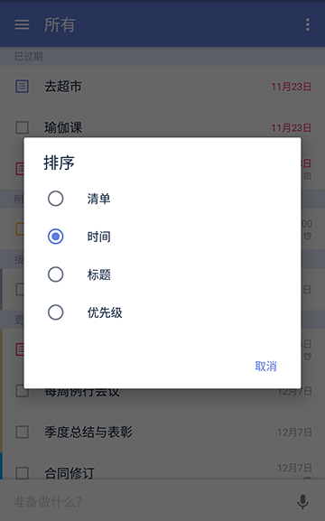
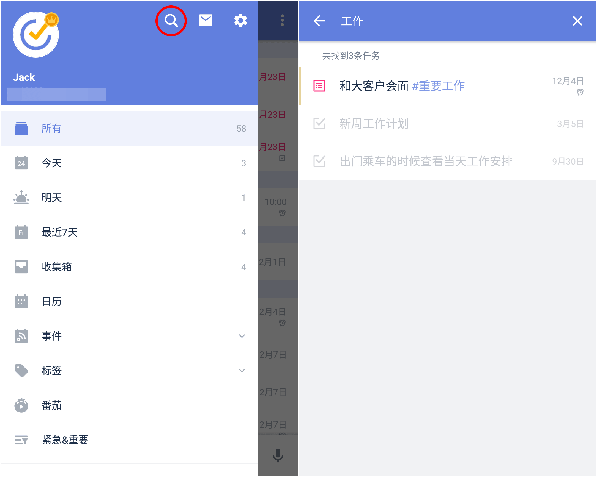
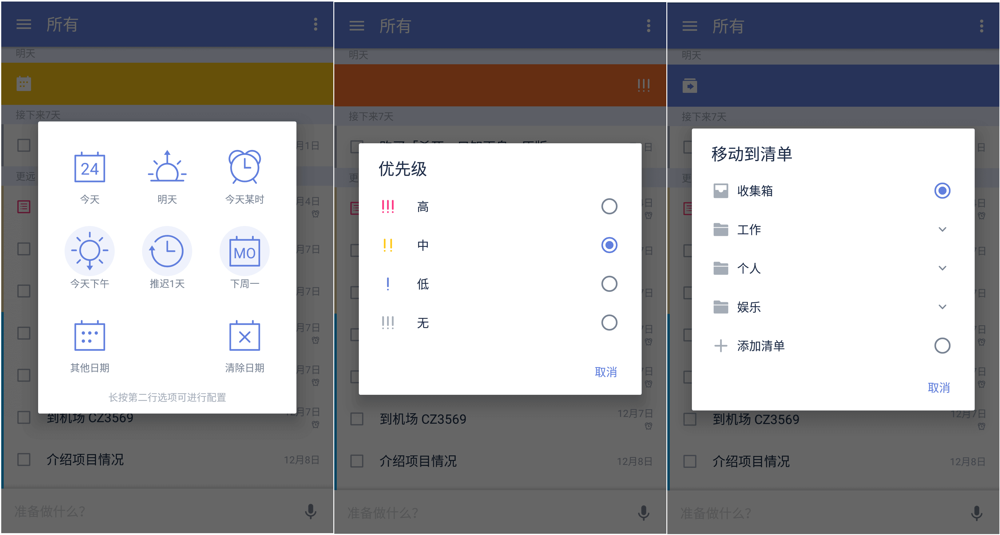
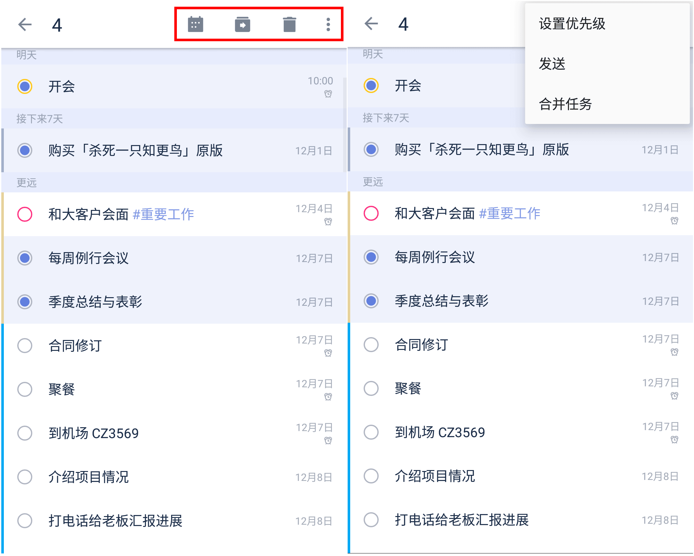
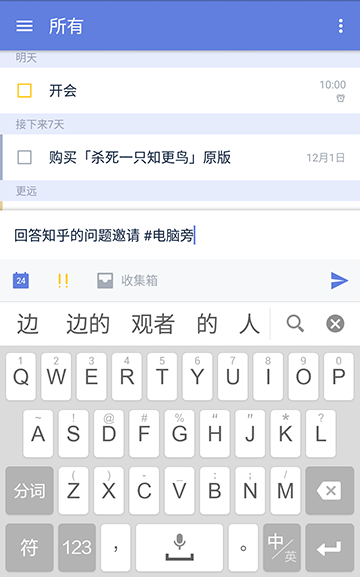
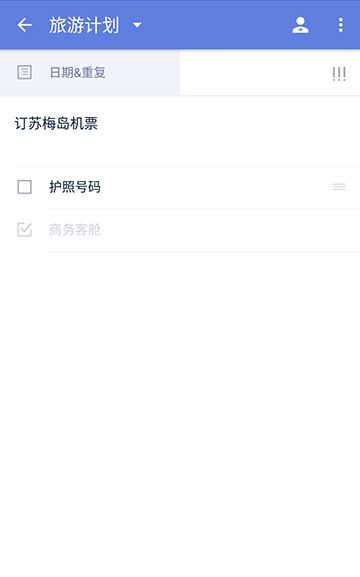
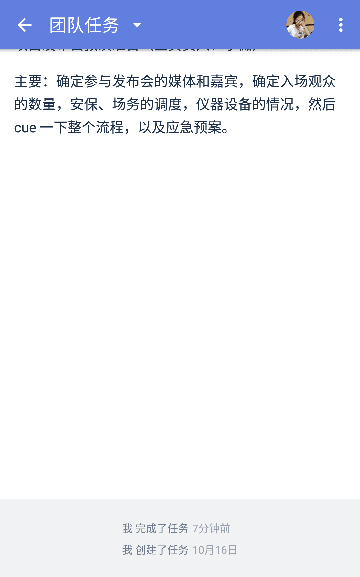
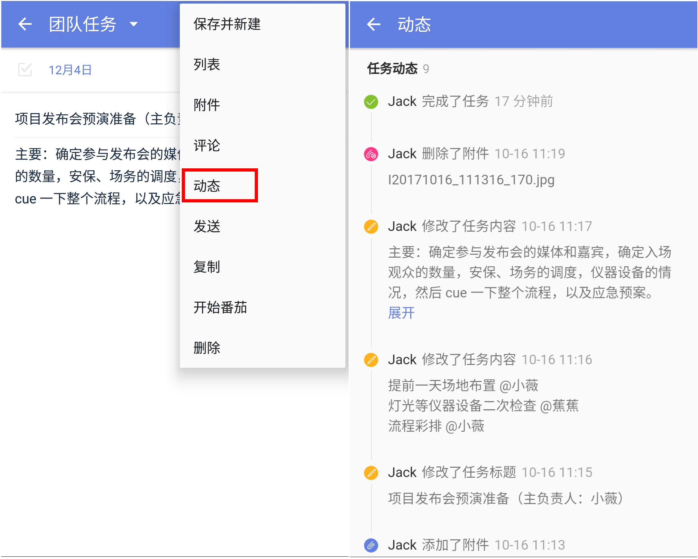
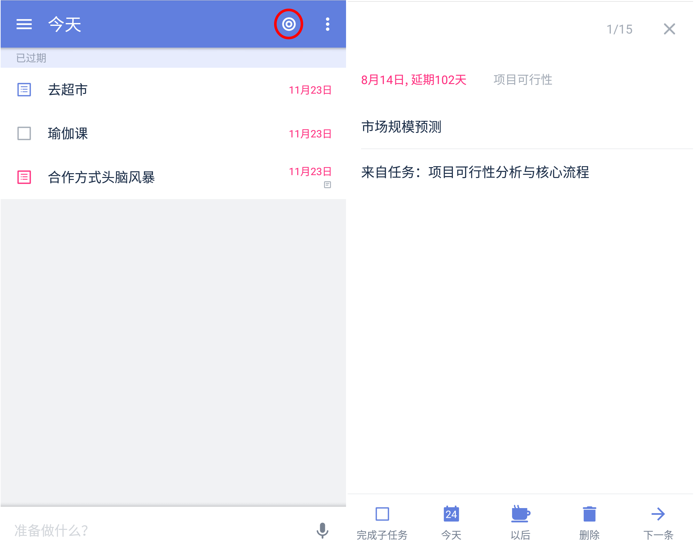

##管理任务

滴答清单为你提供了多种不同的方式来管理你的任务，让你的生活变得井井有条。

####删除任务
进入该任务详情页，点击右上角，选择【删除】。如果误删，可以在页面下方的弹出框中点击【撤销】来恢复任务。
 `注：如果是共享清单中的任务，则该清单中所有共享者的该任务都会被删除。`

####排序
为了清晰地查看自己的任务，您可以按【自定义】、【到期时间】、【标题】、【优先级】、【指派人】以及【清单】六种方式对任务进行排序。

进入清单列表，点击点击右上角选择【排序】。

* 按到期时间排序：该排序下会将任务按【已过期】【今天】【最近7天】【更远】区分排序。长按任务可以拖动排序，拖到对应的时间区域，智能设置时间。
* 按优先级排序：该排序下会将任务按高、中、低、无优先级四个等级排序。长按拖动任务从一个等级区域到另一个等级区域，智能更改任务的优先级。
* 按标题排序：按任务标题的首字母排序。
* 按自定义排序：该排序模式下，长按拖动根据自己的需求排序。
* 按指派人排序：只在共享清单中会使用此种排序方式。为了合作完成某个项目而共享清单时可以使用这种排序方式，按任务的指派人排序，清晰明确每人的任务。
* 按清单排序：只在智能清单、自定义智能清单以及清单文件夹【所有任务】清单中有【按清单排序】。方便区分个人任务和工作任务，同时可以了解各个清单下的任务情况。

####搜索任务
在滴答清单中，可以搜索任务的内容、标题和标签。

 在侧边栏中，点击【搜索】图标，输入关键词或标签，即可搜索所有任务。

`注：只要待完成任务和已完成任务的任务名称、任务描述、子任务中包含关键词，就会被搜索出来。`

####滑动操作
支持在任务列表中左右滑动任务进行快速操作。
 滴答清单默认将任务往左滑动，可以设置到期时间和移动任务到其他清单，往右滑动可以选择归档或者设置优先级。

设置到期日期时，可以选择【推迟1天】来推迟任务的到期时间，也可通过长按icon来自行配置推迟的时间。

`注：长按第二行选项可以自行配置智能时间。`

####批量操作
需要对较多任务进行相同的设置操作时，可以通过批量操作来进行。
 在清单中长按一条任务，任务前会出现小圆圈，点击选择需要编辑的任务，就可以对选中的任务批量处理：
* 修改到期时间；
* 移动到其他清单；
* 删除；
* 设置优先级；
* 发送；
* 合并任务。
 合并任务后，原任务将作为子任务，任务名称默认为原任务名，原任务将被删除，且不保存原任务的附件、评论和任务时间。
 `注：批量操作模式下，对一个任务进行拖动，就会退出批量模式。`

####添加标签
给任务添加标签有便于您更加快捷的管理同一类别的任务。

 标签功能默认情况下是隐藏的，您可以在侧边栏中，点击【管理清单】-【智能清单】-【标签】，设置为显示，标签就会显示在侧边栏。

在任务标题或内容里 输入「#」号键以及标签，如「#电脑旁」。标签前后需空一格。
 `注：纯数字无法作为标签被识别。`

####发送任务
进入任务详情页-点击右上角，选择【发送】。
 在弹出的界面选择发送形式和发送途径，确认发送即可。

####隐藏已完成的任务
如果清单中任务较多，只想看到未完成的任务，那么可以选择【隐藏已完成】。
 进入清单，点击右上角，选择【隐藏已完成】即可。
  可以在【已完成】清单中查看已完成的任务，也可以右上角「更多」按钮点击【显示已完成】，将已完成任务重新显示出来。
 `注：【已完成】是智能清单，需要在【管理清单】-【智能清单】中开启【已完成】清单后才能查看。`

####任务进度
进入任务详情页，左右拖拽日期栏，可对任务设置进度条百分比。

 

####任务动态

你可以在任务详情中查看任务动态，了解任务每一次改动的信息。滴答清单提供两种方式查看任务动态：动态概要和完整动态。

#####查看动态概要

进入任务详情后，向上轻拉界面，即可在底部查看以下动态信息：

* 任务的创建日期
* 任务的完成日期

`注：高级会员还能通过概要查看任务是被谁创建、被谁完成的`

#####查看完整动态（高级功能）

进入任务详情后，点击右上角【菜单】图标，点击【动态】即可进入完整的动态界面，你可以在这里查看以下动态信息：

* 任务的创建日期
* 任务的标题/内容改动记录
* 任务的日期改动记录
* 附件的上传/删除记录
* 指派人改动记录
* 任务的完成日期

####计划 
进入【今天】清单，点击右上角小圆圈，可以对到期日是今天的任务和已过期的任务和收集箱的无日期任务逐条进行处理。   
在底部操作区有【完成任务】【今天】【以后】【下一个】按钮，可以修改任务的日期和时间。
 `注：本功能对所有账户开放，免费账户每周可使用两次，高级账户无限制。  今天的子任务也是可以进行处理的。`
