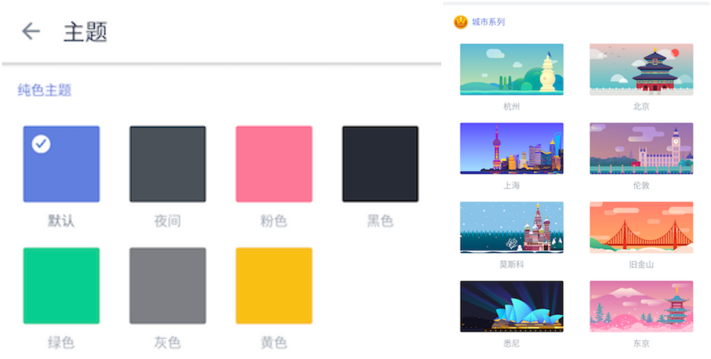

###偏好设置

你可以根据自己的使用习惯来进行设置，更加便于使用。

####语言

滴答清单默认跟随系统语言，如果您希望使用其他语言，可以手动选择。

####字体大小

滴答清单提供两种字体大小选择：【标准】和【大号】
在侧边栏中，进入【设置】-【偏好设置】，点击【字体大小】并选择适合自己的字体大小。

####星期开始于

进入【设置】-【偏好设置】-【星期开始于】，您可以设置日历中的星期开始日期，目前有周六、周日和周一可以选择。

####农历与节假日

【农历】开关开启后，在日历中就会显示出农历日期。
【显示法定节假日调休】开关开启后，在日历中会显示节假日调休情况。

####滑动选项
 您可以进入【设置】-【偏好设置】-【自定义配置】中，选择【滑动选项】来配置列表页滑动任务的快捷操作。

####更换主题
滴答清单包括【夜间】和【默认】在内的七种主题配色，以及八种城市主题。后续会有更多主题供选择。
 在侧边栏中，进入【设置】-【主题】，即可自由更换主题。
 `注：城市主题为高级账户功能。`

