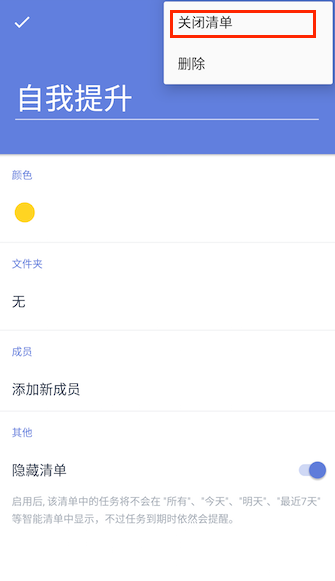
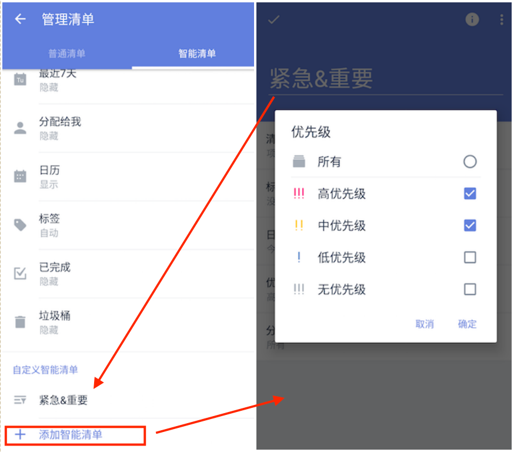

# 创建和管理清单

####新建清单
在侧边栏中，点击底部【添加清单】，即可创建一个新的清单。

您可以为清单命名，设置清单颜色，将清单添加到清单文件夹，也可以隐藏该清单。
 `注：隐藏后，该清单的任务将不会出现在【所有】【今天】【最近七天】等智能清单中，但到期仍会提醒。`

####编辑清单
点击底部【管理清单】，选择要编辑的清单，即可进入编辑界面，编辑该清单。

* 如果侧边栏清单过多，您可以将不常用的清单隐藏：
 在侧边栏中，点击底部【管理清单】，选择清单进入编辑界面，启用【隐藏清单】即可。
 `注：共享清单隐藏后，如果没有分配给你的任务，将不会出现在【所有】【今天】【最近七天】等智能清单中，到期也不会提醒。`

* 您也可以单击【关闭】，可以关闭任务清单。 
 `注：关闭后，任务不会再出现在智能清单，到期也不会提醒。`

* 点击【删除】，将会删除该清单及清单下的所有任务。

####管理智能清单 
当侧边栏中清单过多时，你可以选择将部分不常用的智能清单隐藏。
 点击【管理清单】-【智能清单】，可以对智能清单的状态进行设置。
* 显示：该清单始终显示在清单栏；
* 自动：当清单中有任务时，该清单显示在清单栏，清单中没有任务时，该清单不显示；
* 隐藏：该清单始终不显示在清单栏。
 `智能清单不能被分享、智能清单不能被排序。` 

####自定义智能清单
左侧边栏底部，点击【管理清单】-【智能清单】-【添加智能清单】，即可根据【清单】【日期】【优先级】【标签】【分配给】五个条件对任务进行筛选，创建新的智能清单。
 `当前没有带标签任务和共享清单时，【标签】和【分配给】不显示。`

点击【管理清单】-【智能清单】，可以对自定义智能清单进行编辑和删除。
 `注：删除自定义智能清单，其中的任务不会被删除。`
