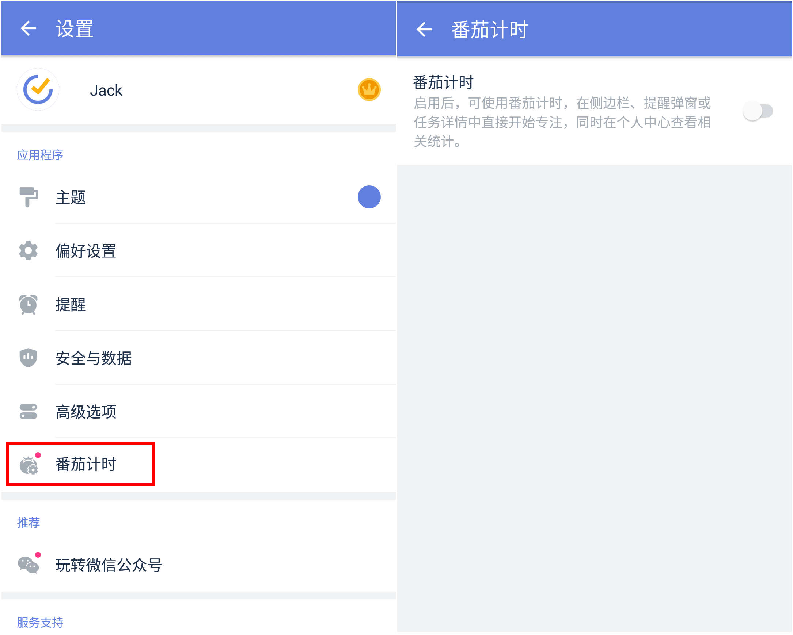
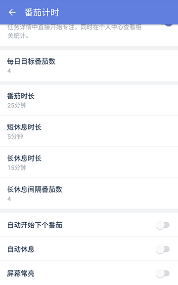
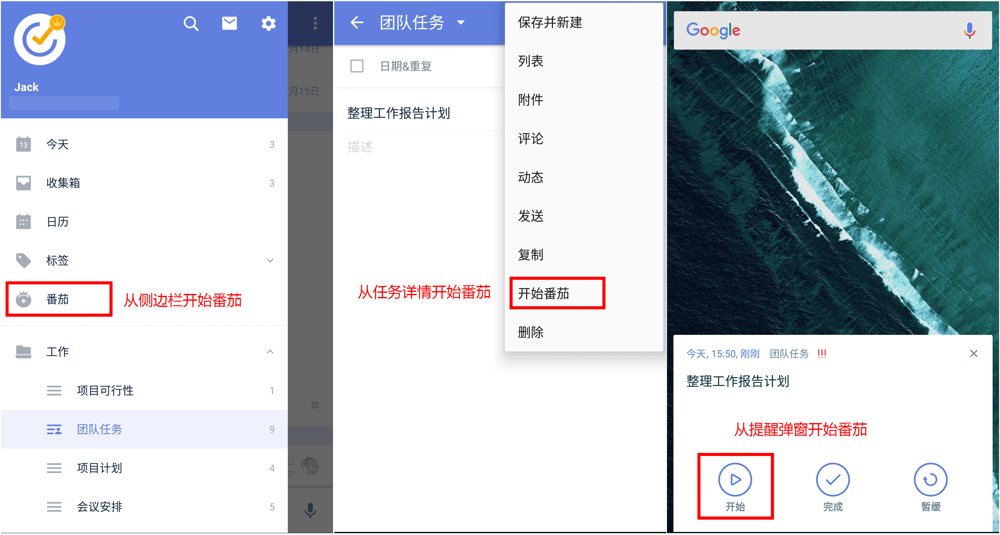
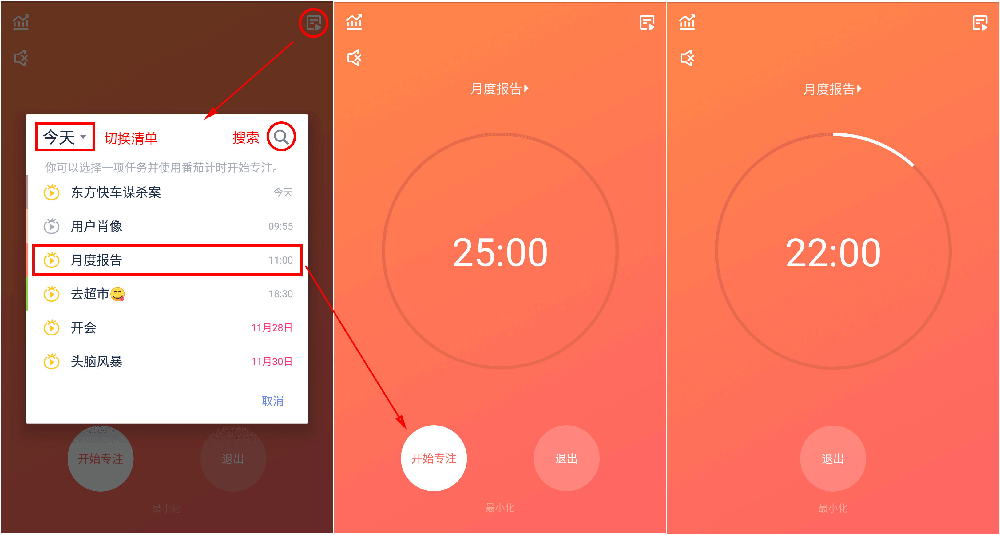

##番茄计时

####开启/关闭番茄计时

在侧边栏点击【设置】图标，进入设置界面后点击【番茄计时】并开启开关项即可。（番茄计时默认关闭）

####更改番茄计时选项

启用番茄计时后，你可以在设置中对以下选项进行配置：

* **番茄时长**：每个番茄倒计时的时长。
* **短休息时长**：但番茄结束后，休息倒计时的时长。
* **长休息时长**：每完成一定数量的番茄后，进入长休息，长休息倒计时的时长。
* **长休息间隔番茄数**：每完成多少个番茄后，进入长休息。
* 开启/关闭“**自动开始下个番茄**”：休息结束后，自动开始番茄倒计时。
* 开启/关闭“**自动休息**”：番茄结束后，自动开始休息倒计时。
* 开启/关闭“**屏幕常亮**”：倒计时过程中，阻止系统锁屏。

####开始番茄

启用番茄计时后，你可以从侧边栏、任务详情、提醒弹窗开始番茄。

* 侧边栏：在侧边栏点击【番茄】进入番茄界面，点击【开始专注】进入倒计时状态。
* 任务详情：点击任务进入详情，点击右上角【菜单】图标，点击【开始番茄】进入倒计时状态。
* 提醒弹窗：提醒响起时，点击提醒弹窗左下角【开始】图标进入倒计时状态。

####在番茄过程中选择/更改任务

进入番茄倒计时界面后，点击右上角【选择任务】图标，在弹窗内点击任务，即可在番茄倒计时界面显示这条任务的标题。在选择任务的弹窗内，你可以

* 直接点击任务选中
* 点击弹窗左上角【清单】切换清单
* 点击弹窗右上角【搜索】直接搜索任务

选定任务后，再次点击【选择任务】图标，可以更改任务。

