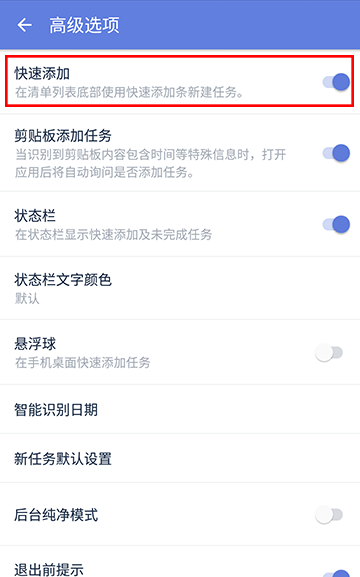
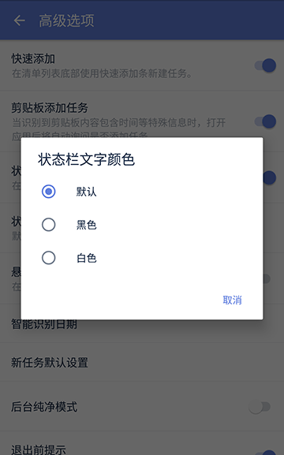
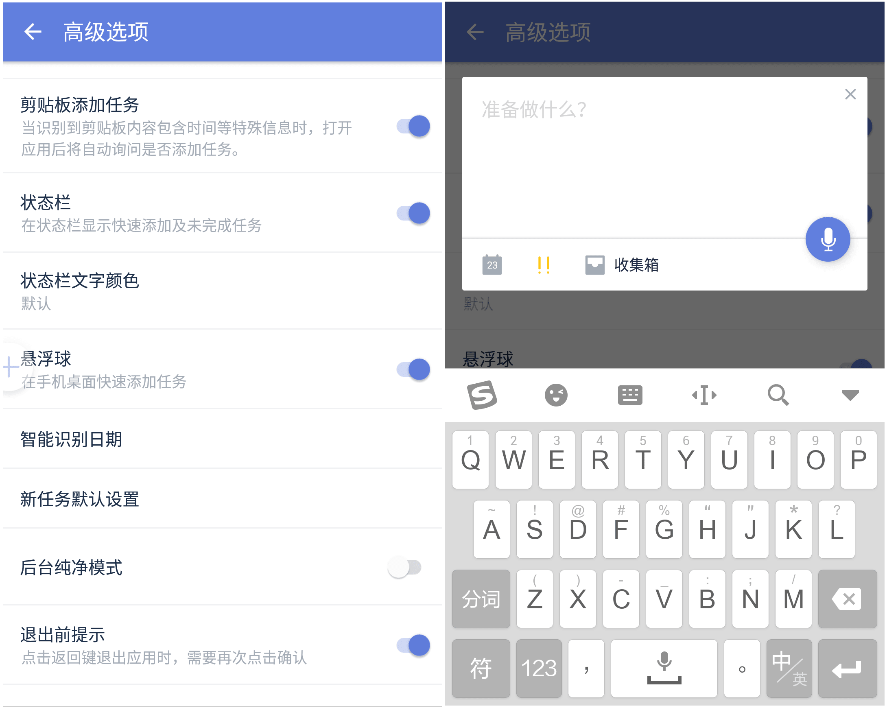
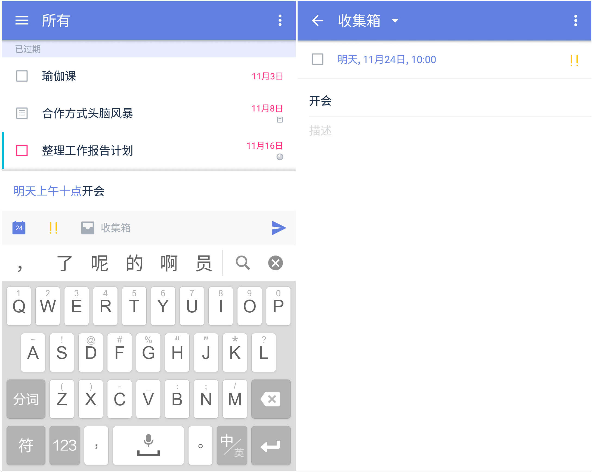
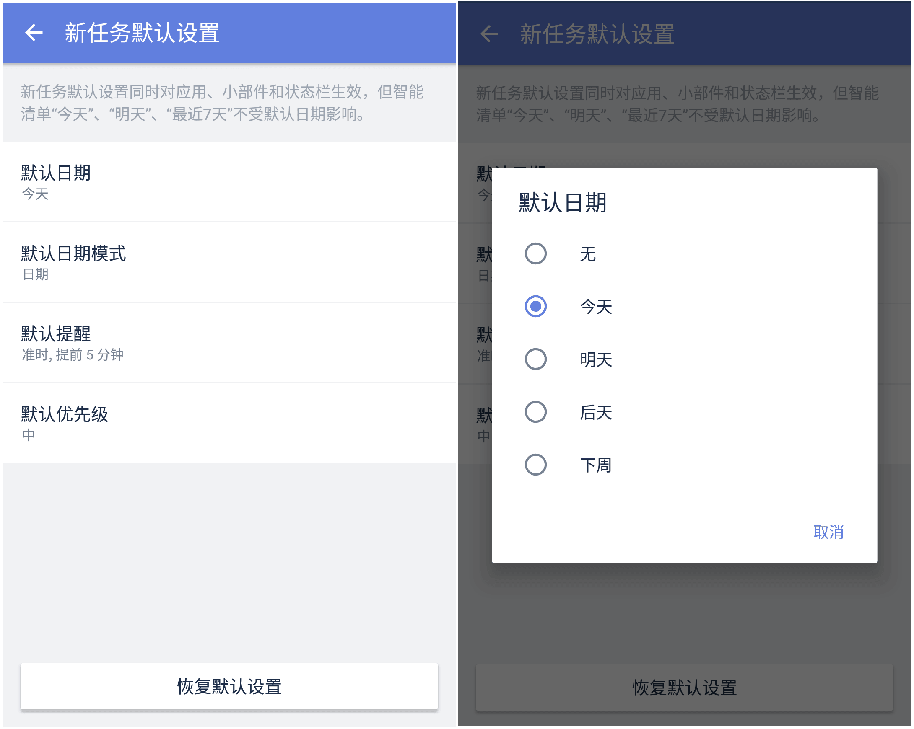
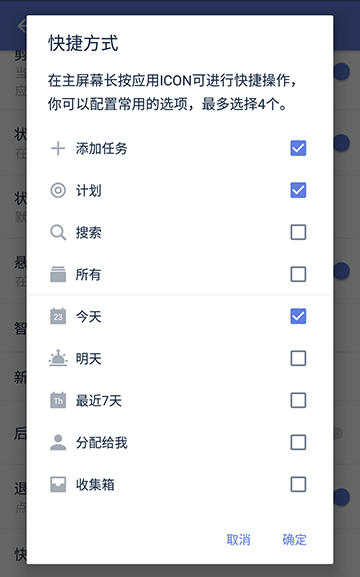
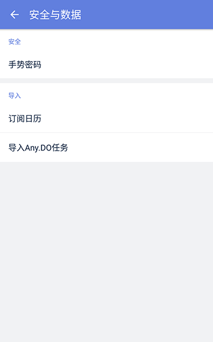

## 高级选项

####快速添加

在侧边栏中，进入【设置】-【高级选项】，启用【快速添加】。

【快速添加】默认开启，在页面底部会显示快速添加条，输入任务内容并回车即可创建。同时支持语音输入任务。

####剪贴板添加任务

在侧边栏中，进入【设置】-【高级选项】，启用【剪贴板添加任务】。

开启此功能后，当您的剪贴板内容包含时间等信息时，进入滴答清单，将自动询问您是否需要创建任务。

####状态栏

在侧边栏中，进入【设置】-【高级选项】，启用【状态栏】。

开启【状态栏】可以在手机通知栏处显示快速添加及未完成的任务。

`注：状态栏中的文字颜色可选，支持默认、黑色和白色。`

####悬浮球

在侧边栏中，进入【设置】-【高级选项】，启用【悬浮球】。

开启【悬浮球】可以在手机桌面上快速添加任务。

####智能识别日期

在侧边栏中，进入【设置】-【高级选项】-【智能识别日期】，可以启用【文本输入识别】。

启用后，当您通过【快速添加】创建任务时，滴答清单能够自动识别任务中的时间信息，并为任务设置提醒。
同时，您还可以选择开启【移除任务文本中的日期】，开启后，日期文本将从任务中被删去。

`例如：创建「明天上午十点开会」的任务，创建成功后任务会显示为「开会」，任务到期时间将会设定为「明天上午十点」。`

####新任务默认设置

在侧边栏中，进入【设置】-【高级选项】-【新任务默认设置】中，可以对新任务截止日期、日期模式、提前提醒时间和优先级进行设置，设置后创建的所有新任务，都将自动保持这些设置。

`注：新任务默认设置对应用、小部件和状态栏生效，但智能清单“今天”、“明天”、“最近7天”和日历不受默认日期的影响。`

####后台纯净模式

在侧边栏中，进入【设置】-【高级选项】，启用【后台纯净模式】。

开启后台纯净模式后，滴答清单将不再允许后台推送同步。为保障同步可用，滴答清单会定时拉取数据。

`注：如果您更新数据比较频繁，此模式可能会影响个平台间的数据同步，请谨慎使用。`

####退出前提示

开启了【退出前提示】后，点击系统返回键退出应用时，需要再次点击确认退出，避免误触。
在侧边栏中，进入【设置】-【高级选项】，启用【退出前提示】即可。

####快捷方式

在侧边栏中，进入【设置】-【高级选项】，选择【快捷方式】，在主屏幕中长按ICON可进行快捷操作，您可以根据自己的需求配置常用的选项。

`注：最多可选择配置4个。android7.1以上版本才有该功能。`

####加锁
带有指纹解锁的手机，可以使用指纹解锁滴答。同时你也可以给滴答清单添加一个单独的手势密码，来保护你的信息安全。成功设置安全锁后，进入应用将需要密码。
在侧边栏中，进入【设置】-【安全与数据】，选择【手势密码】并设置为开启，进入图案锁的绘制界面，绘制自己的安全锁图案即可。

