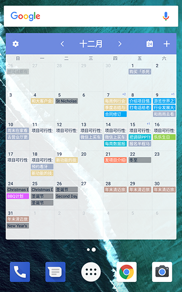
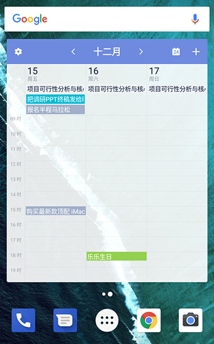
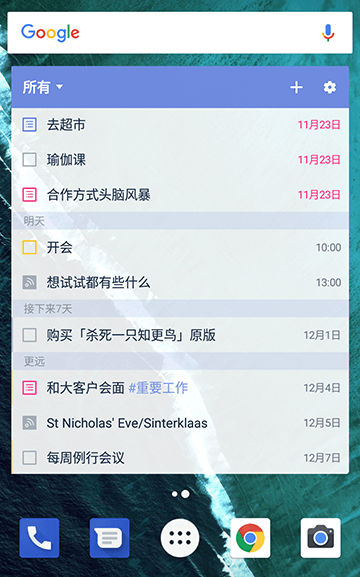
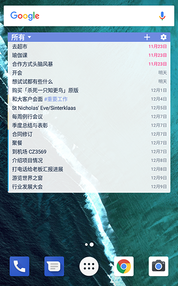
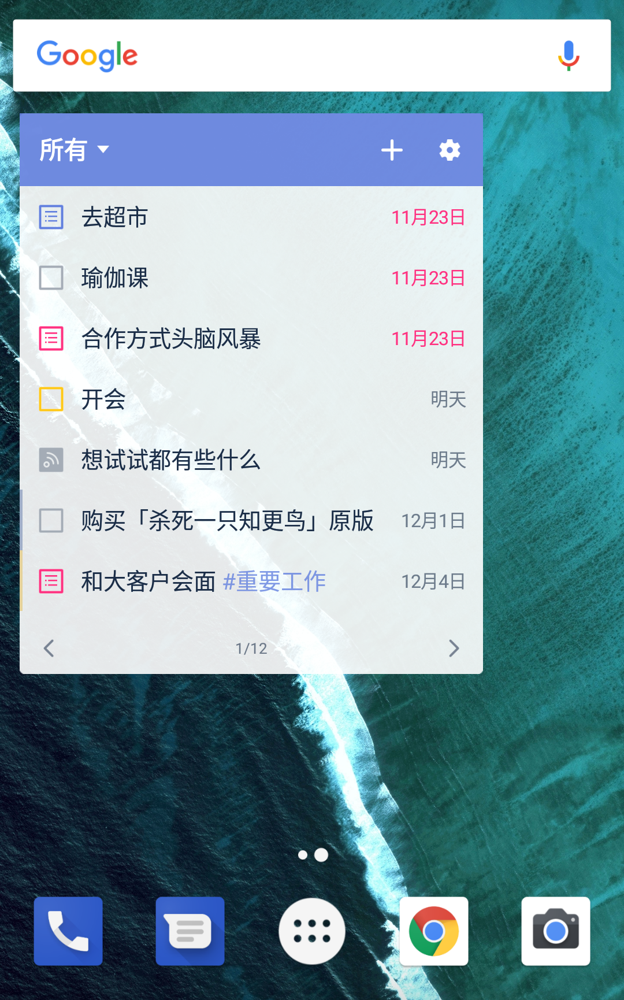
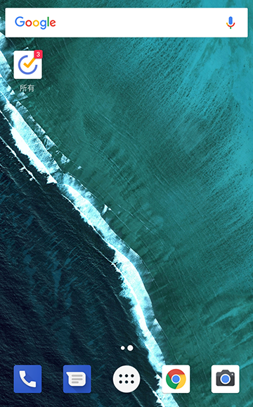
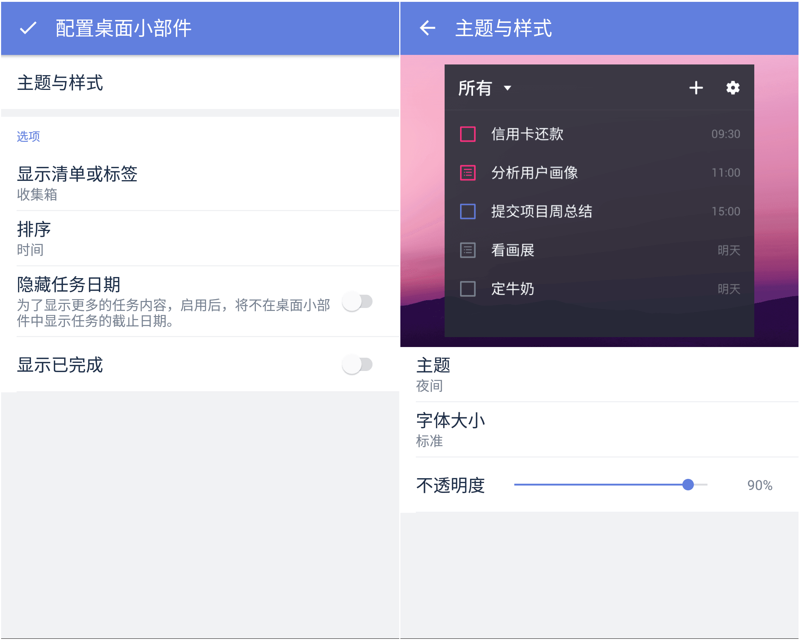

##桌面小部件
滴答清单提供6种不同的桌面小部件。
* 滴答清单 （周）

* 滴答清单 （月）

* 滴答清单 （三日）

* 滴答清单 （标准）

 

* 滴答清单 （紧凑）

 

* 滴答清单 （翻页）
 
 

* 滴答清单 （角标）

您可以根据自己的喜好，使用习惯和桌面空间来自行选择。选择合适的小部件能提高效率，方便使用。

####配置桌面小部件
当你选中某个桌面小部件后,可以先对其进行配置。
 你可以选择展示的任务清单或者标签、任务排序方式、隐藏日期、显示已完成、透明度、主题、圆角等属性。
* 选择任务清单：选择想要显示内容的任务清单。
* 排序：支持按【到期时间】、【自定义顺序】、【名字（字母顺序）】、【优先级】四种方式排序显示。
* 隐藏日期：不显示右边的时间，会显得简洁。
* 不透明度：0~100区间任意调整。
* 主题：目前提供黑白两种主题。

####调整合适的大小
除了滴答清单（4x4）和Undone，剩下几个小部件都可以拉伸，改变大小。
 操作：长按桌面部件，再松手，即可看到调整框，可以根据自己的需求调整部件的大小。

####滴答清单（角标）和滴答清单快捷方式有什么区别?
滴答清单（角标）上会显示一个数字, 代表您当前已过期以及今天待完成的任务数; 最大显示数值为9; 若您当前已过期加上今天待完成的任务数超过9时, 则会显示9+。而滴答清单快捷方式仅仅在桌面上提供一个快捷操作的图标。

####我的小部件列表里为什么没有滴答清单?
为确保桌面小部件的运行, 首先您需要将滴答清单应用安装在手机内存里, 而不是SD卡上。如果桌面小部件偶尔消失, 您可以重启手机试试看。

