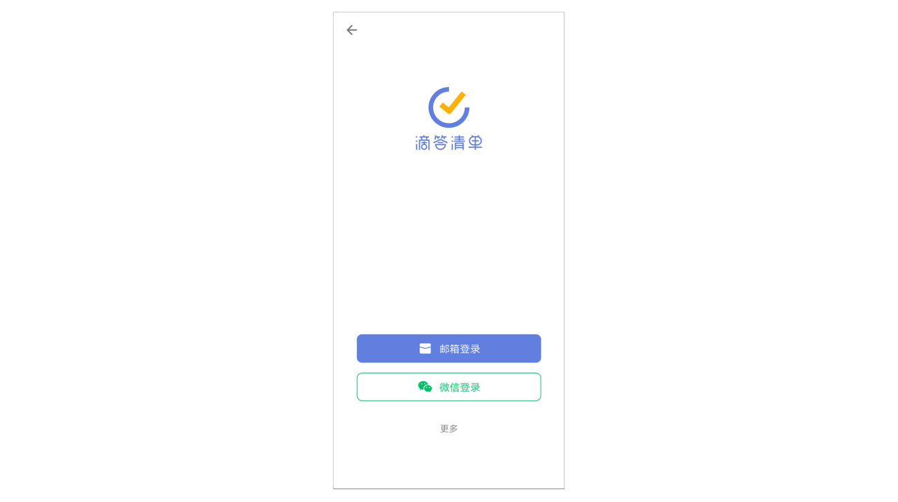
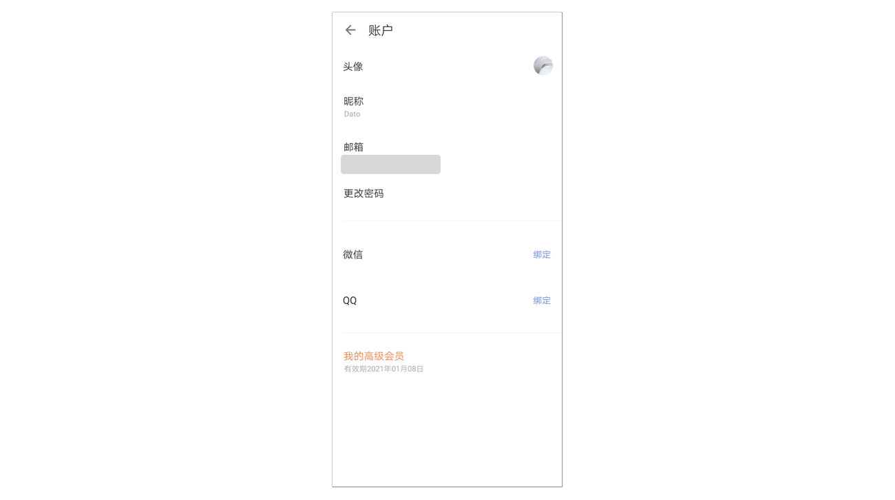
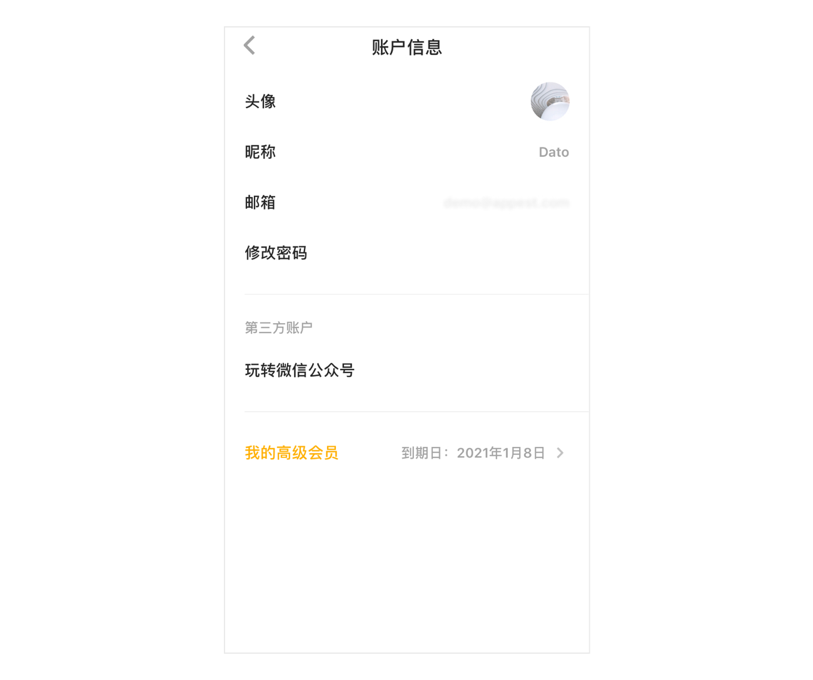

## 帐号

### 注册和登录

#### 注册

您可以使用手机号或邮箱注册滴答清单，还可以通过微信 、QQ、新浪微博账号快捷登录到滴答清单。

用手机号注册滴答清单，进行短信验证并设置登录密码后可注册使用。

用邮箱可直接注册滴答清单，滴答会发验证邮件到注册的邮箱中。若邮箱未验证，账户信息界面中邮箱后面会显示警告图标，点击后进入邮箱页面，可以点击重新发送验证邮件。

还没有滴答清单帐号吗？[立即免费创建](https://dida365.com/signup)

#### 登录

若您已有滴答帐号，可以直接输入手机号或邮箱及密码登录，也可以使用微信、 QQ和新浪微博快捷登录。

#### 绑定

如果您使用 QQ 、微信、新浪微博帐号登录滴答清单，可以绑定您的手机号和邮箱： 点击主界面底部 TAB 栏「设置」- 头像栏 - 头像下方修改 btn -「手机号」或「邮箱」，进入手机号或邮箱页面，输入手机号或邮箱地址，进行验证并设置登录密码后即可绑定。

若您使用手机号或邮箱登录，可以绑定微信和 QQ，就可以使用滴答清单的微信服务，并可以使用微信和 QQ 快捷登录： 点击主界面底部 TAB 栏「设置」- 头像栏 - 头像下方修改 btn -「微信」/「QQ」，按照提示绑定微信即可。  `注：滴答清单目前无法绑定新浪微博帐号。`

如果您是 TickTick 用户，可以点击登录界面下方「切换至 TickTick 」登录；  `注：TickTick 用户要使用滴答清单，需要重新注册一个滴答清单帐号，然后[导入 TickTick 帐号]内的任务信息。`

 滴答清单提供两种帐号：免费帐号和高级帐号。  **免费帐号** ：任何人都可以免费创建滴答清单帐号。免费帐号可以使用这篇指南中介绍的所有核心功能和更多其他功能。  **高级帐号** ：滴答清单高级帐号有诸多专享功能，能帮您更好的使用滴答清单，有按月和按年两种订购方式。要了解滴答清单高级帐号专享功能详情，请访问[滴答清单高级帐号页面](https://www.dida365.com/about/upgrade)。

### 忘记密码

如果您忘记了登录密码，点击登录框下方的[忘记密码](https://www.dida365.com/sign/requestRestPassword)进行密码重置。

在打开的网页中输入你的注册邮箱或手机号，点击重置密码。 去注册邮箱查收重置密码链接或去手机短信查收验证码，按照指示重新设置密码即可。

### 退出登录

如果您需要退出已登录帐号，点击主页面下方的「设置」tab，点击页面底部的「退出登录」即可。下一次登录时需要重新输入密码。

### 帐号设置

#### 上传头像

点击「设置」头像栏 -「头像」，支持拍照和本地照片。

#### 修改昵称

点击「设置」头像栏 -「昵称」，输入昵称即可。

#### 修改邮箱

点击「设置」头像栏 -「邮箱」，按操作指引即可。

#### 修改密码

点击「设置」头像栏 -「修改密码」。输入当前密码和新密码，即可成功修改。

