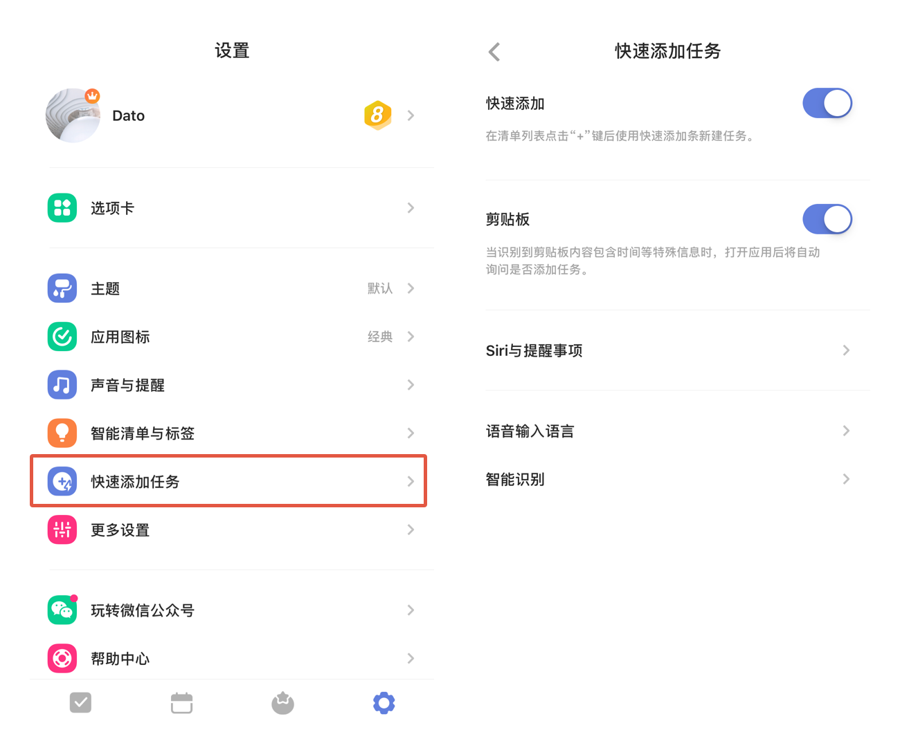

## 更多设置

#### 快速添加

「快速添加」默认开启，在清单列表点击“+”键，呼出快速添加条，输入任务内容并保存即可创建。 长按“+”号键支持语音输入任务。

在主页面，进入「设置」-「快速添加任务」，关闭「快速添加」，在清单列表点击“+”键，直接进入任务详情页创建任务。

#### 剪贴板添加任务

在主页面，进入「设置」-「快速添加任务」，启用「剪贴板添加任务」。

开启此功能后，当您的剪贴板内容包含时间等信息时，进入滴答清单，将自动询问您是否需要创建任务。

#### 语音输入

你可以在主页面中，进入「设置」-「快速添加任务」，选择「语音输入语言」，来设置自己在语音输入时使用的语言。
滴答清单可以识别多种语言。

#### 新任务默认设置

您可以根据您的需要对新任务的日期、日期模式、提醒、优先级和添加到清单的位置进行设置，添加新任务的时候就会带上这些默认设置。 新任务默认设置对应用、小部件都生效，但智能清单“今天”、“明天”、“最近7天”、日历以及带日期的自定义智能清单不受默认日期的影响。  `日期模式分为日期和时间段,默认选中日期。提醒默认为准时，可以设置多个提醒。`

#### 立体触控

配置常用的选项，在主屏幕上按压 app 的 icon 可以进行快速操作。

#### 小部件清单

iOS 10 以上系统的手机，可以选择列表 Widget 中显示的清单列表。

