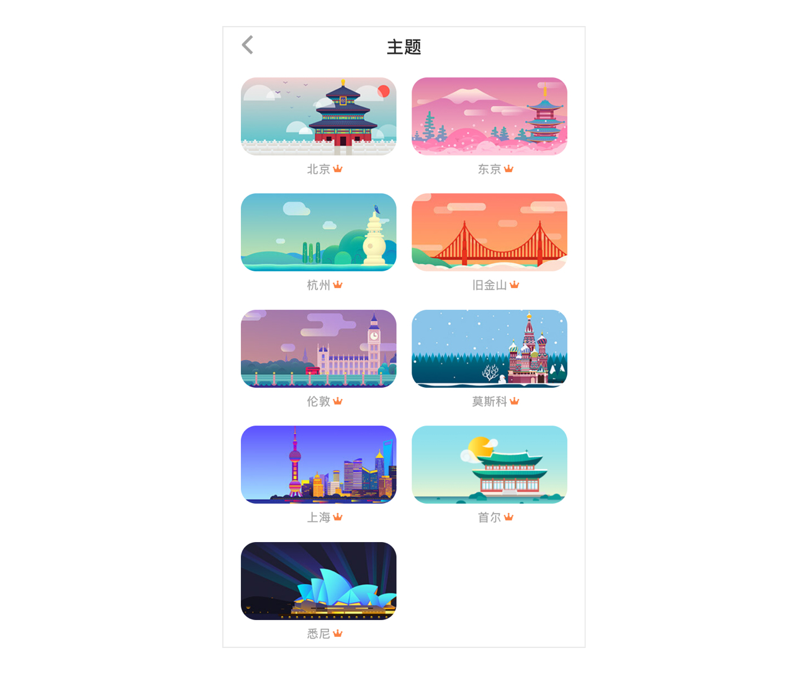
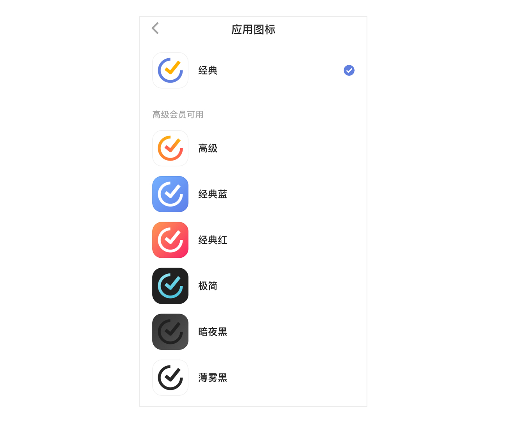
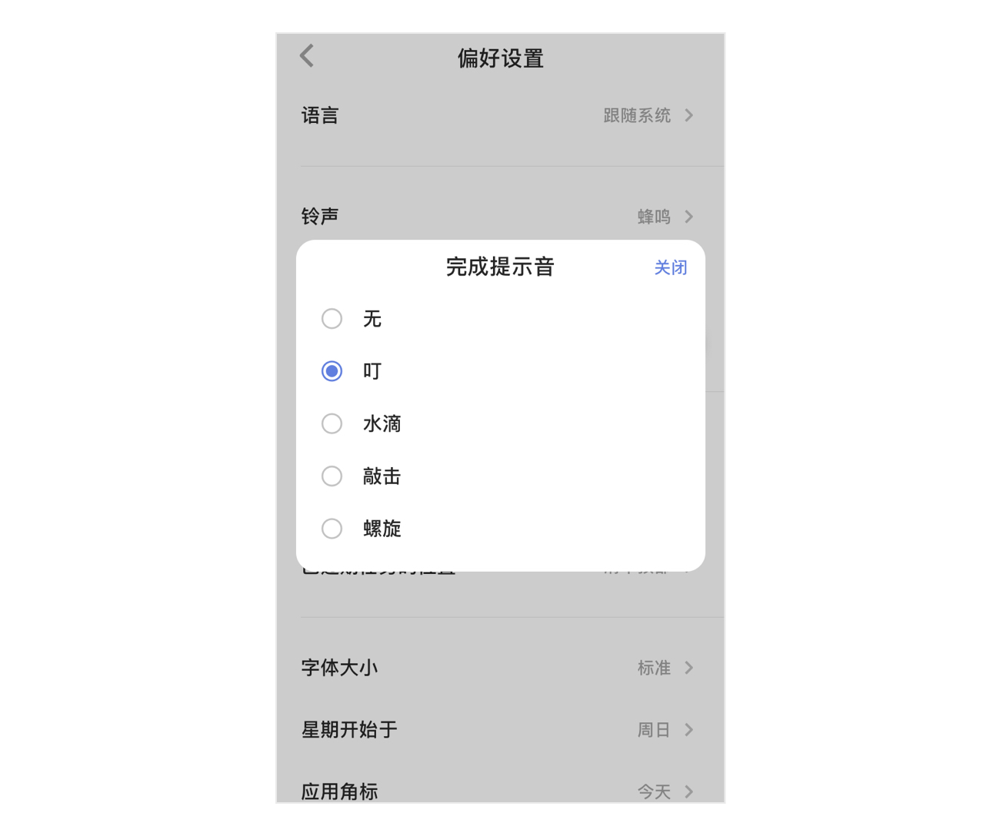
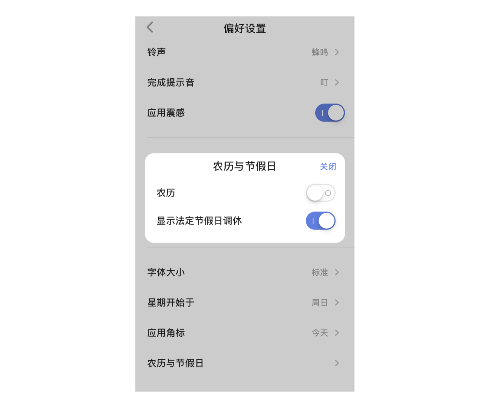

### 偏好设置

#### 主题

提供以下主题：  纯色主题：默认（蓝色）、夜间（pro）、粉色、黑色、绿色、灰色、黄色、白色。

 城市系列主题：北京、东京、杭州、旧金山、伦敦、莫斯科、上海、首尔、悉尼。

 季节系列主题：春季、夏季、秋季、冬季。

 摄影系列主题：蔚蓝湖泊、暮色、慵懒猫等。

`注：白色主题和摄影系列主题是拿成就值换取的，当你赚取越来越多的成就值，成就等级也会提升，就能领取对应的主题奖励。`

Iphone 10及以上系统的手机可以更换应用的图标。

#### 语言

滴答清单默认跟随系统语言，如果您希望使用其他语言，可以手动选择。

#### 铃声

您可以根据喜好选择铃声。
若您希望提醒铃声时间更长，可以在此开启「持续响铃」。  开启后，提醒铃声会持续播放 30 秒直到产生操作。若未及时处理任务提醒，则第一次响铃结束后，间隔 2 分钟再次响铃。

`注：iOS 10 上，当系统通知样式选中“横幅”时，持续响铃会失效；只有系统通知样式选中“提醒”或者“无”时，即可正常持续响铃。`

#### 完成提示音

可选择任务打钩完成时的提示音效，如果您不希望有提示音，也可以选择「无」。 

#### 每日提醒

你可以选择一个固定时间，滴答清单将会在这个时间提醒你今天及已过期的任务，点击「每日提醒」即可设定提醒时间。  `注：你也可以自定义每日提醒的时间。`

#### 时间精确到

你可以为任务设置时间所用的时间滚轮选择最小精度，如果你有一些任务需要精确到分钟，比如上午9：18 的任务，那么建议你将「时间精确到」选择为 1 分钟。  `注：默认最小精度为 5 分钟。`

#### 字体大小

滴答清单提供两种大小的字体供您选择。

#### 星期开始于

进入「设置」-「偏好设置」-「星期开始于」中，根据个人习惯不同，可以选择周一、周日、周六。

#### 应用角标

进入「设置」-「偏好设置」-「应用角标」，根据你的使用习惯，提供五种角标选择，分别是无、时间已过期、今天、日期已过期和今天及日期已过期。

角标会在应用图标上直观显示出待办事项数，即使不进入应用也能够随时了解任务量。

#### 农历与节假日

【农历】开关开启后，在日历中就会显示出农历日期。 【显示法定节假日调休】开关开启后，在日历中会显示节假日调休情况。

