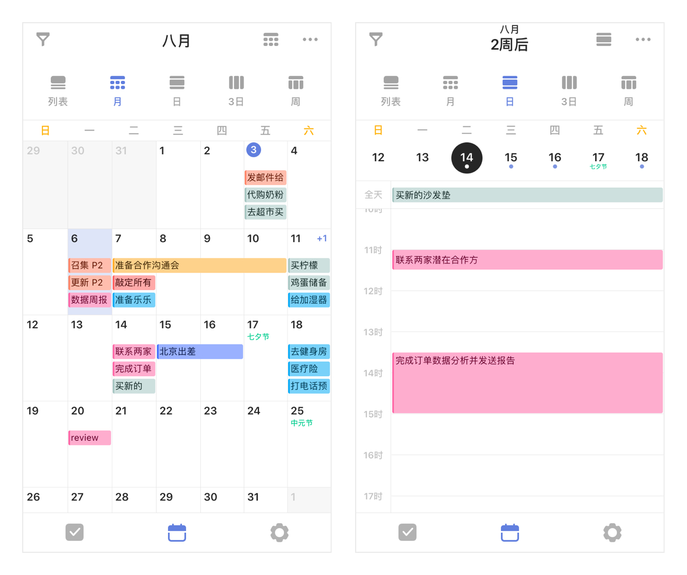

## 日历管理

「日历视图」可以帮助您更直观地查看自己的任务计划和日程安排。

在主页面下方点击「日历」tab，进入日历页面，默认显示列表视图。

### 5 种日历视图

点击日历左上角的切换按钮可以切换列表视图、月视图、日视图、三日视图和周视图，既可以直观显示月度计划，也能够轻松安排近日任务。

当每日任务比较多的时候，可以在列表视图中向上滑动，切换至周视图，下方区域可以显示更多的任务。

### 快速安排任务

只需要在日历视图中从屏幕右侧边缘向左滑动，即可滑出「安排任务」区域。那些尚未设置日期的任务，将在此区域内展示。

点击底部的“筛选”，可选择特定清单下的任务进行安排。筛选完成后，回到日历视图。长按安排任务区域内的某个任务，将它拖拽到日历视图上来可自动设置日期和时间。

已经拖拽起来的任务，如果想要取消本次操作，可以将任务拖拽到右下角的「取消」区域。长按拖动已经在日历上的任务，选择合适的日期再松手，也可修改任务时间。完成后，向右滑动屏幕即可收起安排任务区域。

### 时间轴缩放

在时间轴日历视图中，「双指捏合」或「双指张开」，即可更改时间轴的高度。双指捏合时，时间轴高度将变矮，您就可以在一屏内查看更多的任务；双指张开时，时间轴高度将变高，您就可以看到更多的标题内容。

### 任务显示设置

您可以在日历视图的右上角「···」-「显示设置」中，来设置以下内容：

点击「显示范围」，可以根据清单、标签、订阅日历来来筛选显示在日历中的任务。

点击「显示详细」，可以在日历中显示任务的一些详细属性如时间、所属清单和地点等。

点击「显示已完成」，会使已完成的任务出现在日历视图中。

点击「显示子任务」，使已经设定好时间的子任务出现在日历视图中。

点击「显示所有重复周期」，设置重复的任务会在日历中按重复周期进行重复显示。

