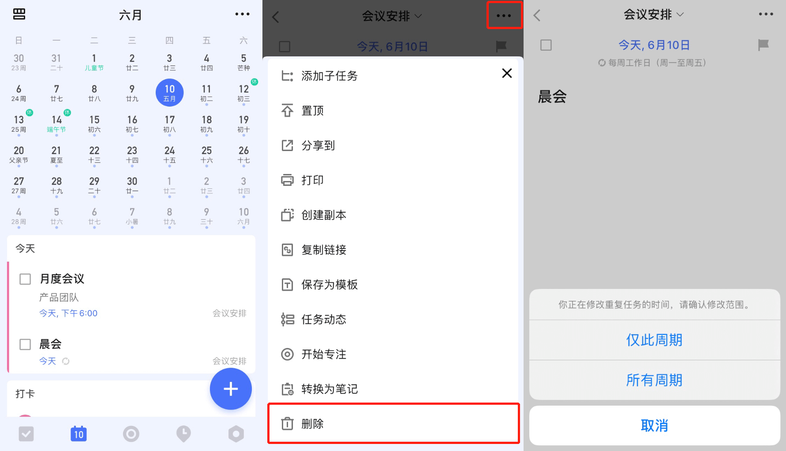
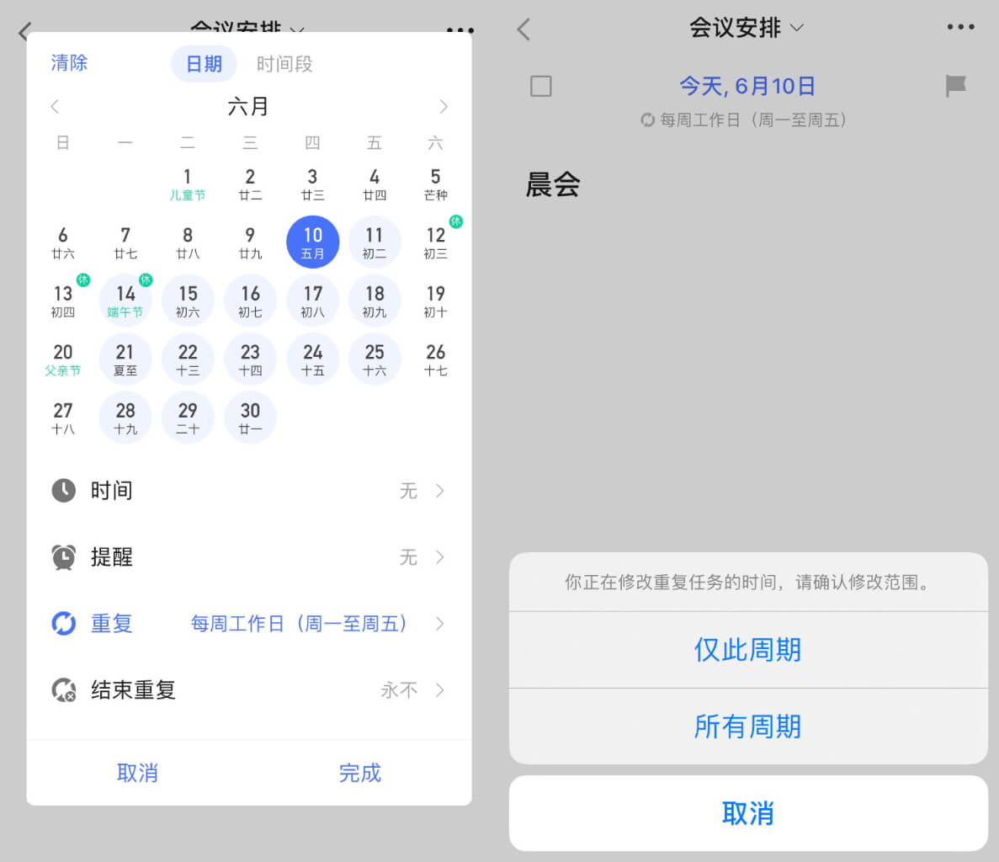

### 修改单个周期

在日历视图上，开启「显示所有重复周期」后，可以对当前的重复任务周期，或未来的某个重复周期进行删除或修改时间设置。
点击进入需要修改的重复任务详情页，点击右上角「···」-「删除」，即会弹窗询问删除范围。
您可以选择「仅此周期」，或「所有周期」。

在任务详情页，点击顶部的日期，打开时间与提醒设置窗口，修改时间或日期后点击右上角的「确认」按钮，即会弹窗询问修改范围。
您可以选择「仅此周期」，或「所有周期」。

