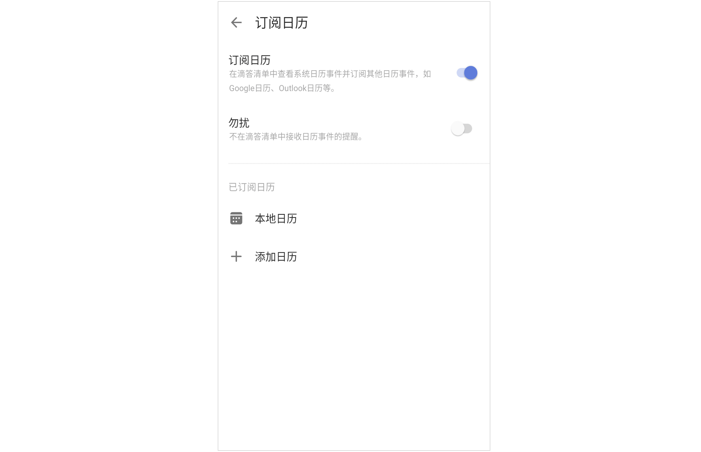

## 订阅日历

### 开启订阅日历：
  在日历界面，点击右上角「···」- 开启「订阅日历」，或在主界面底部 Tab 栏点击「设置」-「导入与关联应用」- 点击「订阅日历」前往开启。
	
	在下方显示的本地日历中设置需要显示或者隐藏的日历类型。
	

  `注：滴答清单显示的日历事件是本地日历所能显示的事件，如果您设置了本地日历不能读取该事件，那将不会显示在滴答清单中。`
	

### 订阅其他日历事件到滴答清单中：
  滴答清单允许您从其他日历服务中订阅事件。在订阅日历界面，点击「添加日历」，可以选择订阅谷歌日历或通过链接订阅其他日历。

**同步谷歌日历**：登录谷歌账号，允许滴答清单订阅谷歌日历，即可完成订阅。 
**通过URL链接日历**：输入您想订阅日历的URL，即可完成订阅。

「订阅日历」开关开启后，可以在左侧边栏中的「事件」智能清单中查看本地日历事件和您订阅的日历事件。

点击已订阅日历进入编辑页中可以选择日历事件的状态，包括**显示**、**仅在日历中显示**、**隐藏**三种状态。

日历事件的状态为**显示**或**在日历中显示**时将会显示在日历中和智能清单中。自定义智能清单也可以对日历事件进行筛选。订阅后的日历也会显示在侧边栏的清单列表下面，点击日历名称，可以查看日历中的任务，但是不能进行修改。
