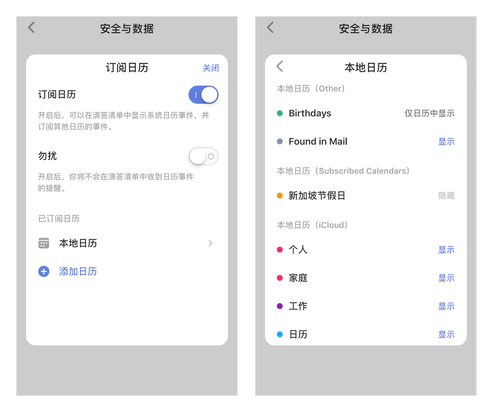
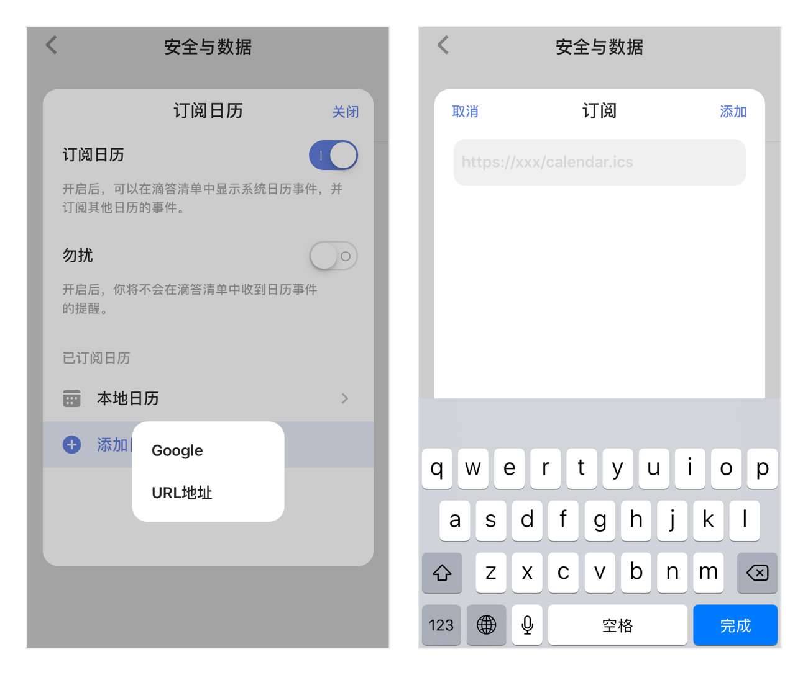

## 订阅日历

进入「设置」-「导入与关联应用」-「订阅日历」，选择是否订阅。如果滴答清单没有“日历”的访问权限，要先在您的手机「设置」-「隐私」-「日历」中允许滴答清单的访问，才能订阅日历。同时可以开启「勿扰」开关，开启后，将不会在滴答清单中收到日历事件的提醒。

### 显示本地日历
  
 开启「订阅日历」并获得“日历”的访问权限后，会自动获取本地日历中的事件。您可以点击「本地日历」设置需要显示、隐藏或仅日历中显示的日历。
`注：滴答清单中显示的日历事件是本地日历所能显示的事件，如果您设置了本地日历不能读取该事件，那就不会显示在滴答清单上。`

### 订阅其他日历事件到滴答清单中

 滴答清单允许您从其他日历服务中订阅事件。在「订阅日历」中，点击「添加日历」，可以同步谷歌日历，也可以通过 URL 链接订阅日历。
 
 **同步 Google 日历**：登录谷歌账号，允许滴答清单订阅谷歌日历，即可完成订阅。
 **添加 URL 链接日历**：输入您想订阅日历的URL，即可完成订阅。

订阅日历」开关开启后，在左侧边栏中会显示「事件」智能清单，在这里可以查看本地日历时间和您订阅的日历事件。本地日历事件是可以进行添加、编辑和删除的。

