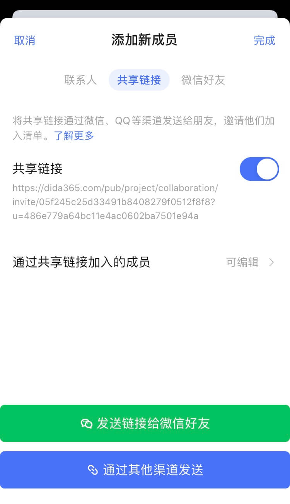

## 共享清单

滴答清单不仅能记录您的个人计划，还可以和他人共享清单，实现团队的共享协作。将清单共享给其他成员，所有成员都可以在清单内查看、编辑、添加和删除任务。

选择某个清单进入清单内任务列表页，点击右上角「···」-「共享协作」，选择邀请新成员即可。

邀请新成员有以下三种方式：

* **联系人邀请**：输入联系人电子邮箱或名字，回车即可发送邀请，未注册过滴答清单的邮箱可以通过点击邮箱内的链接来激活共享。您也可以从最近邀请和团队成员里显示的联系人中选择一个或者多个进行邀请。
* **共享链接邀请**：点击即可创建一个共享链接，可复制链接发送给其他人。若其他成员确认加入该清单，您将会收到申请加入的通知，在您确认同意后，该成员即可共享此清单。
* **微信好友邀请**：可点击「邀请微信好友」直接转跳至微信进行邀请，也可以通过二维码邀请好友加入。
* 

以上三种邀请方式均可以对被邀请人进行权限设置，权限分为**可评论**、**只读**和**可编辑**三个层级。

